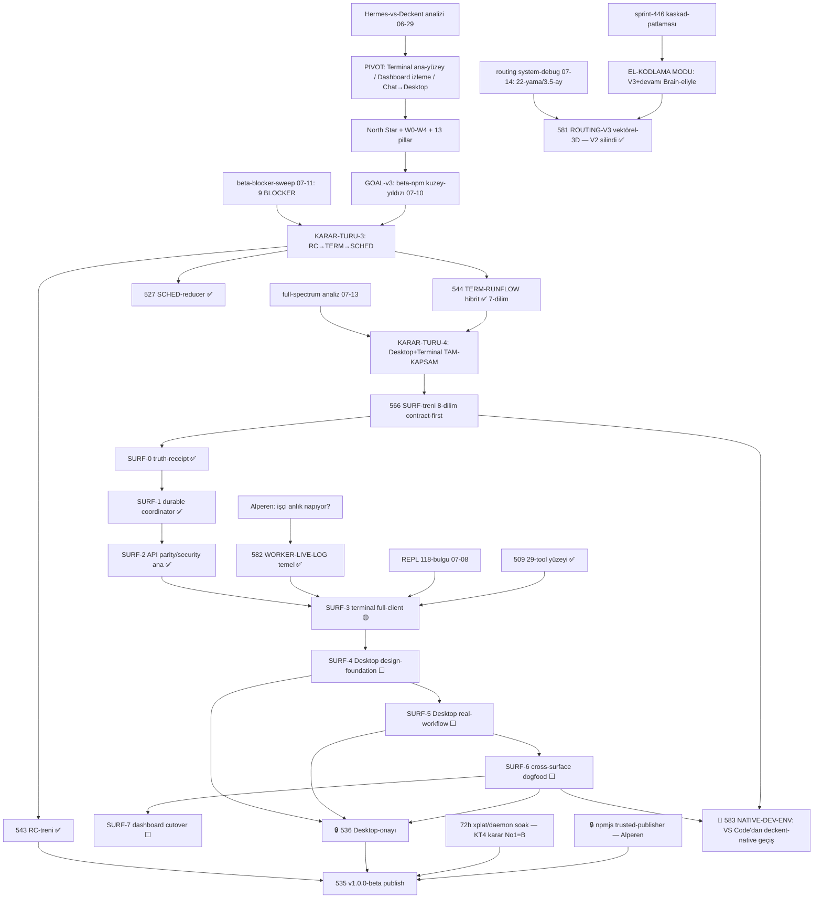

# Deckent — Karar Sebep→Sonuç Matrisi (2026-07-15)

> **Amaç:** Bugüne kadar KARAR-VERİLMİŞ tüm işlerin sebep→sonuç zinciri — hangi analiz hangi kararı doğurdu,
> hangi karar neyi öldürdü/neyi bağımlı kıldı — tek belgede. Alperen-direktifi (2026-07-15):
> "karar verilen işlerin sebep sonuç matrisini diyagramını kapsamlı araştırarak çıkart."
> **Yeni yön aynı direktifle kayda girdi:** SURF bitince terminal+desktop TASARIM DAHİL bitirilir;
> SURF-sonrası İLK HEDEF = **VS Code'dan deckent-native çalışma ortamına geçiş** → MASTER-PLAN **583 NATIVE-DEV-ENV**.
>
> **Yöntem:** 3 paralel keşif-ajanı (desktop-kararları · terminal-kararları · stratejik-zincir) + Brain-sentezi.
> **Kaynaklar:** `docs/MASTER-PLAN.md` (SSOT) · `docs/analysis/deckent-full-spectrum-2026-07-13.md` ·
> `.analysis/desk2-blueprint-2026-07-10.md` · `.analysis/desktop-shell-research-2026-07-08.md` ·
> `.analysis/adr-095-terminal-first-pivot-draft.md` · `.analysis/hermes-vs-deckent-direction-decisions.md` ·
> `.analysis/routing-v3-*-2026-07-14.md` · `.analysis/deckent-repl-code-review-2026-07-08.md` · ADR-G-033/034/029/006.
> **Görsel diyagram:** `.analysis/karar-matrisi-diyagram-2026-07-15.html`

---

## §1 Nedensel omurga (kronolojik)

```
Hermes-vs-Deckent analizi (06-29)
  └─► PIVOT: Terminal=ana-yüzey · Dashboard=yalnız-izleme · Chat→Desktop(Electron)
        └─► North Star + W0-W4 wave-bantları + 13-pillar yön-kararları
              ├─► TERM-ailesi: golden-flow/footer → 463-wire-dersi → 511 dogfood-kabulü (sprint-430)
              ├─► GOAL-v3 merceği (07-10): kuzey-yıldızı = v1.0.0-beta npm
              ├─► KARAR-TURU-3 (07-11, 9-BLOCKER kanıtı): RC→TERM→SCHED üç-tren
              │     ├─► 543 RC-treni ✅ · 544 TERM-RUNFLOW hibrit ✅ (7 dilim) · 527 SCHED-reducer ✅
              │     └─► publish-kilidi doğdu: 535 = RC ∧ 🔒536-Desktop ∧ npmjs ∧ soak
              ├─► KARAR-TURU-4 (07-13, full-spectrum): Desktop+Terminal TAM-KAPSAM, geliştirme İKİSİNDEN
              │     └─► 566 SURF-treni (8 dilim, contract-first #3=B)
              │           SURF-0✅ → 1✅ → 2-ana✅ → 3-ilk-parça✅ → [3-kalan → 4 → 5 → 6 → 7]
              ├─► Alperen-şikayet-kararları (doğrudan P0-satır doğuran):
              │     "her yer sprint basıyor"→510 · "kan ağlayan prompt"→573/580 · "sürekli yama"→581-V3
              │     "işçi anlık napıyor görmüyorum"→582 · sprint-446-kaskadı→EL-KODLAMA-MODU
              └─► 🧭 YÖN-DİREKTİFİ (07-15): SURF-sonrası İLK HEDEF = 583 NATIVE-DEV-ENV
                    (VS Code'dan çıkış → deckent app + deckent terminal; terminal+desktop tasarım-dahil biter)
```

Mermaid kaynağı (render eden ortam için):



---

## §2 Sebep→Sonuç Matrisi (karar-satırları, domain-gruplu)

Sütunlar: **KARAR** (kaynak-referanslı) · **SEBEP** (tetikleyici kanıt) · **SONUÇ/ETKİ** (doğurduğu/öldürdüğü/bağımlı-kıldığı) · **DURUM** · **BAĞIMLILIK**

### S — Strateji / yüzey-hiyerarşisi

| # | KARAR | SEBEP | SONUÇ/ETKİ | DURUM | BAĞ. |
|---|---|---|---|---|---|
| S1 | **Terminal = ana ürün-yüzeyi** (ADR-G-034 immutable; ADR-095-taslak; North Star) | Hermes-karşılaştırması: çekirdek derin AMA ürün-yüzeyi dağınık — "340+ sprint sistem-genişliği üretti, ürün-şekli değil"; canlı-approval yok, trace unwired, disclosure yok | W1 wave-bandı (product-loop) + tüm TERM-pillar ailesi doğdu; dashboard ana-ürün konumundan düştü; "tam-kontrol + yormayan + tam-işlevsellik" sözleşmesi | ✅ yön canlı (⚠️ ADR-095 dosyası hâlâ PROPOSED-taslak) | — |
| S2 | **Dashboard = yalnız izleme** (ADR-G-033 immutable, scope-freeze) | Dashboard kontrol-merkezi olursa yüzey-otoritesi bölünür; Alperen: izleme-only | Dashboard-write'ların ölüm-fermanı (SURF-7'de infaz); gold-accent dashboard'a rezerve; DASH-pillar P1'e indi | ✅ karar / ⬜ cutover (SURF-7) | 566 |
| S3 | **Chat → Desktop-app (Electron)** (ADR-G-033) | Terminal=eller, dashboard=gözler → karar-veren üçüncü yüzey gerekli; chat dashboard'da yaşayamaz (S2) | Desktop üçüncü first-class yüzey oldu; 496 DESK-1 + 536 DESK-2 doğdu; publish-kilidi Desktop'a bağlandı | ✅ karar | S2 |
| S4 | **KT-4: Desktop+Terminal TAM-KAPSAM, geliştirme İKİSİNDEN** (2026-07-13) | full-spectrum: "Desktop product-consumer seviyesinde boş — 'Desktop'tan deckent geliştiriliyor' DOĞRULANAMADI"; iki ayrı deckent değil **tek flow-service'in iki client'ı** | SURF-treni (566, 8 dilim); 536-kapanışı SURF-4/5/6-parity olarak yeniden-tanımlandı; ordering-invariant'lar dayatıldı | 🟡 (SURF 0-3 ilerledi) | 544 |
| S5 | **🧭 YÖN-DİREKTİFİ (2026-07-15): SURF-sonrası İLK HEDEF = VS Code'dan deckent-native geçiş** | Alperen: "geliştirme ortamımızı vscode'dan çıkarıp deckent app ve deckent terminale taşımak istiyorum"; Yasa-1 dual-lens: aynı yetenek = son-kullanıcı ürünü | **583 NATIVE-DEV-ENV** satırı doğdu (§5); terminal+desktop işleri TASARIM DAHİL bitirilecek; SURF-6 dogfood'u kalıcı çalışma-moduna evrilir | ⬜ yeni | 566 |

### R — Yayın (release) zinciri

| # | KARAR | SEBEP | SONUÇ/ETKİ | DURUM | BAĞ. |
|---|---|---|---|---|---|
| R1 | **GOAL-v3: kuzey-yıldızı = v1.0.0-beta npm** (07-10) | SSOT-reconcile sonrası tek yürütme-merceği ihtiyacı | Faz-0→4 zinciri; 535 PUBLISH-GATE; "GOAL bitse bile 511+510+492/493 şart" uyarısı | 🟡 | — |
| R2 | **KT-3: üç-tren RC→TERM→SCHED** (07-11) | beta-blocker-sweep: 9 kanıtlı BLOCKER; 3 sol-ultra rapor | 543 RC ✅ · 544 TERM ✅ · 527 SCHED ✅; publish yalnız RC + 🔒536'ya bağlandı | ✅ | — |
| R3 | **KT-4 #1: beta=B — kilitler kapanınca 72h xplat/daemon soak, SONRA publish** | Analist A (hemen) önerdi; **Alperen tek-sapma ile B seçti** — her-ortam yasası kanıt istiyor | Publish'e soak-penceresi eklendi; acele-yayın riski öldü | ✅ karar | 543,536 |
| R4 | **Publish-kilit formülü:** 535 = 543✅ ∧ 561✅ ∧ **🔒536-Desktop-onayı** ∧ **🔒npmjs-trusted-publisher** ∧ 72h-soak | "DESKTOP-APP Alperen 'bitti' demeden PUBLISH OLMAZ" (07-11) | Desktop release'in kritik-yoluna girdi → SURF-4/5/6 fiilen publish-öncesi zorunlu | 🔒 açık | SURF-4/5/6 |
| R5 | **KT-4 #6=C: Community GA + dürüst Enterprise Preview** (570) | Enterprise enforcement parçalı — yalanla GA olmaz | ENT-TRUTH-0 doğdu; paid-boundary=governance/audit-depth ilkesi | ⬜ | — |

### T — Terminal zinciri

| # | KARAR | SEBEP | SONUÇ/ETKİ | DURUM | BAĞ. |
|---|---|---|---|---|---|
| T1 | **Golden-flow + canlı-footer** (TERM-FLOW-40 · TERM-LIVE-43) | Pivotun ilk somut kanıtı; "en yüksek-sinyal" P0×2 | NL→plan→approve→run→evaluate orkestratörü + 5-soru footer; 511'in yapıtaşları | ✅ | S1 |
| T2 | **463: delivered-ama-unwired düzeltme + KURAL** | Alperen canlı-testte yakaladı ("footer göremedim") — flag'ler inmiş ama hiçbir caller bağlamamış | config→prop wire; **"teslim≠kablolu" merceği** doğdu → 541/492 gap-analizlerinin yöntemi oldu | ✅ | — |
| T3 | **511 TERM-DEV-LOOP dogfood-kabulü** | Parçalar ✅ ama ENTEGRE deneyim gerçek-işte hiç kullanılmamış | 🏁 sprint-430: tek `deckent do "<NL>"` → 4/4 DONE, elle CLI-komut yok; do-first goal-loop devrede | ✅ (07-12) | 492,510 |
| T4 | **544 TERM-RUNFLOW: hibrit RunProposal** — saf-A (REPL'e-bağla) ve saf-B (tools-resmileş) REDDEDİLDİ | 541-gap-raporu: golden-flow REPL'e bağsız, ChatTurnQueue üreticisiz, risk-gate 0-çağıran | ÖLDÜRDÜ: buildPlanNlIntent-canonical · sync-stdio-start · DIRECTIVES-swap · exit-code-evaluate; ORGAN-NAKLİ: stage-invariants→reducer; 7 dilim ✅; Desktop aynı flow-service'i tüketecek | ✅ çekirdek | 511,541 |
| T5 | **509: 6→29 tool CLI-bridge yüzeyi** | Native-engine yalnız 6 read-only tool görüyordu; dispatch zaten her şeyi destekliyordu — modele reklam eksikti | 16-read/7-write/6-destructive katalog + arg-aware classifyTool gate; deckent_review read→confirm güvenlik-fix; SURF-3 discoverability temeli | ✅ (9923d49b) | — |
| T6 | **575: REPL-118-bulgu = SURF-3 kapı-koşulu** ("İLK okunacak") | 07-08 çok-ajanlı review: 118 bulgu (2 P0: claude-ENOENT process-crash · InputBar↔ApprovalCard tuş-çifte-tüketimi), **hiçbiri mevcut testlerce yakalanmıyor** | SURF-3 full-client inşası öncesi fix-triyajı zorunlu; "testler yeşil" güvencesinin çürüğü belgelendi | ⬜ | 566 |
| T7 | **582 WORKER-LIVE-LOG** | Alperen: "workerlar log'u en son yazıyor; işçi anlık napıyor görmezsem güzel arayüz veremem" | ACTIVITY-kanalı mevcut-stream'e eklendi (ikinci mekanizma YASAK kararı); temel ✅ + `status --follow` ⚡Live; Desktop-console tüketicisi SURF-4'e bağlandı | 🟡 temel ✅ | SURF-3/4 |

### D — Desktop zinciri

| # | KARAR | SEBEP | SONUÇ/ETKİ | DURUM | BAĞ. |
|---|---|---|---|---|---|
| D1 | **Electron; Tauri/Wails/Neutralino ELENDİ** (ADR-G-033 + shell-research re-onayı, ~130 kaynak) | (a) Node-çekirdek yeniden yazılamaz → Tauri'de ürün Rust-sidecar'a döner (b) Linux WebKitGTK, xterm.js+canlı-stream yükünde resmî-zayıf → Yasa-2 riski (c) kategori-kanıtı: CC/Codex/Cursor/Wave hepsi Electron; AFFiNE/opencode Tauri→Electron GERİ DÖNDÜ | Electron ≥41 (hedef 43) + electron-vite + electron-builder sabitlendi; alternatif-şasi tartışması kapandı | ✅ | S3 |
| D2 | **İnce-kabuk + system-Node `deckent serve` daemon (seçenek-c)** | better-sqlite3 v12 + node-pty Electron-ABI rebuild-cehennemi belgeli; daemon'da ikisi de normal prebuild | ABI-problem-sınıfı ÖLDÜ; CLI+MCP+Desktop tek çekirdek-process'e bağlandı; **WSL özel-durum olmaktan çıktı → connection-profile**; PTY-paneli bedava (ADR-G-029) | ✅ karar / 🟡 uygulama | D1 |
| D3 | **496 DESK-1 iskelet** | ADR-G-033'ün somutlaşması | `src/desktop/` doğdu (~2.590 satır: daemon-lifecycle/security/IPC/profile-store; renderer=pre-daemon state-machine); B1-B3 ✅ | 🟡 (B4-e2e + Phase-4 imza kaldı) | 494,**536** |
| D4 | **536 DESK-2: dashboard-reuse ÜRÜN DEĞİL → birinci-sınıf Desktop-UX blueprint KARARLI** (07-10) | Alperen netleştirmesi; Desktop=KARAR-VEREN yüzey | Blueprint v2 sabitlendi: Console-adı · studio-dark+teal/cyan · 12 ekran + 12 GAP (CHAT-EVENT-STREAM…ENTERPRISE-POLICY-PUSH) · persona/ERP 4-preset · IPC=UI-grade-only · Playwright-Electron smoke + Alperen user-truth turu; 496 tek-başına "tamam" sayılmaz | ⬜ inşa (blueprint ✅) | 496→SURF-4/5 |
| D5 | **536-kapanışı = SURF-4/5/6 parity-kabulü** ("shell-boot yetmez") | KT-4: Desktop'un kanıtı gerçek-workflow'dur, pencere-açılması değil | Desktop-onayı ölçülebilir tanıma bağlandı → publish-kilidinin (R4) fiili anahtarı SURF-4/5/6 oldu | ⬜ | 566 |

### F — Çekirdek akış (RunFlow / SURF dilimleri)

| # | KARAR | SEBEP | SONUÇ/ETKİ | DURUM | BAĞ. |
|---|---|---|---|---|---|
| F1 | **SURF-0 truth-receipt** | flowId zinciri kanıtsızdı; elle-inject mümkündü | Gerçek-binary receipt (completionRecord.flowId birebir); elle-inject ÖLDÜ; DERS: dist-smoke sprint-içi olamaz → post-sprint CC-adımı | ✅ | 544 |
| F2 | **SURF-1 durable RunFlowCoordinator** | API module-local Map restart/multi-instance truth olamaz | module-Map ÖLDÜ → per-root registry; durable event-log + replay-cursor + plannedSprint-durable; command-idempotency | ✅ | F1 |
| F3 | **SURF-2 API parity/security** | full-spectrum riski: SSE query-token allowlist RunFlow'u kapsamıyor → **çözülmeden Desktop live-flow NO-GO** | Query-token GET/HEAD-only MAJOR-fix + run-flow allowlist; list/start/cancel parity; `id:`-frame + Last-Event-ID durable-backfill; tenant-negatifler | ✅ ana (kalan: resume/retry-semantik · gateFindings-parity) | F2 |
| F4 | **SURF-3 Terminal full-client** | Terminal'in "tam-kontrol" sözü tek-flow'la tutmaz | `status --follow` ⚡Live ✅; KALAN: multi-flow-inbox · born-697 canlı-approval son-mili · result-evidence · REPL-575-triyajı · Claude-CLI zengin-akış | 🟡 | F3,T6,T7 |
| F5 | **Ordering-invariant'lar (bağlayıcı):** (1) SURF-0/1 bitmeden Desktop Console state YAZAMAZ (ADR-G-011) (2) SURF-5 bitmeden dashboard-write KALKMAZ (ADR-G-033) | "İkinci-implementation yok" + "user-capability kaybı yok" | SURF-4/5 önü açıldı (0/1 ✅); SURF-7 en-sona sabitlendi | ✅ (1)-koşulu sağlandı | — |

### Q — Kalite-programları (prompt / routing)

| # | KARAR | SEBEP | SONUÇ/ETKİ | DURUM | BAĞ. |
|---|---|---|---|---|---|
| Q1 | **573 PCOMP-6: derlenen-prompt + tutarlılık-lint** (07-14, BİRİNCİ-ÖNCELİK) | Alperen: "kan ağlayan" prompt-mekanizması; kalite 75/100; dış-analiz P1-P5 | D1a→D5 + D4.5 ADR-sol-shift ✅ (verify-placeholder öldü · DONE≡checklist · prompt-lint 6-kontrol · planner-ADR-bloğu); fail-closed flip Alperen-onayına bağlı | 🟡 ana ✅ | 512 |
| Q2 | **580 PCOMP-8: prompt-devrimi 8. tur** (442-analizi + "sabotaj mı" hesap-sorusu) | Implementer-era çöküşü; U1-U4 ölçüm-disiplini | sprint-443/444 ✅; U5/F4-kuyruk (6 shadow-merge = Alperen-kararı) | 🟡 | 573 |
| Q3 | **581 ROUTING-V3: vektörel-3D yeniden-tasarım + V2 TAM-SİLME** | system-debug: **22 yama/3,5 ay, 8 hata-sınıfının 7'si nüks**; 443-doğal-deneyi (20 özdeş görev→4 rota); catch-all çağdan-çağa göçüyor; öğrenme-döngüsü açık-devre | Alperen-kararları: LLM-atama+deterministik-doğrulayıcı · capability=agent.json-v3 SSOT · **doğrudan-kesim (shadow yok)** · Brain-eskalasyonu · 🔒vektörel-3D direktifi · **test-engineer DİRİLMEZ, "test"-kelimesinden çıkarım YASAK** → S0-S3 ✅: V2 **-18.495 satır fiziksel-silindi**, ADR-G-006 today=V3, `src/core/routing/` | ✅ çekirdek (kalan: config-rename kuyruk) | 580 |
| Q4 | **EL-KODLAMA MODU: V3+devamı Brain-eliyle, sprint mekanizmasız** | sprint-446 kaskad-patlaması (debt-enjeksiyonu numara kaydırdı → 18-görev ölümü) + Alperen kesin-talimatı | V3 S1-S3 el-kodlandı; SURF-1c/2/3 el-kodlandı; DERS: DIRECTIVES "Task N"-referansları enjeksiyon-varlığında güvenilmez | ✅ mod aktif | — |

---

## §3 Kilit-düğümler (tek bakışta)

1. **Publish-düğümü:** `535 = 543-RC✅ ∧ 561✅ ∧ 🔒536-Desktop-onayı ∧ 🔒npmjs(Alperen) ∧ 72h-soak`
   → teknik-zincir hazır; **tek gerçek kapı = SURF-4/5/6** (536'nın kapanış-tanımı).
2. **SURF-sıra-değişmezi:** 0/1 ✅ → Desktop-write serbest; SURF-5 bitmeden dashboard-write kalkmaz (SURF-7 en-son).
3. **SURF-3 kapı-koşulu:** REPL-575 triyajı (2 P0 dahil) İLK okunur; 582-tüketicileri + born-697 + multi-flow-inbox SURF-3 gövdesi.
4. **🧭 Yeni hedef-düğümü (07-15):** SURF-treni → **583 NATIVE-DEV-ENV** (VS Code çıkışı). SURF-6 dogfood'u 583'ün provası;
   536-onay/publish ile 583 paralel yürüyebilir (583 publish'i BLOKLAMAZ, publish 583'ü BLOKLAMAZ).

## §4 Alperen'i bekleyen açık-karar kuyruğu

**Seçim bekleyen:** prompt-lint fail-closed flip (573/580, temiz-defter ölçümü sonrası) · 6 shadow-merge (580-F4) ·
COST K4-geniş/K5 Batch-API (529) · 11 gerçek-ölü modül silme (490) · Hub anahtar-veliliği (503) · SLO-eşikleri (KT-4 #13) ·
persona_render default-flip · nervous canlı-doğrulama · **SURF-2 resume/retry semantiği** · **583 tasarım-turu onayı (yeni, §5)**.
**Elle-aksiyon bekleyen:** npmjs trusted-publisher · Desktop "bitti" onayı (536) · 496 imza/appId · `.deck` API-anahtarı (576) · 488 göç-onayları.

---

## §5 🧭 583 NATIVE-DEV-ENV — VS Code'dan deckent-native geçiş (yeni hedef, tanım)

**Alperen-direktifi (2026-07-15):** "surf işleri bitince terminal ve desktop işlerini tasarım dahil bitirmek istiyorum.
geliştirme ortamımızı vscode'dan çıkarıp deckent app ve deckent terminale taşımak istiyorum.
surf işi sonrası ilk hedef vscode'dan deckent native çalışma ortamına geçiş."

**Yasa-1 dual-lens:** Bu yalnız iç-dogfood değil — "deckent'ten geliştirme" son-kullanıcı ürün-yeteneğidir
(solo geliştirici → enterprise ekip aynı yüzeyle çalışır). Tasarım her iki merceğe göre yapılır.

### VS Code yetenek-envanteri ↔ deckent-native karşılığı (gap-matrisi, ilk-taslak)

| VS Code'un verdiği | deckent-native karşılığı | Durum | Boşluk/karar |
|---|---|---|---|
| El-ile kod düzenleme | Ajan-eliyle değişiklik (Brain/worker) + insan=yönlendiren/onaylayan | ✅ çekirdek | **TASARIM-KARARI: editör YAPILMAZ mı?** Hafif dosya-görüntüleme+diff yeterli mi — Alperen tasarım-turunda |
| Diff inceleme / code-review | GAP-4 DIFF-API + Desktop diff/eval/history (SURF-5 kanıt-kriteri) + terminal result-evidence | ⬜ | SURF-5 + SURF-3 result-evidence |
| Dosya-gezinme / arama | 508 TERM-AT-REF `@path` fuzzy-autocomplete + 29-tool read-yüzeyi | 🟡 (509 ✅ / 508 ⬜) | 508 SURF-3-komşusu olarak öne alınmalı |
| Entegre terminal / shell | PTY = Expert-Console organı (ADR-G-029, daemon'da hazır) | ✅ | Desktop'ta panel-yerleşimi SURF-4 tasarımı |
| Git yüzeyi (stage/commit/log) | Bugün CC/CLI; deckent-native commit-onay akışı + result-evidence | 🟡 kısmi | Tasarım-turu maddesi (onay-akışıyla bütünleşik) |
| Canlı çalışma-izleme | 582 ACTIVITY + `status --follow` ⚡Live + Desktop-console | 🟡 temel ✅ | SURF-3/4 tüketicileri |
| Çoklu-iş yönetimi | Multi-flow inbox (SURF-3) + Desktop History | ⬜ | SURF-3 gövdesi |
| Onay/karar UX | APR-ailesi + born-697 son-mil + Desktop Approval-ekranı | 🟡 | SURF-3/4 |
| AI-asistan (CC VS Code terminalinde) | deckent terminal native-agent (29-tool) + Claude-CLI zengin-akış (stream-json) | 🟡 | SURF-3 "Claude-CLI zengin-akış" maddesi = bu geçişin köprüsü |
| IDE-eklentileri | CHAT-IDE (64) İKİNCİLLEŞİR (publish-sonrası; ana-yüzey artık deckent) | 🟡 dilim 1-3 ✅ | Öncelik düşer — 583 lehine |

### Kabul-ölçütü önerisi (511/SURF-6 deseni)
SURF-6'nın 5-gerçek-task × iki-yüzey dogfood'u geçtikten sonra: **ardışık 5 gerçek geliştirme-günü (marathon-oturumu dahil)
VS Code açılmadan deckent app + deckent terminal'den yürür**; her pürüz born'lanır (511'deki pürüz-listesi deseni);
VS Code yalnız acil-fallback (kullanımı olay-kaydına girer).

### Sıra (öneri — sıra-değişmezleri korunarak)
`SURF-3 kalanları (575-triyaj → multi-flow-inbox → born-697 → result-evidence → Claude-CLI-akış)` →
`SURF-4 (tasarım-turu Alperen-onaylı: design-tokens/Console/Chat/Approval/History)` → `SURF-5 (packaged real-workflow)` →
`SURF-6 (cross-surface dogfood = 583-provası)` → `SURF-7 (dashboard-cutover)` → **583-kabul** (+ 536-onay/publish paralel).

---

## §6 Doğruluk-uyarıları (matris okunurken)

1. **Emoji-lag:** MASTER-PLAN'da 582 🔴 görünür ama narrative "TEMEL ✅" (fiilen 🟡); 566 🟡 ama SURF-0/1/2+3-ilk-parça ✅.
   Gerçek durum = en-son-tarihli Not-anlatısı, en-soldaki emoji değil.
2. **ADR-095** (terminal-first pivot) hâlâ PROPOSED-taslak — yön North Star + ADR-G-034 üzerinden işletiliyor;
   taslağın kaderi (accept/arşiv) küçük bir tutarlılık-borcu.
3. **REPL-118 raporu (07-08) kısmen bayat olabilir:** 509 (07-10) slash-drift kümesini kısmen kapatmış olabilir —
   575-triyajı güncel-HEAD cross-check ile başlar (raporun kendi tazelik-uyarısı).
4. **"Trinity"** birebir doküman-terimi değil; üç-yüzey (Terminal/Dashboard/Desktop) + Brain-Worker-Auditor üçlüleri kastedilir.
5. **KARAR-TURU-1/2 etiketi yok:** Tur-1 (Hermes-pivot) ve Tur-2 (GOAL-v3) kronolojik çıkarımdır; resmî etiket KT-3'ten başlar.
