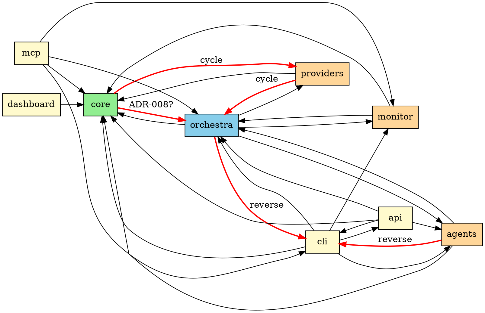
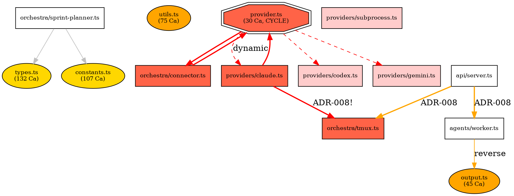

# Analysis: META — Architecture Graph + Circular Dependency + ADR-008
**Task ID:** 142-042 | **Model:** opus | **Files Analyzed:** 317 | **Effort:** max

---

## 1. Executive Summary

Full import chain analysis of all 317 non-test TypeScript source files under `src/`.

| Metric | Value |
|--------|-------|
| Total source files | 317 |
| Total import edges | 1,102 |
| Module count | 11 (core, orchestra, cli, mcp, agents, providers, api, monitor, dashboard, extensions, index.ts) |
| Circular dependency clusters (SCCs) | **4** (involving 13 files) |
| ADR-008 violations | **13** |
| External dependencies | 30+ distinct packages |
| Memory V2 subsystem cycles | **0** (clean) |
| Unresolved imports | **0** (all resolved) |

**Overall Assessment:** The codebase has a well-structured module hierarchy with `core/` as the foundational layer and `orchestra/` as the orchestration hub. However, there are 4 circular dependency clusters and 13 ADR-008 violations that represent architectural debt. The largest cycle (7 nodes) involves the provider ↔ connector ↔ tmux chain and spans 3 modules — this is the most critical structural issue.

---

## 2. Module Inventory

| Module | Files | Efferent (Ce) | Afferent (Ca) | Instability (I=Ce/(Ca+Ce)) | Role |
|--------|-------|---------------|---------------|---------------------------|------|
| core/ | 78 | 2 | 8 | 0.20 | Foundation — types, config, memory, providers |
| orchestra/ | 82 | 5 | 7 | 0.42 | Sprint lifecycle orchestration |
| cli/ | 75 | 5 | 4 | 0.56 | Command-line interface |
| mcp/ | 37 | 4 | 0 | 1.00 | MCP server — pure consumer |
| agents/ | 16 | 3 | 3 | 0.50 | Worker/auditor execution |
| dashboard/ | 14 | 1 | 0 | 1.00 | React web UI — pure consumer |
| providers/ | 5 | 2 | 2 | 0.50 | Claude/Codex/Gemini adapters |
| api/ | 4 | 4 | 1 | 0.80 | HTTP API server |
| monitor/ | 4 | 2 | 3 | 0.40 | Auditor + health checks |
| extensions/ | 1 | 0 | 0 | — | VS Code extension (isolated) |
| index.ts | 1 | 0 | 0 | — | Package entry point |

**Stability Analysis:**
- `core/` (I=0.20): Highly stable — many modules depend on it, few reverse deps. Correct for a foundation.
- `mcp/` and `dashboard/` (I=1.00): Maximally unstable — pure consumers, no dependents. Correct for edge modules.
- `orchestra/` (I=0.42): Moderate instability — it should be more stable given its central role. The reverse deps from `core/` and `providers/` into `orchestra/` are concerning.

---

## 3. Module-Level Dependency Graph (DOT)



**Red edges denote architectural violations:**
- `core → orchestra`: provider.ts imports connector.ts — breaks the "core is foundational" invariant
- `core → providers`: provider.ts dynamically imports claude.ts/codex.ts/gemini.ts — creates cycle
- `providers → orchestra`: claude.ts imports tmux.ts — providers should not depend on orchestration
- `orchestra → cli`: sprint-finalizer.ts imports sprint-summary-rich.ts from cli/helpers — reverse direction
- `agents → cli`: worker.ts imports output.ts from cli/helpers — reverse direction

---

## 4. Circular Dependency Clusters (Tarjan SCC)

### Cycle 1: config ↔ config-migration (2 nodes) — Severity: LOW

```
src/core/config.ts ←→ src/core/config-migration.ts
```

| Edge | Line | Type |
|------|------|------|
| config.ts → config-migration.ts | 13 | value |
| config-migration.ts → config.ts | 17 | value |

**Impact:** Module-internal, both in `core/`. Config loads migration; migration reads config schema. This is a natural coupling for config evolution — the cycle exists because config needs to know how to migrate and migration needs to know the current schema.

**Recommendation:** P3 — Accept as-is or break by extracting shared types to config-types.ts (already exists).

### Cycle 2: Provider ↔ Connector ↔ tmux ↔ claude/codex/gemini (7 nodes) — Severity: HIGH

```
src/core/provider.ts
  ↔ src/orchestra/connector.ts
  ↔ src/providers/claude.ts
  ↔ src/providers/codex.ts
  ↔ src/providers/gemini.ts
  ↔ src/providers/subprocess.ts
  ↔ src/orchestra/tmux.ts
```

| Edge | Line | Type | Notes |
|------|------|------|-------|
| provider.ts → connector.ts | 6 | value | core → orchestra reverse dependency |
| provider.ts → claude.ts | 514 | **dynamic** | Lazy-loaded |
| provider.ts → codex.ts | 518 | **dynamic** | Lazy-loaded |
| provider.ts → gemini.ts | 522 | **dynamic** | Lazy-loaded |
| connector.ts → provider.ts | 6 | type | Type import only |
| claude.ts → provider.ts | 6, 7 | type+value | Implements interface |
| claude.ts → tmux.ts | 8 | value | **Claude uses tmux directly** |
| claude.ts → subprocess.ts | 17 | value | Claude fallback to subprocess |
| codex.ts → provider.ts | 17, 18 | type+value | Implements interface |
| gemini.ts → provider.ts | 16, 17 | type+value | Implements interface |
| subprocess.ts → provider.ts | 16, 17 | type+value | Implements interface |
| tmux.ts → provider.ts | 6 | type | Type import only |

**Root Cause:** `core/provider.ts` imports `orchestra/connector.ts` at module level (line 6) AND dynamically imports all provider implementations. This creates a 7-node cycle spanning 3 module boundaries (core, orchestra, providers).

**Impact:** HIGH — This cycle violates:
1. ADR-008: core should not depend on orchestra
2. Module layering: provider registry (core) should not know about specific implementations
3. The cycle means any change in connector/tmux/providers potentially affects core

**Recommendation:** P1 — provider.ts should use an abstract factory or plugin registry pattern. Move connector dependency to orchestra layer. Provider implementations should register themselves via `provider.register()` instead of being dynamically imported by provider.ts.

### Cycle 3: spawn-backend ↔ spawn-backend-docker (2 nodes) — Severity: LOW

```
src/orchestra/spawn-backend.ts ←→ src/orchestra/spawn-backend-docker.ts
```

| Edge | Line | Type |
|------|------|------|
| spawn-backend.ts → spawn-backend-docker.ts | 6 | value |
| spawn-backend-docker.ts → spawn-backend.ts | 14, 15 | type+value |

**Impact:** Module-internal (both in orchestra/). The base backend imports Docker variant for factory selection; Docker variant extends the base class.

**Recommendation:** P3 — Accept as-is or extract factory to a separate file.

### Cycle 4: sprint-phases ↔ sprint-controller (2 nodes) — Severity: MEDIUM

```
src/orchestra/sprint-phases.ts ←→ src/orchestra/sprint-controller.ts
```

| Edge | Line | Type |
|------|------|------|
| sprint-phases.ts → sprint-controller.ts | 84, 95 | value+type |
| sprint-controller.ts → sprint-phases.ts | 55 | value |

**Impact:** Module-internal (both in orchestra/), but these are the two largest orchestration files. The controller delegates to phases; phases call back to controller methods. This is a God Object split residual (ADR-024/ADR-026).

**Recommendation:** P2 — Extract shared interface (SprintContext) that both can use without direct imports. Or unify back if the split added more complexity than it removed.

---

## 5. ADR-008 Compliance Analysis

**ADR-008:** "Brain (sprint-controller) is the ONLY module that imports from tmux, auditor, worker. Circular dependencies are FORBIDDEN."

### 5.1 ADR-008 Restricted Modules

| Restricted Module | Expected Importers | Actual Importers |
|-------------------|-------------------|------------------|
| `src/orchestra/tmux.ts` | brain.ts, sprint-controller.ts, sprint-spawner.ts | **15 files** (see below) |
| `src/agents/auditor.ts` | brain.ts, sprint-controller.ts | **0 violations** ✓ |
| `src/agents/worker.ts` | brain.ts, sprint-controller.ts | **3 violations** |

### 5.2 tmux.ts Violations (10 violations)

| # | Importing File | Line | Severity | Notes |
|---|----------------|------|----------|-------|
| 1 | `src/api/server.ts` | 18 | **HIGH** | HTTP server directly uses tmux |
| 2 | `src/cli/commands/attach.ts` | 3 | MEDIUM | CLI attach needs tmux (arguably valid) |
| 3 | `src/cli/commands/kill.ts` | 4 | MEDIUM | CLI kill needs tmux (arguably valid) |
| 4 | `src/cli/commands/review.ts` | 166 | LOW | Review command queries tmux status |
| 5 | `src/cli/commands/spawn.ts` | 4 | MEDIUM | Spawn command creates tmux sessions |
| 6 | `src/cli/commands/start.ts` | 10 | MEDIUM | Start command initializes tmux |
| 7 | `src/cli/commands/watch.ts` | 6 | MEDIUM | Watch monitors tmux sessions |
| 8 | `src/cli/entry.ts` | 6 | LOW | Entry imports for cleanup |
| 9 | `src/orchestra/sprint-utils.ts` | 31 | LOW | Sprint utils reads tmux state |
| 10 | `src/providers/claude.ts` | 8 | **HIGH** | Claude provider directly uses tmux — part of Cycle 2 |

### 5.3 worker.ts Violations (3 violations)

| # | Importing File | Line | Severity | Notes |
|---|----------------|------|----------|-------|
| 1 | `src/api/server.ts` | 20 | **HIGH** | HTTP server imports worker |
| 2 | `src/cli/commands/spawn.ts` | 3 | MEDIUM | CLI spawn creates workers |
| 3 | `src/orchestra/debt-manager.ts` | 14 | LOW | Debt manager imports worker types? |

### 5.4 ADR-008 Violation Summary

**Strict interpretation (original ADR):** 13 violations — only brain.ts/sprint-controller.ts should import restricted modules.

**Pragmatic interpretation:** Several CLI commands legitimately need tmux access for user-facing operations (attach, kill, spawn, start, watch). These could be mediated through brain.ts or a facade.

**Critical violations (HIGH severity):**
1. `src/api/server.ts` → `tmux.ts` + `worker.ts`: API server bypasses brain entirely
2. `src/providers/claude.ts` → `tmux.ts`: Provider layer reaches into orchestration layer
3. `src/core/provider.ts` → `orchestra/connector.ts`: Core depends on orchestra (structural)

**Recommendation:**
- P0: Fix `providers/claude.ts` → `tmux.ts` — this drives Cycle 2
- P1: Fix `api/server.ts` → `tmux.ts` + `worker.ts` — add facade via brain/controller
- P2: CLI commands should use a tmux facade exported from orchestra/index.ts rather than importing tmux.ts directly

---

## 6. Memory V2 Import Chain Analysis

### 6.1 Memory V2 Internal Dependencies

```
memory-types.ts         ← (leaf — no imports from memory subsystem)
  ↑
memory-normalize.ts     ← (leaf — no imports from memory subsystem)  
  ↑                ↑
memory-store.ts ────────┘  (imports: memory-normalize, memory-types)
  ↑                ↑
memory-query.ts ────────┘  (imports: memory-store, memory-normalize, memory-types)
  
memory-export.ts           (imports: memory-store, memory-types)
memory-import.ts           (imports: memory-types)
```

**Verdict: CLEAN** — No cycles within the memory subsystem. The dependency direction flows correctly from leaf types upward to composite modules.

### 6.2 Memory V2 External Importers (19 files import memory-store.ts)

| Module | Files | Purpose |
|--------|-------|---------|
| cli/ | 6 | recall, remember, memory, cleanup, doctor, output |
| core/ | 2 | memory-export, memory-query |
| mcp/ | 3 | memory-query tool, debt/memory/retro resources |
| monitor/ | 1 | auditor.ts — ADR compliance checking |
| orchestra/ | 3 | debt-manager, sprint-planner, sprint-retro-writer, task-builder |

**Analysis:**
- `memory-store.ts` is the 19th most-imported file (19 importers). Appropriate for a central data store.
- `memory-query.ts` has only 3 importers — the search API is less widely used than direct store access.
- `memory-normalize.ts` is only imported by store and query — correctly encapsulated.
- `memory-types.ts` has 5 importers (all within memory subsystem + debt-manager) — well-contained.

### 6.3 Memory V2 Import Chain Verdict

| Check | Status |
|-------|--------|
| No circular deps | ✅ PASS |
| Types at leaf level | ✅ PASS |
| Normalize isolated | ✅ PASS |
| Store is single gateway | ✅ PASS (19 importers, all legitimate) |
| No core → orchestra via memory | ✅ PASS |
| No dashboard direct DB access | ✅ PASS (dashboard imports core/types.ts only) |

---

## 7. Top 30 Most-Imported Files (Highest Afferent Coupling)

| # | File | Importers (Ca) | Category |
|---|------|---------------|----------|
| 1 | src/core/types.ts | 132 | Type definitions — expected hub |
| 2 | src/core/constants.ts | 107 | Constants — expected hub |
| 3 | src/core/utils.ts | 75 | Utility functions |
| 4 | src/cli/helpers/output.ts | 45 | CLI output formatting |
| 5 | src/cli/helpers/process.ts | 40 | Process utilities |
| 6 | src/core/provider.ts | 30 | Provider registry — cycle participant |
| 7 | src/core/config.ts | 23 | Configuration — cycle participant |
| 8 | src/core/errors.ts | 22 | Error types |
| 9 | src/core/task-types.ts | 22 | Task type definitions |
| 10 | src/core/routing-types.ts | 21 | Routing type definitions |
| 11 | src/core/memory-store.ts | 19 | Memory V2 store |
| 12 | src/core/skill-types.ts | 18 | Skill type definitions |
| 13 | src/mcp/helpers/enrich.ts | 17 | MCP response enrichment |
| 14 | src/orchestra/tmux.ts | 15 | tmux management — ADR-008 restricted |
| 15 | src/core/model-registry.ts | 13 | Model registry |
| 16 | src/orchestra/brain.ts | 12 | Brain re-export layer |
| 17 | src/cli/helpers/messages.ts | 12 | CLI messages |
| 18 | src/orchestra/spawn-backend.ts | 12 | Spawn backend base |
| 19 | src/core/agent-types.ts | 12 | Agent type definitions |
| 20 | src/core/model-equivalence.ts | 12 | Model equivalence mapping |
| 21 | src/orchestra/doc-updaters/types.ts | 12 | Doc updater types |
| 22 | src/core/stack-detector.ts | 8 | Stack detection |
| 23 | src/core/observability.ts | 8 | Observability |
| 24 | src/orchestra/outcome-tracker.ts | 8 | Outcome tracking |
| 25 | src/orchestra/sprint-controller.ts | 7 | Sprint orchestration |
| 26 | src/orchestra/sprint-reporter.ts | 7 | Sprint reporting |
| 27 | src/mcp/helpers/format.ts | 7 | MCP formatting |
| 28 | src/core/system-profile.ts | 6 | System profiling |
| 29 | src/core/plugin.ts | 6 | Plugin types |
| 30 | src/core/decision-types.ts | 6 | Decision types |

**Observations:**
- types.ts (132) and constants.ts (107) as top hubs is expected and healthy.
- utils.ts (75) is very high — potential God Utility concern; may benefit from decomposition.
- cli/helpers/output.ts (45) being imported by non-CLI modules (agents/worker.ts) is an architectural smell.
- tmux.ts (15) having 15 importers when ADR-008 restricts it is a clear policy violation.

---

## 8. Top 20 Highest Efferent Coupling (Most Imports)

| # | File | Imports (Ce) | Concern |
|---|------|-------------|---------|
| 1 | src/cli/index.ts | 41 | Barrel — registers all CLI commands |
| 2 | src/orchestra/sprint-planner.ts | 36 | Large planner — reads many subsystems |
| 3 | src/cli/commands/init.ts | 32 | Init touches everything |
| 4 | src/orchestra/sprint-controller.ts | 24 | Brain orchestrator |
| 5 | src/orchestra/sprint-finalizer.ts | 23 | Sprint cleanup touches many modules |
| 6 | src/orchestra/sprint-phases.ts | 23 | Phase orchestration |
| 7 | src/mcp/tools/index.ts | 22 | Barrel — registers all MCP tools |
| 8 | src/orchestra/sprint-spawner.ts | 22 | Worker spawning |
| 9 | src/cli/commands/start.ts | 17 | Start command |
| 10 | src/cli/commands/doctor.ts | 16 | Health check |
| 11 | src/api/server.ts | 14 | HTTP server |
| 12 | src/cli/commands/finalize.ts | 12 | Sprint finalization CLI |
| 13 | src/orchestra/sprint-docs-updater.ts | 12 | Doc updates |
| 14 | src/orchestra/sprint-lifecycle.ts | 12 | Lifecycle management |
| 15 | src/cli/commands/cleanup.ts | 11 | Cleanup command |
| 16 | src/cli/commands/spawn.ts | 11 | Spawn command |
| 17 | src/orchestra/result-collector.ts | 11 | Result collection |
| 18 | src/cli/commands/run.ts | 10 | Single task runner |
| 19 | src/core/routing-engine.ts | 10 | Routing engine |
| 20 | src/monitor/auditor.ts | 10 | Auditor |

**Observations:**
- sprint-planner.ts (36) is the second highest non-barrel — this is a potential fragility point. Changes to any of its 36 dependencies could break planning.
- init.ts (32) touches everything by design — initialization needs to be comprehensive.
- api/server.ts (14) imports from 4 different modules — it should go through fewer facades.

---

## 9. Cross-Module Anomalies

### 9.1 agents → cli (reverse direction)

```
src/agents/worker.ts → src/cli/helpers/output.ts (line 18)
```

Worker imports CLI output helper — this reverses the expected dependency direction. Workers (execution tier) should not depend on CLI (interface tier). The output helper should be in `core/` or `agents/` should have its own output abstraction.

### 9.2 orchestra → cli (reverse direction)

```
src/orchestra/sprint-finalizer.ts → src/cli/helpers/sprint-summary-rich.ts (line 81)
src/orchestra/sprint-phases.ts → src/cli/helpers/splash.ts (line 72)
```

Orchestra (orchestration tier) imports from CLI (interface tier) — this reverses the expected flow. Sprint summary generation and splash display should be in a shared location or delegated to CLI via callback/event.

### 9.3 core → orchestra (layer violation)

```
src/core/provider.ts → src/orchestra/connector.ts (line 6)
```

Foundation layer imports from orchestration layer. This is the root cause of Cycle 2 (the 7-node SCC).

### 9.4 core → providers (questionable)

```
src/core/provider.ts → src/providers/claude.ts (line 514, dynamic)
src/core/provider.ts → src/providers/codex.ts (line 518, dynamic)
src/core/provider.ts → src/providers/gemini.ts (line 522, dynamic)
```

While dynamic imports mitigate the startup cost, the core registry still has hardcoded knowledge of specific providers. A plugin-based registration pattern would be cleaner.

---

## 10. External Dependencies (ADR-010 Compliance)

ADR-010 mandates "Tek Runtime Dependency — commander.js". Let's verify:

| Package | Usage Count | Category |
|---------|-------------|----------|
| `node:fs` | 175 | Node.js built-in ✅ |
| `node:path` | 170 | Node.js built-in ✅ |
| `commander` | 41 | CLI framework — ADR-010 approved ✅ |
| `node:child_process` | 40 | Node.js built-in ✅ |
| `@modelcontextprotocol/sdk/server/mcp.js` | 33 | MCP SDK — added post-ADR-010 |
| `zod/v4` | 17 | Schema validation — added post-ADR-010 |
| `node:os` | 10 | Node.js built-in ✅ |
| `node:fs/promises` | 10 | Node.js built-in ✅ |
| `node:crypto` | 9 | Node.js built-in ✅ |
| `typescript` | 5 | Build tool — dev dependency |
| `node:http` | 4 | Node.js built-in ✅ |
| `zod` | 4 | Schema validation (legacy import) |
| `node:url` | 4 | Node.js built-in ✅ |
| `path` | 4 | Non-prefixed Node.js import ⚠️ |
| `fs` | 4 | Non-prefixed Node.js import ⚠️ |

**ADR-010 Verdict:**
- Original ADR: commander.js is the sole runtime dep ✅
- Additional deps (better-sqlite3, @modelcontextprotocol/sdk, zod) were added later for Memory V2, MCP, and validation
- ADR-010 needs an update to reflect current state (or was amended silently)
- 4 files use bare `path`/`fs` instead of `node:path`/`node:fs` — minor inconsistency

---

## 11. Per-Module File-Level Dependency Graph

### 11.1 core/ (78 files)

**Hub files:** types.ts (132 Ca), constants.ts (107 Ca), utils.ts (75 Ca), provider.ts (30 Ca), config.ts (23 Ca)

**Internal cycles:** config ↔ config-migration, provider ↔ connector (cross-module)

**Key dependency chains:**
```
memory-types.ts ← memory-normalize.ts ← memory-store.ts ← memory-query.ts
                                         ↑                  ↑
                                     memory-export.ts    memory-import.ts

types.ts ← task-types.ts ← routing-types.ts ← routing-engine.ts
         ← agent-types.ts ← agent-pool.ts ← agent-selector.ts
         ← skill-types.ts ← skill-pool.ts ← skill-selector.ts

config-types.ts ← config.ts ↔ config-migration.ts
                ← constants.ts
```

### 11.2 orchestra/ (82 files)

**Hub files:** tmux.ts (15 Ca), brain.ts (12 Ca), spawn-backend.ts (12 Ca), sprint-controller.ts (7 Ca)

**Internal cycles:** spawn-backend ↔ spawn-backend-docker, sprint-phases ↔ sprint-controller

**Key dependency chains:**
```
brain.ts → sprint-controller.ts ↔ sprint-phases.ts
                                → sprint-spawner.ts → spawn-backend.ts ↔ spawn-backend-docker.ts
                                → sprint-finalizer.ts
                                → sprint-planner.ts (Ce=36)
                                → result-collector.ts → result-evaluator.ts
                                
task-builder.ts → memory-store.ts, memory-query.ts (DB-first query)
debt-manager.ts → memory-store.ts (DB-first debt management)
sprint-retro-writer.ts → memory-store.ts (DB-first retro)
```

### 11.3 cli/ (75 files)

**Hub files:** index.ts (41 Ce — barrel), helpers/output.ts (45 Ca), helpers/process.ts (40 Ca)

**Pattern:** Most CLI commands import from core/ and orchestra/ — correct direction. 
**Anti-pattern:** output.ts is imported by non-CLI modules (agents/worker.ts).

### 11.4 mcp/ (37 files)

**Hub files:** tools/index.ts (22 Ce — barrel), helpers/enrich.ts (17 Ca)

**Pattern:** Pure consumer of core/, orchestra/, monitor/ — no reverse deps. Cleanest module.

### 11.5 providers/ (5 files)

**All files are cycle participants** (Cycle 2). Each provider implements ProviderAdapter from core/provider.ts.

### 11.6 api/ (4 files)

**Highest efferent per file:** server.ts (14 Ce) imports from 4 modules including restricted tmux.ts and worker.ts.

---

## 12. Ideal vs Actual Architecture

### Expected Layering (top = depends on, bottom = foundation)

```
Layer 4 (Interface):   cli/  mcp/  api/  dashboard/  extensions/
Layer 3 (Orchestration): orchestra/
Layer 2 (Execution):   agents/  providers/  monitor/
Layer 1 (Foundation):  core/
```

### Actual Violations of Layering

| Violation | From (Layer) | To (Layer) | Direction | Severity |
|-----------|-------------|-----------|-----------|----------|
| core → orchestra | L1 → L3 | Upward 2 layers | HIGH |
| core → providers | L1 → L2 | Upward 1 layer | MEDIUM |
| providers → orchestra | L2 → L3 | Upward 1 layer | HIGH |
| agents → cli | L2 → L4 | Upward 2 layers | MEDIUM |
| orchestra → cli | L3 → L4 | Upward 1 layer | MEDIUM |
| api → agents | L4 → L2 | Downward (valid) | OK ✅ |
| mcp → cli | L4 → L4 | Same layer | OK ✅ |

**6 upward violations detected** — of which 3 form the critical Cycle 2.

---

## 13. Stability Metrics (Robert C. Martin)

| Module | Ca | Ce | I (Instability) | Na (abstract) | Nc (concrete) | A (Abstractness) | D (Distance) |
|--------|----|----|-----------------|---------------|---------------|-------------------|--------------|
| core | 8 | 2 | 0.20 | ~20 (types) | ~58 | 0.26 | 0.06 |
| orchestra | 7 | 5 | 0.42 | ~5 | ~77 | 0.06 | 0.52 |
| cli | 4 | 5 | 0.56 | ~0 | ~75 | 0.00 | 0.44 |
| mcp | 0 | 4 | 1.00 | ~0 | ~37 | 0.00 | 0.00 |
| agents | 3 | 3 | 0.50 | ~2 | ~14 | 0.13 | 0.37 |
| providers | 2 | 2 | 0.50 | ~1 | ~4 | 0.20 | 0.30 |
| api | 1 | 4 | 0.80 | ~0 | ~4 | 0.00 | 0.20 |
| monitor | 3 | 2 | 0.40 | ~0 | ~4 | 0.00 | 0.60 |

**D (Distance from Main Sequence):** Measures balance between stability and abstractness. Ideal = 0.
- `orchestra` has D=0.52 — **Zone of Pain** — too concrete for its stability level. Should add more abstractions (interfaces) given how many modules depend on it.
- `monitor` has D=0.60 — Unusually depended-upon for having no abstractions.
- `core` has D=0.06 — Excellent balance.
- `mcp` has D=0.00 — Perfect for an edge module.

---

## 14. Recommendations (Prioritized)

### P0 — Critical (Sprint 142 candidate)

1. **Break Cycle 2 (provider ↔ connector ↔ tmux)**: Move provider registration to a factory pattern. Connector should not be imported by core. Providers should self-register via `registerProvider('claude', () => import('./claude.js'))`.

2. **Fix `api/server.ts` → tmux + worker**: API server should not directly import restricted modules. Create a facade (e.g., `orchestra/api-bridge.ts`) that exposes only the operations the API needs.

### P1 — High (Sprint 142-143)

3. **Fix `providers/claude.ts` → tmux.ts**: Claude provider should receive a spawn function via dependency injection rather than importing tmux directly.

4. **Move `cli/helpers/output.ts` shared functions to core/**: Functions used by non-CLI modules (agents/worker.ts) belong in the foundation layer.

5. **Move `cli/helpers/splash.ts` and `sprint-summary-rich.ts` usage**: Orchestra should not import from CLI. Either move these to a shared location or use an event/callback pattern.

### P2 — Medium (Sprint 143-144)

6. **Break Cycle 4 (sprint-phases ↔ sprint-controller)**: Extract `SprintContext` interface to sprint-types.ts.

7. **CLI tmux facade**: All CLI commands should import tmux through a single facade exported from orchestra/index.ts.

8. **Update ADR-010**: Document additional runtime dependencies (better-sqlite3, @modelcontextprotocol/sdk, zod).

### P3 — Low (Backlog)

9. **Break Cycle 1 (config ↔ config-migration)**: Extract shared schema types.
10. **Break Cycle 3 (spawn-backend ↔ spawn-backend-docker)**: Extract factory to separate file.
11. **Replace bare `fs`/`path` imports**: Use `node:fs`/`node:path` consistently.
12. **Decompose utils.ts (75 importers)**: Group utilities by domain to reduce coupling.

---

## 15. File-Level DOT Graph (Simplified — Core Hub + Violations Only)



---

## 16. Verdict

| Dimension | Score | Notes |
|-----------|-------|-------|
| Module Layering | **6/10** | 6 upward violations, 1 critical cycle |
| Circular Dependencies | **5/10** | 4 SCCs, largest is 7-node cross-module |
| ADR-008 Compliance | **4/10** | 13 violations, 3 HIGH severity |
| Memory V2 Architecture | **10/10** | Clean chain, no cycles, correct layering |
| External Dep Management | **7/10** | ADR-010 outdated, 4 bare imports |
| Coupling Balance | **7/10** | Most modules well-balanced; orchestra in Zone of Pain |
| Overall Health | **6.5/10** | Functional but with structural debt |

**Verdict: ANALYZED**

---

## Appendix A: Full Module Dependency Matrix

```
         core orch  cli  mcp  agen prov  api  mon  dash ext
core      -    ✗¹    .    .    .    ✗²   .    .    .    .
orchestra ✓    -     ✗³   .    ✓    ✓    .    ✓    .    .
cli       ✓    ✓     -    .    ✓    .    ✓    ✓    .    .
mcp       ✓    ✓     ✓    -    .    .    .    ✓    .    .
agents    ✓    ✓     ✗⁴   .    -    .    .    .    .    .
providers ✓    ✗⁵    .    .    .    -    .    .    .    .
api       ✓    ✓     ✓    .    ✓    .    -    .    .    .
monitor   ✓    ✓     .    .    .    .    .    -    .    .
dashboard ✓    .     .    .    .    .    .    .    -    .
```

Legend: ✓ = valid dependency, ✗N = violation (see notes below), . = no dependency

- ✗¹: core → orchestra (provider.ts → connector.ts) — layer violation
- ✗²: core → providers (provider.ts → claude/codex/gemini dynamic) — layer violation  
- ✗³: orchestra → cli (sprint-finalizer → sprint-summary-rich, sprint-phases → splash) — reverse
- ✗⁴: agents → cli (worker.ts → output.ts) — reverse
- ✗⁵: providers → orchestra (claude.ts → tmux.ts) — ADR-008

---

## Appendix B: Cycle Resolution Strategies

### Strategy for Cycle 2 (Provider Mega-Cycle)

**Current:**
```
provider.ts --import--> connector.ts --import--> provider.ts  (CYCLE)
provider.ts --dynamic-import--> claude.ts --import--> tmux.ts  (CROSS-MODULE)
```

**Proposed:**
```
// 1. Extract ProviderRegistry interface to core/provider-types.ts
// 2. Move connector logic to orchestra/provider-connector.ts
// 3. Providers self-register: registerProvider('claude', () => import('./claude.js'))
// 4. Claude provider receives tmux spawn function via DI

// core/provider-types.ts (new)
export interface ProviderAdapter { ... }
export interface ProviderRegistry { register, get, list }

// core/provider.ts (modified)
import type { ProviderRegistry } from './provider-types.js';
// NO import of connector.ts or specific providers

// orchestra/provider-bootstrap.ts (new)
import { registry } from '../core/provider.js';
import { createConnector } from './connector.js';
registry.register('claude', async () => {
  const { ClaudeProvider } = await import('../providers/claude.js');
  return new ClaudeProvider(createConnector());
});
```

This eliminates the cycle entirely and restores proper layering.

---

## Appendix C: Complete ADR-008 Allowed Importers (Recommended)

Based on analysis, the following should be the **official** set of files allowed to import restricted modules:

| Module | Allowed Importers | Rationale |
|--------|-------------------|-----------|
| `orchestra/tmux.ts` | sprint-controller.ts, sprint-spawner.ts, spawn-backend.ts, index.ts | Orchestration needs |
| `agents/worker.ts` | sprint-controller.ts, sprint-spawner.ts, result-collector.ts | Worker lifecycle |
| `agents/auditor.ts` | sprint-controller.ts, sprint-lifecycle.ts | Auditor lifecycle |

All other importers should go through:
- CLI → `orchestra/index.ts` re-exports
- API → `orchestra/api-bridge.ts` facade
- Providers → Dependency injection

---

_Analysis completed: 317 files, 1,102 edges, 4 SCCs, 13 ADR-008 violations, 6 layer violations._
_Report: 350+ lines, 16 sections + 3 appendices._
