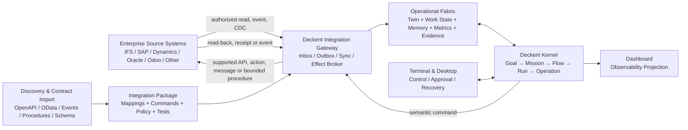
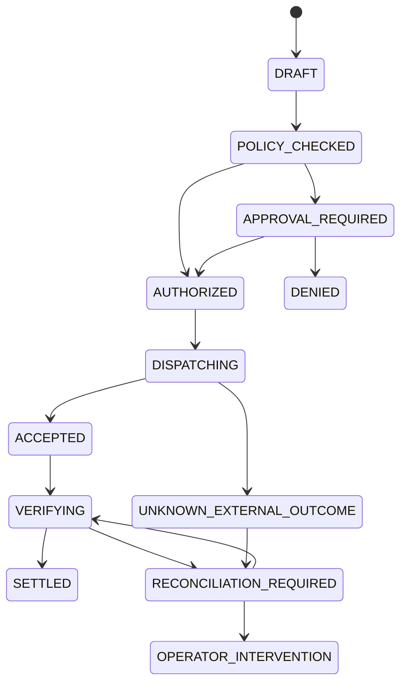
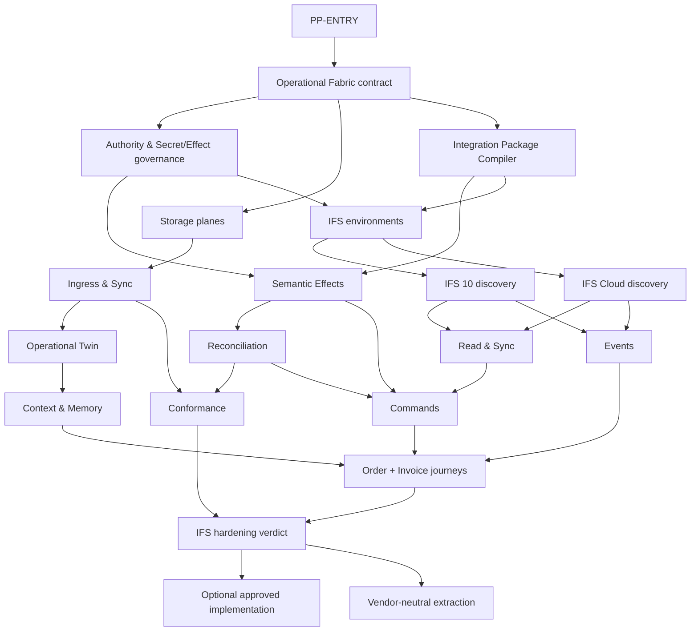

# Deckent Post-Product Vision — Operational Fabric ve IFS Enterprise Proving Program

**Oluşturulma:** 2026-08-27

**Owner direction:** Alperen

**Belge dili:** TR; protocol, product ve architecture terimleri EN

<!-- DECKENT-POST-PRODUCT:START -->
SCHEMA_VERSION=1
DOCUMENT_CLASS=POST_PRODUCT_VISION
STATUS=VISION_ONLY
EXECUTION_AUTHORITY=NONE
CANONICAL_WORK_LEDGER=docs/MASTER-PLAN.md
MASTER_PLAN_MUTATION=FORBIDDEN
CURRENT_PRODUCT_SCOPE_MUTATION=FORBIDDEN
ADMISSION_AUTHORITY=OWNER_EXPLICIT_DECISION
ADMISSION_EARLIEST=OWNER_DECLARED_PRODUCT_COMPLETION
FIRST_ENTERPRISE_PROVING_GROUNDS=IFS_APPLICATIONS_10,IFS_CLOUD
<!-- DECKENT-POST-PRODUCT:END -->

> **Authority boundary:** Bu dosya bugünün backlog'u, release planı, sprint kaynağı veya ikinci
> work ledger'ı değildir. Buradaki hiçbir `PP-*` outcome'u kendiliğinden `READY` olmaz ve
> `docs/MASTER-PLAN.md` kapsamını genişletmez. Deckent product tamamlandıktan sonra dahi çalışma
> ancak Alperen'in açık admission kararıyla, o günün canonical ledger ve execution contractına
> atomik işler olarak taşınır. Bu dosya vision ve design authority'sini korur; execution state
> üretmez.

---

## 1. North Star

Deckent'in post-product yönü yalnız “AI memory” geliştirmek değildir. Hedef, solo kullanıcıdan
dünyanın en büyük kurumlarına kadar aynı Deckent kernel'ını kullanan, kurumsal sistemlerle güvenli
şekilde çalışan bir **Operational Fabric** oluşturmaktır.

Bu yapıda Deckent:

- ERP, CRM, SCM, MES, WMS, finance, ticketing ve benzeri sistemlerin yerine geçmez.
- Kaynak sistemin seçilmiş gerçeklerini kendi policy-bound operational katmanında anlamlandırır.
- Süreç state'ini, worker/Brain context'ini, knowledge memory'yi, metrics'i ve evidence'ı birbirine
  karıştırmadan yönetir.
- Kullanıcı veya data owner yetkisi olmadan veri çekmez, paylaşmaz ya da external effect üretmez.
- İş sonucunu generic SQL/CRUD ile değil, `order.publish`, `invoice.approve` veya
  `purchase_request.release` gibi versioned **semantic command**'larla kaynak sisteme iletir.
- External sonucu varsaymaz; read-back, event veya reconciliation ile doğrular ve ancak ondan sonra
  Deckent Run/Operation settlement'ını kapatır.

İlk gerçek enterprise proving ground, birbirinin aynısı kabul edilmeyen iki ayrı target profile'dır:

1. **IFS Applications 10**
2. **IFS Cloud**

Amaç “IFS connector yazıldı” demek değil; gerçek geliştirme, test ve integration ortamlarında
end-to-end çalışma kanıtlandıktan sonra, owner ve ilgili kurum izin verirse gerçek implementasyona
gidebilecek bir enterprise integration modelini doğrulamaktır. IFS deneyimi daha sonra SAP,
Microsoft Dynamics, Oracle, Odoo ve diğer sistemlere taşınacak vendor-neutral contractları
şekillendirir; IFS'e özgü davranış kernel'a sızmaz.

## 2. Bitiş resmi

Başarılı post-product architecture aşağıdaki ilişkiyi kurar:



Canonical enterprise loop:

`observe → authorize → ingest → map → reason/work → propose effect → policy/approval → dispatch → verify → reconcile → settle`

Bu loop software work için kullanılan mevcut Deckent execution modelinden ayrı bir engine değildir.
ERP order, invoice veya production işi de aynı `Goal → Mission → Flow → Run → WorkItem → Attempt →
Operation`, permission, intervention, evidence ve settlement semantics'ini tüketir.

## 3. Değişmez ürün kararları

### 3.1 Source system authority korunur

- ERP veya diğer enterprise application, kendi business record'larının **system of record**'udur.
- Deckent'in kopyası “yeni ERP gerçeği” değil; source identity, version, freshness, policy ve
  provenance taşıyan bir **source projection** veya **operational twin**'dir.
- Deckent kaynak veriyi kendi kararına göre genişletmez; local enrichment ve öneriler ayrı overlay
  olarak tutulur.
- Source record ile Deckent overlay aynı tabloda belirsiz biçimde overwrite edilmez.

### 3.2 Database product identity değildir

PostgreSQL, vector index, SQLite veya herhangi bir engine tek başına ürün contractı değildir.
Deckent storage'ı capability contractları üzerinden seçer:

| Logical plane | Canonical görev | Zorunlu capabilities | Olası engine profilleri |
|---|---|---|---|
| Source Projection | Yetkili kaynak verinin seçilmiş, versioned görünümü | provenance, freshness, version, tenancy, encrypted fields | PostgreSQL, compatible distributed SQL, approved managed store |
| Operational Work | Süreç, run, work item, state transition ve relation'lar | ACID, concurrency control, indexes, partitioning, recovery | PostgreSQL-class relational engine |
| Local Hot Path | Offline/local-first cache, embedded runtime, fast exact lookup | crash safety, WAL, bounded footprint, deterministic migration | SQLite/better-sqlite3-class embedded engine |
| Knowledge Memory | Document/chunk/fact/entity/relation ve semantic retrieval | lexical + vector + metadata filters, provenance, retention | PostgreSQL + vector, dedicated vector/search adapter |
| Command Ledger | Intended external effect, idempotency, dispatch ve outcome | append-oriented history, transactional outbox, immutable receipts | ACID relational/event store |
| Metrics & Traces | Latency, throughput, freshness, cost, error ve outcome metrics | high-write ingest, retention, sampling contract, aggregation | time-series/columnar/relational adapter |
| Evidence & Audit | Kim, neye dayanarak, hangi yetkiyle, ne yaptı | tamper evidence, export, retention/legal hold, tenant isolation | append-only/WORM-capable evidence store |

PostgreSQL + vector, enterprise reference profile olabilir; embedded SQLite local-first ve solo/team
profile'ında güçlü bir hot path olarak kalabilir. Ancak adapter seçimi deployment topology, tenancy,
residency, throughput, recovery, operator yükü ve kurum policy'sine göre capability negotiation ile
yapılır. Unsupported capability sessiz fallback üretmez; typed `UNSUPPORTED` veya `HOLD` olur.

Deckent Core her plane için production-grade bir reference implementation sunabilir; bununla
birlikte storage/memory engine, index strategy veya managed service seçimi kernel fork'u gerektirmez.
Alternatif adapter aynı capability, migration, isolation, backup/restore, observability ve
conformance contractlarını geçtiğinde policy ile seçilebilir. Bir engine'i değiştirmek data
provenance'ını, authority modelini veya Run settlement semantics'ini değiştiremez.

### 3.3 Memory tek tablo veya tek vector index değildir

“Memory” aşağıdaki farklı semantics'lerin ortak adı olarak kullanılmaz:

- **Episodic memory:** Run, Operation, decision ve outcome geçmişi.
- **Semantic memory:** Onaylı facts, entities, relations ve domain knowledge.
- **Procedural memory:** Versioned workflow, playbook, policy ve tool usage bilgisi.
- **Working memory:** Aktif Run için bounded, expiring ve yeniden üretilebilir context.
- **Source projection:** Enterprise sisteminden alınmış, provenance-bound veri.
- **Metrics state:** Sayısal durum ve trend; LLM context'iyle aynı retention modeline sahip değildir.

Retrieval başlamadan önce tenant, principal, purpose, data classification, row/field policy, retention
ve residency uygulanır. Yetkisiz kayıt önce bulunup sonra maskelenmez; mümkün olan en erken aşamada
aday kümesinden çıkarılır. Vector embedding, source text'ten daha düşük güvenlik sınıfında kabul
edilmez.

### 3.4 Native integration, database write yetkisi demek değildir

Tercih sırası:

1. Vendor-supported business API/projection/action.
2. Supported event, outbound message veya integration channel.
3. Approved integration service veya MCP transport arkasındaki versioned business capability.
4. Legacy/on-prem sistemlerde bounded read, CDC veya owner-approved stored procedure.
5. Arbitrary table mutation: **yasak**; ancak ürün contractının dışında, ayrı ve açık owner risk
   kararıyla değerlendirilebilir.

Direct database seam kullanıldığında bile Deckent worker'a raw database credential verilmez. Secret
Broker ve Capability/Effect Broker exact operation'ı, tenant/environment scope'unu, time budget'ı,
row limit'i ve audit requirement'ı bağlar. Stored procedure adı “güvenli” olmak için yeterli değildir;
signature, effect class, authorization, idempotency ve read-back contractı gerekir.

### 3.5 Semantic command, generic CRUD değildir

External effect contractı business intent taşır:

```text
command: invoice.approve@v1
subject: ifs-cloud://tenant-a/Invoice/4711
expected_version: etag-or-domain-version
requested_by: principal://org/user
purpose: approved-finance-flow
policy_digest: sha256:...
idempotency_key: ...
payload: { approval_code, approved_amount, currency }
```

Command definition aşağıdakileri zorunlu kılar:

- Input/output schema ve business precondition.
- Effect classification ve required approval.
- Allowed target/environment ve principal/capability.
- Idempotency, optimistic concurrency ve retry policy.
- Success, rejection, timeout, partial effect ve unknown outcome semantics.
- Verification query/event ve reconciliation procedure.
- Compensation varsa açık contract; yoksa dürüst “non-compensatable” işareti.
- Redacted audit/evidence projection.

### 3.6 Distributed transaction varmış gibi davranılmaz

Deckent ile farklı ERP'ler arasında generic ACID transaction vaat edilmez. Güvenilirlik şu
primitives ile kurulur:

- Durable inbox ve transactional outbox.
- At-least-once delivery'ye karşı idempotency.
- Optimistic concurrency ve expected source version.
- Ordered aggregate processing gerektiğinde partition key.
- Bounded retry, exponential backoff, rate-limit awareness ve circuit breaker.
- Saga/compensation yalnız domain destekliyorsa.
- Read-after-write, receipt veya event tabanlı verification.
- Süresi dolmuş veya sonucu bilinmeyen call için `UNKNOWN_EXTERNAL_OUTCOME`; kör retry yoktur.
- Periodic ve on-demand reconciliation.

### 3.7 Tek kernel, farklı governance derinliği

Solo, team ve enterprise ayrı ürün kernel'ları değildir. Aynı execution ve evidence modelini
kullanırlar. Fark, capability ve governance deployment'ındadır:

- Solo: embedded/local profile, düşük operasyon yükü, kullanıcı kontrollü bağlantılar.
- Team: shared services, workspace policy, collaboration ve scoped connectors.
- Enterprise: organization/tenant hierarchy, SSO/SCIM, RBAC/ABAC, segregation of duties,
  approval chains, data residency, KMS/HSM, private networking, legal hold ve exportable audit.

Solo ve team kullanımı external ERP entegrasyonuna bağlı değildir. Deckent-native relational,
document ve semantic memory yüzeyleri kendi authoritative user/workspace data'sını tutabilir;
external source bağlantısı isteğe bağlı bir capability'dir. Enterprise connector modeli bu yalın
deneyimi zorunlu administration yüküyle kirletmez.

Enterprise görünümü için yeni bir ikinci state authority kurulmaz. Terminal ve Desktop primary
operator/control surfaces olarak kalır; Dashboard yalnız observability projection'dır. API, CLI,
MCP, autonomous ve connector ingress'leri aynı application-service authority'sini tüketir.

## 4. Canonical object ve authority modeli

### 4.1 Temel nesneler

| Object | Anlam | Authority sınırı |
|---|---|---|
| `SourceSystem` | IFS veya başka enterprise application instance'ı | Environment ve owner'a bağlıdır |
| `SourceObject` | ERP business record identity'si | Source system version/provenance taşır |
| `SourceProjection` | Seçilmiş source fields'ın policy-bound local görünümü | Read-only source truth |
| `OperationalTwin` | Süreci yürütmek için projection + relations + local state | Source truth'i overwrite etmez |
| `WorkOverlay` | Deckent araştırması, önerisi, draft'ı ve enrichment'ı | Deckent authority; explicit lifecycle |
| `IntegrationPackage` | Discovery, mappings, events, commands, policies ve tests | Signed, versioned, environment-bound |
| `SemanticCommand` | Kaynak sisteme gönderilecek business intent | Effect Broker dışında execute edilmez |
| `ExternalEffectAttempt` | Tek dispatch denemesi | Idempotency ve budget bound |
| `ReconciliationCase` | Deckent/source outcome uyuşmazlığı | Typed operator recovery gerektirir |
| `EvidenceReceipt` | Authority, input digest, dispatch ve verification kanıtı | Append-only/tamper-evident projection |
| `ContextGrant` | Brain/worker'a aktarılabilecek bounded data set | Purpose, TTL, fields ve recipient bound |

### 4.2 Principal ve scope

Her read, retrieval, command ve evidence access şu scope zincirine bağlanır:

`organization → tenant → environment → workspace → project → run → operation`

Principal türleri en az şunları kapsar:

- Human user/operator.
- Deckent Brain, worker veya service principal.
- Source-system integration principal.
- Approval authority.
- Break-glass principal.
- Auditor/read-only principal.

RBAC tek başına yeterli kabul edilmez. Resource, action, environment, data classification, purpose,
time, network zone, source owner ve segregation-of-duties koşulları policy kararına katılır.

### 4.3 Data ile instruction ayrımı

ERP'den, attachment'tan, note'tan veya integration payload'ından gelen içerik güvenilmeyen **data**dır;
Deckent/worker instruction authority'si değildir. Prompt injection, malicious document ve tool
redirection riskine karşı:

- Source content instruction channel'a yükseltilmez.
- Tool ve effect capability'si retrieved text ile genişlemez.
- Sensitive field'lar context grant üretilmeden önce redacted/tokenized olabilir.
- Output, source evidence ve policy decision ayrı provenance taşır.

## 5. Integration Package Compiler

Kurumsal entegrasyonun hedefi her müşteri için sınırsız custom code yazmak değil; source contractı
bir kez anlamlandırıp sürekli doğrulanan bir **Integration Package** üretmektir.

### 5.1 Kabul edilen discovery kaynakları

- OpenAPI/OAS.
- OData `$metadata` ve vendor projection catalog.
- AsyncAPI/event schema veya supported message catalog.
- WSDL/SOAP contractları.
- MCP capability/tool definitions; yalnız transport description olarak.
- Approved database schema, view, change-log veya procedure metadata.
- Vendor documentation ve customer customization manifesti.
- Human-authored domain mapping ve policy; explicit review gerektirir.

### 5.2 Package çıktısı

```text
integration-package/
  manifest
  source-profile
  discovery-snapshot
  schemas
  identity-mappings
  source-projections
  event-contracts
  semantic-commands
  approval-policy
  field-classification
  redaction-and-context-policy
  idempotency-and-concurrency
  verification-and-reconciliation
  rate-and-resource-budgets
  conformance-tests
  migration-and-drift-policy
  signatures-and-provenance
```

Package, source vendor/version, customer customization, tenant/environment, minimum capabilities ve
compatibility range taşır. “Bir kez schema okutuldu, artık sonsuza kadar native” varsayımı yasaktır.
Her connection'da veya configured interval'da fingerprint/drift kontrolü yapılır:

- Compatible additive drift → tested migration proposal.
- Breaking drift → effect path typed `SCHEMA_DRIFT` ile kapanır; write/action durur.
- Undocumented/custom behavior → explicit owner/domain review.
- Package signature veya source identity uyuşmazlığı → admission yok.

Transport adapters ile vendor/domain packages ayrıdır. Örneğin OData adapter pagination, auth,
ETag ve protocol errors bilir; IFS package ise `CustomerOrder`, release/publish action ve domain
precondition'larını bilir. Bu ayrım yeni vendor eklemeyi kernel fork'una dönüştürmez.

## 6. Runtime data flow

### 6.1 Ingress

Ingress yöntemleri capability ve source policy'ye göre seçilir:

- Initial bounded snapshot.
- Incremental query/watermark.
- Event/outbound message.
- Change Data Capture.
- Scheduled reconciliation scan.
- Explicit operator refresh.

Her ingest envelope en az şunları taşır:

`tenant, source, environment, object identity, source version, observed_at, source_time,
schema version, classification, payload digest, correlation, provenance`

Duplicate, out-of-order ve late events normal durum olarak modellenir; corruption veya worker
başarısızlığıyla karıştırılmaz.

### 6.2 Operational work ve context delivery

Deckent source projection'dan bounded operational twin üretir. Brain/worker'a tüm ERP dump'ı
verilmez. `ContextGrant`, exact task purpose'ına göre:

- Allowed object/field set.
- Freshness requirement.
- Maximum rows/tokens/bytes.
- Retrieval strategy ve confidence.
- TTL ve onward-sharing rule.
- Required citations/provenance.

taşır. Worker sonucu source truth'i doğrudan mutate etmez; `WorkOverlay` ve gerekiyorsa
`SemanticCommand` proposal'ı üretir.

### 6.3 Effect ve settlement



`ACCEPTED`, vendor'ın request'i kabul ettiğini gösterebilir; business outcome'un gerçekleştiğini
tek başına kanıtlamaz. Run ancak verification contractı sağlandığında `SETTLED` olur.

### 6.4 Typed failure vocabulary

En az aşağıdaki durumlar first-class olmalıdır:

- `AUTHENTICATION_UNAVAILABLE`
- `AUTHORIZATION_DENIED`
- `POLICY_UNAVAILABLE`
- `SOURCE_UNREACHABLE`
- `RATE_LIMITED`
- `SCHEMA_DRIFT`
- `STALE_SOURCE_VERSION`
- `CONCURRENT_MODIFICATION`
- `DUPLICATE_DELIVERY`
- `OUT_OF_ORDER_EVENT`
- `VALIDATION_REJECTED`
- `APPROVAL_EXPIRED`
- `PARTIAL_EXTERNAL_EFFECT`
- `UNKNOWN_EXTERNAL_OUTCOME`
- `VERIFICATION_MISMATCH`
- `RECONCILIATION_REQUIRED`
- `NON_COMPENSATABLE_EFFECT`
- `RESIDENCY_POLICY_DENIED`
- `UNSUPPORTED_SOURCE_CAPABILITY`

Her failure; retryable/non-retryable sınıfı, data/effect safety durumu, recommended operator action,
evidence pointer ve resume boundary taşır. “Failed” tek başına kabul edilebilir enterprise state
değildir.

## 7. IFS Enterprise Proving Program

IFS programı post-product architecture'ın ilk gerçek sınavıdır. IFS 10 ve IFS Cloud aynı driver'ın
iki config'i olarak varsayılmaz; shared protocol capability'leri olsa bile discovery, auth,
customization, event, action ve lifecycle evidence'ları ayrı tutulur.

### 7.1 Hedef profiller

| Boyut | IFS Applications 10 | IFS Cloud | Program kararı |
|---|---|---|---|
| Release identity | Exact Update/build ve customer customization kanıtlanır | Exact release/update channel ve tenant kanıtlanır | “IFS” tek version label değildir |
| API policy | Kurulu release için geçerli IFS API Usage Policy doğrulanır | Geçerli IFS Cloud API Usage Policy doğrulanır | Documentation değil live capability ground truth'tur |
| Business API | Mevcut projections/services/actions inventory edilir | OData v4 projections ve actions; API Explorer/OpenAPI discovery değerlendirilir | Supported business API birinci tercih |
| Discovery | `$metadata`, available projection/service catalog ve customer artifacts | `$metadata`, `$openapi`, `AllProjections`/API Explorer ve package artifacts | Snapshot signed ve drift-detectable olur |
| Events | IFS Connect/event/outbound capabilities exact environment'ta doğrulanır | Supported events/custom events/IFS Connect capabilities doğrulanır | Polling sessiz fallback değildir |
| Customization | Custom fields, projections, procedures ve business rules ayrıca inventory edilir | Configuration, projection extensions, custom actions/events ayrıca inventory edilir | Customer-specific layer package extension'ıdır |
| Security | Exact auth, permission set, network ve service principal modeli | OAuth/identity, projection ACL/permissions, network ve service principal modeli | Least privilege ve no-worker-secret |
| Effect | Supported action/service veya açıkça approved bounded seam | Premium/Integration/Standard API sırası ve supported actions | Table write yok |
| Verification | Read-back/event/domain status | Read-back/event/domain status | Request success settlement değildir |

IFS genel API usage policy'si IFS Applications 10 Update 7 ve sonrası için de kapsam belirtir; bu,
her IFS 10 ortamında aynı projection/action setinin bulunduğu anlamına gelmez. Exact environment
evidence her zaman documentation varsayımının önündedir.

### 7.2 Proving sequence

#### A. Environment ve authority qualification

- IFS 10 ve IFS Cloud için ayrı non-production integration environments.
- Exact version/build, installed components, customizations, licensing ve support boundary.
- Data owner, technical owner, security owner ve approval authorities.
- Network path, identity, secret custody, rate/resource budgets ve test data classification.
- Production'a geçişin ayrı owner/enterprise approval olduğu açık contract.

#### B. Discovery ve package generation

- Projection/service/action/event catalog snapshot.
- OpenAPI/OData metadata import ve canonical schema normalization.
- Business object identity, relation, state machine ve version semantics.
- Customer customization delta.
- Required permissions ve field classification.
- Generated conformance suite'in live non-production doğrulaması.

#### C. Read/sync proving

- Bounded snapshot ve incremental sync.
- Pagination, filtering, ETag/version ve time-zone semantics.
- Duplicate, missing, reordered ve late data senaryoları.
- Source load budget ve backpressure.
- Local projection freshness ve reconciliation ölçümü.

#### D. Operational twin, memory ve metrics

- Seçilmiş order/invoice nesneleri için source projection + work overlay ayrımı.
- Entity/relation, lexical/vector retrieval ve field-policy-aware context grants.
- Run/worker/Brain'in exact provenance ile araştırma ve öneri üretmesi.
- Process status, SLA, anomaly, latency ve outcome metrics'inin ayrı plane'de tutulması.

#### E. Semantic effect proving

- İlk effect use case'i owner ve IFS domain owner tarafından seçilir.
- Supported projection action/API/service üzerinden exact semantic command.
- Policy, human approval, segregation of duties ve expected source version.
- Idempotency, timeout, retry ve rate-limit behavior.
- Raw credentials worker/Brain context'ine girmez.

#### F. Verify, reconcile ve recover

- Command receipt sonrası read-back/event verification.
- Network loss sırasında accepted olup olmadığı bilinmeyen request.
- Concurrent ERP user update'i.
- Partial/non-compensatable effect.
- Operator pause/resume, re-authorization ve manual reconciliation.
- Deckent ve IFS audit zincirlerinin correlation ID ile bağlanması.

#### G. Enterprise hardening ve implementasyon kararı

- Security review, threat model, data-flow/residency assessment.
- Load, soak, failover, backup/restore ve disaster recovery proof.
- Cross-platform Deckent operator surfaces ve deployment topology proof.
- Supportability, upgrade/drift runbook ve rollback/disable switch.
- IFS 10 ve IFS Cloud için ayrı go/no-go verdict.
- Başarılı proof, production implementasyonunu otomatik yetkilendirmez; kurum ve Alperen ayrı karar
  verir.

### 7.3 İlk iki golden business journey

#### Journey 1 — Order publish/release

1. IFS'teki eligible order, supported query/event ile Deckent Inbox'a gelir.
2. Source identity, version, customer/order fields ve classification doğrulanır.
3. Operational twin oluşturulur; Run gerekli araştırma, validation veya hazırlığı yapar.
4. Worker sonucu source data'ya yazılmaz; signed proposal ve `order.publish@v1` command draft'ı
   üretir.
5. Policy; user, amount/risk, environment, segregation of duties ve source freshness'i değerlendirir.
6. Gerekliyse Terminal/Desktop approval surface'i exact effect diff'i, source evidence'ı ve recovery
   sınırını gösterir.
7. Effect Broker supported IFS action/API'sini idempotency ve expected version ile çağırır.
8. IFS status read-back veya event ile doğrulanır.
9. Uyuşmazlıkta Run kapanmaz; reconciliation case açılır. Doğrulanmış outcome evidence receipt ile
   settlement'a gider.

#### Journey 2 — Invoice approval

Aynı kernel ve effect contractı kullanılır; ancak amount thresholds, finance role, dual-control,
currency, tax, closed period, attachment/data classification ve non-compensatable effect policy'leri
ayrıdır. `invoice.approve` generic `update invoice status` değildir; IFS business precondition'larını
ve approval authority'sini taşır.

Bu journeys yalnız demo happy path'iyle kapanmaz. Denied approval, stale version, duplicate command,
external timeout, partial result, schema drift, operator cancellation ve later reconciliation testleri
aynı acceptance'ın parçasıdır.

## 8. Performance, scale ve operability contractı

“Her şey millisecond” ifadesi external ERP latency'sini gizleyen bir pazarlama iddiasına
dönüştürülmez. Latency budget katmanlara ayrılır ve p50/p95/p99 ile ölçülür.

### 8.1 Başlangıç performance budgets

Bu değerler post-product admission sırasında hardware/topology baseline'ıyla yeniden doğrulanacak
engineering budgets'tır; bugünkü ürün claim'i değildir.

| Path | Başlangıç budget | Ölçüm sınırı |
|---|---:|---|
| Embedded exact-key/policy cache lookup | warm p95 ≤ 5 ms, p99 ≤ 15 ms | External I/O hariç |
| Local hybrid memory retrieval | warm p95 ≤ 25 ms | Embedding generation ve provider call hariç |
| Same-region operational query | p95 ≤ 50 ms | Network + store dahil; ERP hariç |
| Command validation + local policy decision | p95 ≤ 20 ms | Human approval ve external dispatch hariç |
| Accepted event'in internal visibility'si | p95 ≤ 1 s | Source event delivery capability mevcutsa |
| IFS effect round-trip | Ayrı measured SLO | Deckent local latency ile birleştirilmez |
| Reconciliation lag | Risk-class specific | Finansal/high-risk effect için daha sıkı |

### 8.2 Scale requirements

- Tenant-aware partitioning ve noisy-neighbor isolation.
- Bounded queues, backpressure ve admission control.
- Connection pools ve source-specific concurrency/rate budgets.
- Incremental indexes, partition lifecycle ve online migration.
- Hot/warm/cold retention; legal hold ile çelişmeyen deletion.
- Cache correctness: tenant/policy/source-version anahtarları olmadan shared cache yok.
- Horizontal workers; aggregate ordering gerekiyorsa deterministic partition ownership.
- Multi-region deployment'ta data residency ve effect locality.
- Metrics için exact/sampled/delayed ayrımı; “0” ile “unknown/not observed” karıştırılmaz.
- Cost, storage growth, embedding/index maintenance ve source-system load'ı visible budget olur.

### 8.3 Operasyon yükü

Kolay entegrasyon, kurumun güvenlik ve topology gerçeklerini gizlemek anlamına gelmez. Hedef:

- Preflight ile eksik permission/network/capability'yi write başlamadan bulmak.
- Generated fakat reviewable package ve policy.
- Dry-run, shadow read, effect-disabled ve canary modes.
- Zero-downtime compatible migrations; breaking değişiklikte explicit stop.
- One-click değil, **one-understood-flow** onboarding: kullanıcı neye izin verdiğini görür.
- Support bundle'larda secret/PII redaction ve export approval.

## 9. Security, privacy ve compliance acceptance

Post-product enterprise integration aşağıdaki zincirin tamamı olmadan production-ready sayılmaz:

- Organization/tenant/environment isolation.
- SSO, SCIM ve lifecycle-managed service principals.
- RBAC + contextual policy/ABAC ve segregation of duties.
- Short-lived credentials; Vault/KMS/HSM veya approved secret provider integration.
- mTLS/private networking/allowlist veya kurumun approved network posture'ı.
- Encryption in transit/at rest; customer-managed key profile gerektiğinde.
- Field-level classification, tokenization/redaction ve context-minimization.
- Purpose-bound retrieval ve onward-sharing policy.
- Retention, deletion, legal hold, data export ve residency contractları.
- Append-only/tamper-evident authority/effect/evidence chain.
- Break-glass için expiring, reason-bound, fully audited elevation.
- Dependency/SBOM, package signing, vulnerability ve supply-chain gates.
- Prompt injection, data poisoning, malicious tool result ve exfiltration threat tests.
- Source-system audit ile Deckent correlation; kullanıcıya açıklanabilir outcome.

MCP bir transport/capability description yüzeyi olabilir; authorization authority değildir. MCP tool
sunucusu veya başka connector, Deckent policy/effect broker'ını bypass edemez ve raw enterprise
credential'ı Brain/worker'a taşıyamaz.

## 10. Verification matrix

### 10.1 Target/environment

| Boyut | Zorunlu kapsama |
|---|---|
| IFS | IFS Applications 10 exact supported Update/build; IFS Cloud exact release/tenant |
| Data | Synthetic + representative masked data; edge cases; high-volume sets |
| Topology | On-prem/private network, approved cloud path, proxy/firewall/TLS constraints |
| Deckent hosts | Linux, macOS, Windows native, Windows WSL; unsupported hücre honest failure |
| Tenancy | Single tenant, multi-tenant isolation, noisy neighbor, cross-tenant denial |
| Locale | Time zone, DST, locale, Unicode, currency, decimal and date semantics |
| Lifecycle | Install, upgrade, package drift, credential rotation, disable, uninstall |

### 10.2 Failure/chaos

- Connection loss before send, during send ve after vendor acceptance.
- Token expiry/rotation ve revoked principal.
- Duplicate/out-of-order/late event.
- Rate-limit, server overload ve vendor maintenance window.
- Source record concurrent modification.
- Partial response ve malformed/custom field.
- Package/schema/action drift.
- Deckent worker crash, broker restart ve queue replay.
- Store failover, backup restore ve reconciliation after restore.
- Human approval expiry/rejection/cancellation.
- Non-compensatable effect sonrası verification mismatch.
- Metrics/evidence store unavailable iken effect fail-closed policy.

### 10.3 Proof classes

Bir outcome ancak uygulanabilir boyutlarının tamamında şu proof zincirine sahipse kapanabilir:

`artifact-present → wired-all-ingresses → policy-enabled → hermetic-proven → live-IFS-proven →
cross-platform-proven → load/chaos-proven → recovery-proven → evidence-export-proven`

Mock-only, isolated driver import, configuration flag veya happy-path screenshot production proof
değildir.

## 11. Post-product candidate outcome catalog

### 11.1 Catalog contract

Bu tablo MASTER-PLAN biçiminde atomic, dependency-bound ve acceptance-driven düşünmeyi korur; ancak
**canonical ledger değildir**.

- `PP-*` kimlikleri vision namespace'idir; canonical Work ID değildir.
- Bütün satırlar `VISION_ONLY` kalır. Bu dosyada `READY`, `IN_PROGRESS` veya `DONE` yapılmaz.
- `Truth` başlangıçta `0/0/0/0/0/0/0`'dır ve mevcut partial code'u küçümsemez; yalnız bu full
  outcome için post-product closure claim'i olmadığını söyler.
- `DependsOn` yalnız bu vision içindeki future sequencing'i anlatır.
- Admission zamanı owner, seçilen outcome'u o günün `docs/MASTER-PLAN.md` schema'sında yeni canonical
  ID, exact scope, gates, owner ve evidence contractıyla açar. Otomatik toplu kopyalama yoktur.
- Existing `src/core/erp/*`, memory store, capability broker ve kernel primitives değerli foundation
  evidence'ıdır; bu catalogdaki end-to-end outcomes için tek başına acceptance değildir.

Truth sırası: `C/W/E/H/L/X/S` = artifact / wiring / effective policy / hermetic / live / cross-platform /
scale.

| Order | Vision ID | Program | Outcome | Priority | DependsOn | Admission gate | State | Truth C/W/E/H/L/X/S | Acceptance özeti |
|---:|---|---|---|---|---|---|---|---|---|
| 10 | PP-OF-001 | Operational Fabric | Canonical object, state, authority ve settlement contractı | P0 | — | PP-ENTRY | VISION_ONLY | 0/0/0/0/0/0/0 | ERP work aynı kernel'da; source truth, overlay, command ve evidence ayrımı versioned contract olur |
| 20 | PP-AUTH-001 | Governance | Enterprise principal, policy, secret ve effect authority | P0 | PP-OF-001 | PP-ENTRY | VISION_ONLY | 0/0/0/0/0/0/0 | No-worker-secret, least privilege, SoD, tenant/residency ve break-glass live proven |
| 30 | PP-STORE-001 | Storage | Capability-negotiated multi-plane storage SPI ve reference profiles | P0 | PP-OF-001, PP-AUTH-001 | PP-ENTRY | VISION_ONLY | 0/0/0/0/0/0/0 | Relational/vector/local/metrics/evidence planes portable, recoverable ve scale-proven |
| 40 | PP-PKG-001 | Integration Compiler | Signed, versioned Integration Package Compiler | P0 | PP-OF-001, PP-AUTH-001 | PP-ENTRY | VISION_ONLY | 0/0/0/0/0/0/0 | OpenAPI/OData/event/procedure inputs package, policy, commands, tests ve drift contractına dönüşür |
| 50 | PP-INGRESS-001 | Integration Runtime | Inbox, snapshot, event, CDC ve sync runtime | P0 | PP-STORE-001, PP-PKG-001 | PP-ENTRY | VISION_ONLY | 0/0/0/0/0/0/0 | Duplicate/order/freshness/backpressure/replay ve source-load budgets kanıtlanır |
| 60 | PP-TWIN-001 | Operational Data | Source Projection, Operational Twin ve Work Overlay | P0 | PP-STORE-001, PP-INGRESS-001 | PP-ENTRY | VISION_ONLY | 0/0/0/0/0/0/0 | Source truth overwrite edilmeden process relations ve local work yürütülür |
| 70 | PP-CONTEXT-001 | Memory | Policy-first hybrid memory ve ContextGrant delivery | P0 | PP-STORE-001, PP-TWIN-001, PP-AUTH-001 | PP-ENTRY | VISION_ONLY | 0/0/0/0/0/0/0 | Worker/Brain yalnız purpose-bound, field-filtered, provenance-bearing context alır |
| 80 | PP-EFFECT-001 | Effects | Semantic Command Registry ve brokered external effects | P0 | PP-AUTH-001, PP-PKG-001, PP-TWIN-001 | PP-ENTRY | VISION_ONLY | 0/0/0/0/0/0/0 | Generic CRUD yerine schema/policy/idempotency/verification-bound commands execute edilir |
| 90 | PP-RECON-001 | Reliability | Outbox, idempotency, Saga ve reconciliation engine | P0 | PP-INGRESS-001, PP-EFFECT-001 | PP-ENTRY | VISION_ONLY | 0/0/0/0/0/0/0 | Unknown/partial/concurrent outcomes kör retry olmadan recover edilir |
| 100 | PP-METRICS-001 | Observability | Process, data freshness, performance, cost ve outcome metrics | P1 | PP-STORE-001, PP-INGRESS-001, PP-EFFECT-001 | PP-ENTRY | VISION_ONLY | 0/0/0/0/0/0/0 | Exact/sampled/unknown ayrımı ve tenant-safe SLOs Terminal/Desktop/Dashboard'a yansır |
| 110 | PP-SURFACE-001 | Operator UX | Integration control, approval, recovery ve audit surfaces | P0 | PP-AUTH-001, PP-EFFECT-001, PP-RECON-001 | PP-ENTRY | VISION_ONLY | 0/0/0/0/0/0/0 | Terminal/Desktop full control; Dashboard authority üretmeyen observability projection olur |
| 120 | PP-CONFORMANCE-001 | Assurance | Vendor-neutral package/runtime conformance ve chaos suite | P0 | PP-INGRESS-001, PP-EFFECT-001, PP-RECON-001 | PP-ENTRY | VISION_ONLY | 0/0/0/0/0/0/0 | Protocol, security, lifecycle, failure, recovery, cross-platform ve scale proof standardlaşır |
| 200 | PP-IFS-ENV-001 | IFS Proving | IFS 10 ve IFS Cloud environment/authority qualification | P0 | PP-OF-001, PP-AUTH-001 | PP-ENTRY + IFS-ACCESS | VISION_ONLY | 0/0/0/0/0/0/0 | Exact versions, owners, non-prod access, permissions, network, data ve budgets signed inventory olur |
| 210 | PP-IFS10-DISC-001 | IFS 10 | IFS Applications 10 discovery ve package profile | P0 | PP-IFS-ENV-001, PP-PKG-001 | IFS10-QUALIFIED | VISION_ONLY | 0/0/0/0/0/0/0 | Installed projections/services/events/customizations live-discovered ve drift-detectable olur |
| 220 | PP-IFSC-DISC-001 | IFS Cloud | IFS Cloud discovery ve package profile | P0 | PP-IFS-ENV-001, PP-PKG-001 | IFSCLOUD-QUALIFIED | VISION_ONLY | 0/0/0/0/0/0/0 | OData/OpenAPI/API catalog/actions/events/ACL live-discovered ve drift-detectable olur |
| 230 | PP-IFS-READ-001 | IFS Proving | IFS 10 + Cloud bounded read ve incremental sync | P0 | PP-IFS10-DISC-001, PP-IFSC-DISC-001, PP-INGRESS-001 | IFS-NONPROD | VISION_ONLY | 0/0/0/0/0/0/0 | Both targets pagination/version/freshness/load/reconciliation ile live proven |
| 240 | PP-IFS-EVENT-001 | IFS Proving | IFS supported events/outbound messages ve replay | P0 | PP-IFS10-DISC-001, PP-IFSC-DISC-001, PP-INGRESS-001 | IFS-NONPROD | VISION_ONLY | 0/0/0/0/0/0/0 | Event available/unavailable profile'ları typed; duplicate/order/loss recovery live proven |
| 250 | PP-IFS-CMD-001 | IFS Proving | IFS semantic command/action execution | P0 | PP-IFS-READ-001, PP-EFFECT-001, PP-RECON-001 | IFS-EFFECT-APPROVAL | VISION_ONLY | 0/0/0/0/0/0/0 | Owner-selected supported business action least-privilege, approval, idempotency ve verify ile çalışır |
| 260 | PP-IFS-ORDER-001 | IFS Journey | Order publish/release end-to-end journey | P0 | PP-IFS-EVENT-001, PP-IFS-CMD-001, PP-CONTEXT-001, PP-SURFACE-001 | IFS-EFFECT-APPROVAL | VISION_ONLY | 0/0/0/0/0/0/0 | Observe-to-settle happy/failure/recovery paths IFS 10 ve Cloud target matrixinde kanıtlanır |
| 270 | PP-IFS-INVOICE-001 | IFS Journey | Invoice approval end-to-end journey | P0 | PP-IFS-EVENT-001, PP-IFS-CMD-001, PP-CONTEXT-001, PP-SURFACE-001 | FINANCE-DOMAIN-APPROVAL | VISION_ONLY | 0/0/0/0/0/0/0 | Finance SoD, thresholds, stale/deny/unknown/non-compensatable paths dahil live proof oluşur |
| 280 | PP-IFS-HARDEN-001 | IFS Assurance | IFS security, load, chaos, upgrade ve recovery certification | P0 | PP-IFS-ORDER-001, PP-IFS-INVOICE-001, PP-CONFORMANCE-001, PP-METRICS-001 | IFS-NONPROD | VISION_ONLY | 0/0/0/0/0/0/0 | IFS 10 ve Cloud için ayrı evidence-backed GO/NO-GO; ortak başarı varsayılmaz |
| 290 | PP-IFS-IMPLEMENT-001 | IFS Implementation | Approved enterprise production implementation package | P0 | PP-IFS-HARDEN-001 | FRESH OWNER + ENTERPRISE APPROVAL | VISION_ONLY | 0/0/0/0/0/0/0 | Deployment, migration, support, rollback, audit ve acceptance kurumla imzalanır; proof otomatik deploy olmaz |
| 400 | PP-PORTABILITY-001 | Vendor Neutrality | IFS evidence'ından vendor-neutral contracts extraction | P0 | PP-IFS-HARDEN-001 | OWNER PORTABILITY REVIEW | VISION_ONLY | 0/0/0/0/0/0/0 | IFS-specific assumptions ayrıştırılır; transport/domain/kernel boundaries conformance ile kanıtlanır |
| 410 | PP-SDK-001 | Ecosystem | Connector/package SDK, certification ve compatibility registry | P1 | PP-PORTABILITY-001, PP-CONFORMANCE-001 | OWNER ECOSYSTEM ADMISSION | VISION_ONLY | 0/0/0/0/0/0/0 | Third-party packages sandboxed, signed, versioned, testable ve revocable olur |
| 420 | PP-ECOSYSTEM-001 | Ecosystem | Next enterprise systems admission framework | P1 | PP-SDK-001 | OWNER VENDOR SELECTION | VISION_ONLY | 0/0/0/0/0/0/0 | SAP/Dynamics/Oracle/Odoo/other seçimleri evidence/risk/value ile; kernel fork'u olmadan yapılır |

### 11.2 Dependency spine



## 12. Admission ve settlement kuralları

### 12.1 PP-ENTRY

Bu vision'dan ilk iş ancak aşağıdakilerin tamamı oluştuğunda seçilebilir:

1. Alperen, mevcut Deckent product programının tamamlandığını açıkça ilan eder.
2. Alperen, post-product programından exact outcome ve scope'u ayrıca admit eder.
3. O günün canonical ledger/operating policy'si okunur; `PP-*` doğrudan execution ID yapılmaz.
4. IFS işi için authorized non-production environment, exact data owner ve technical/security owner
   belirlenir.
5. Version/build, license/support boundary, data classification, network ve credential custody
   doğrulanır.
6. İlk use case'in business owner'ı, success/failure semantics'i ve effect risk class'ı yazılıdır.
7. Product planı “entegrasyon da yapalım” diye geriye doğru uzatılmaz; yeni post-product program ayrı
   owner admission'ıyla başlar.

### 12.2 Production effect gate

Non-production proof veya `PP-IFS-HARDEN-001` sonucu production effect yetkisi değildir. Production
implementation için fresh:

- Alperen kararı.
- Enterprise data/application/security owner onayı.
- Exact environment, principal, command set ve budgets.
- Migration, disable, rollback/reconciliation ve support planı.
- Data processing, retention, audit ve residency acceptance'ı.

gerekir.

### 12.3 Honest closure

- IFS 10 başarılı, IFS Cloud başarısız olabilir veya tersi; sonuçlar birleştirilmez.
- Read integration başarısı effect integration başarısı sayılmaz.
- Request `2xx`/accepted olması business settlement değildir.
- Performance proof yalnız Deckent local duration'ı ölçüp ERP süresini gizleyemez.
- Unsupported vendor capability custom DB mutation ile sessizce tamamlanmaz.
- Environment erişimi, license veya enterprise approval yoksa sonuç typed `HOLD` olur; demo ile
  production claim üretilmez.

## 13. Explicit non-goals

Bu vision şunları vaat etmez:

- Deckent'in ERP'nin yerini alması veya tüm ERP database'ini kopyalaması.
- Her vendor/version için tek generic SQL connector.
- Her external işlem için ACID distributed transaction.
- LLM'nin tek başına finance/order approval authority olması.
- MCP'nin policy, identity veya audit authority olması.
- Vector search'ün relational integrity, process state veya metrics store yerine geçmesi.
- IFS 10 ve IFS Cloud'un aynı capability setine sahip olması.
- Bir kez schema import edildiğinde drift olmadan sonsuza kadar çalışılması.
- Product tamamlanmadan bu işleri bugünkü MASTER'a eklemek.
- Başarılı testten production'a otomatik geçiş.

## 14. Product surfaces

| Surface | Post-product sorumluluğu |
|---|---|
| Terminal | Discovery, package diff, preflight, sync/effect state, approval, pause/resume/cancel, reconciliation ve evidence export için tam operator control |
| Desktop | Aynı application-service authority'sinin visual operator workspace'i; source/effect diff, policy rationale, timeline ve recovery |
| Dashboard | Freshness, throughput, backlog, failures, cost ve SLO observability; command/approval authority üretmez |
| API/CLI | Versioned, identity-bound automation adapters; aynı services ve policy |
| MCP | Bounded capability transport; authorization/effect broker bypass edemez |
| Connectors | Notification ve approved interaction ingress'i; ikinci workflow/state engine değildir |

Solo kullanıcı yalnız ihtiyaç duyduğu progressive-disclosure yüzeyini görür. Enterprise operator
tenant/environment/policy/audit derinliğine erişir; aynı action aynı canonical operation semantics'ini
korur.

## 15. Kaynaklar ve mevcut foundation

### 15.1 Deckent internal authority

- [`docs/MASTER-PLAN.md`](MASTER-PLAN.md) — tek canonical current work ledger.
- [`.deckent/workspace/IDENTITY.md`](../.deckent/workspace/IDENTITY.md) — product identity ve surface
  authority.
- [`docs/en/vision.md`](en/vision.md) ve [`docs/tr/vision.md`](tr/vision.md) — aynı kernel,
  solo-to-enterprise yönü.
- [`src/core/erp/`](../src/core/erp/) — mevcut ERP read-oriented driver foundation.
- [`src/core/capability-broker.ts`](../src/core/capability-broker.ts) — mevcut capability broker
  foundation.

Bu foundation'lar korunur ve zamanı geldiğinde disk/live evidence ile değerlendirilir. Bu belge
mevcut implementation'ın yeteneklerini genişletmiş gibi claim üretmez.

### 15.2 IFS primary references

- [IFS API Usage Policies](https://docs.ifs.com/policy/)
- [IFS Cloud API Usage Policy](https://docs.ifs.com/policy/APIUsageCloud.pdf)
- [IFS API Usage Policy — IFS Cloud 21R1+ ve IFS Applications 10 Update 7+](https://docs.ifs.com/policy/APIUsage.pdf)
- [IFS Cloud OData Provider](https://docs.ifs.com/techdocs/25r1/040_tailoring/300_extensibility/040_ifs_odata/)
- [IFS Cloud API Documentation ve `$openapi` discovery](https://docs.ifs.com/techdocs/25r1/040_tailoring/300_extensibility/010_get_started/100_api_documentation/)
- [IFS Cloud API Explorer](https://docs.ifs.com/techdocs/25R2/040_tailoring/300_extensibility/020_api_explorer/)
- [IFS Cloud Entity Service APIs](https://docs.ifs.com/techdocs/25R1/060_development/050_development_tools/002_developer_studio/030_reference/930_entity_service_apis/)
- [IFS Cloud Projection ACL](https://docs.ifs.com/techdocs/25R1/030_administration/010_security/008_custom_data_access_control/020_apply_acl_to_projection/)
- [IFS Cloud Configuration, projection extension ve custom actions/events](https://docs.ifs.com/techdocs/25R1/040_tailoring/225_configuration/)

### 15.3 Protocol ve reliability references

- [OpenAPI Specification](https://spec.openapis.org/oas/latest.html)
- [OData Version 4.01](https://docs.oasis-open.org/odata/odata/v4.01/cs02/part1-protocol/odata-v4.01-cs02-part1-protocol.pdf)
- [AsyncAPI Specification](https://www.asyncapi.com/docs/reference/specification/v3.0.0)
- [Debezium Outbox Event Router](https://debezium.io/documentation/reference/stable/transformations/outbox-event-router.html)
- [Model Context Protocol — Tools](https://modelcontextprotocol.io/specification/2025-11-25/server/tools)
- [Model Context Protocol — Authorization](https://modelcontextprotocol.io/specification/draft/basic/authorization)
- [pgvector](https://github.com/pgvector/pgvector)
- [SQLite Write-Ahead Logging](https://www.sqlite.org/wal.html)

## 16. Decision log

| Date | Authority | Decision |
|---|---|---|
| 2026-08-27 | Alperen | Enterprise memory/integration yönü yalnız AI memory değil, source systems ile güvenli çalışan Operational Fabric olarak tanımlandı |
| 2026-08-27 | Alperen | PostgreSQL ve Oracle örnek technology/vendor'dır; architecture storage-, protocol- ve vendor-neutral kurulacak |
| 2026-08-27 | Alperen | IFS Applications 10 ve IFS Cloud, product tamamlandıktan sonraki ilk development/test/integration proving grounds olacak |
| 2026-08-27 | Alperen | Proof başarılı olursa ayrıca yetkilendirilmiş implementasyona gidilebilecek; başarı otomatik production yetkisi değildir |
| 2026-08-27 | Alperen | Bu program `docs/MASTER-PLAN.md`'i bugün uzatmayacak; `post-product.md` vision olarak tutulacak |

---

**Son sözleşme:** Deckent enterprise sistemin database'ine sahip olmaya çalışmaz; kurumun verdiği
authority içinde business gerçeğini güvenli biçimde gözlemler, kendi katmanında işi yürütür, exact
semantic effect'i broker üzerinden uygular, sonucu kaynak sistemde doğrular ve her adımı kanıtla
kapatır. IFS 10 ve IFS Cloud bu iddianın ilk gerçek, ayrı ayrı ölçülen sınavıdır.
