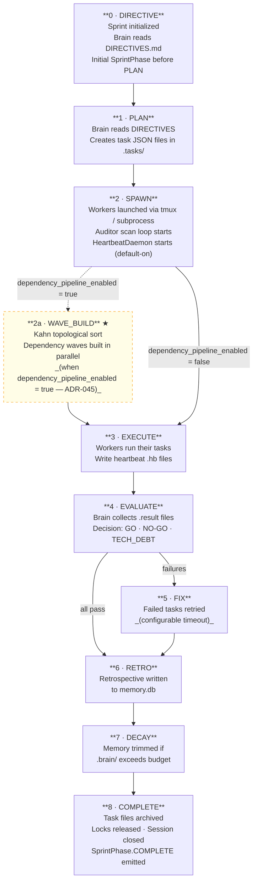
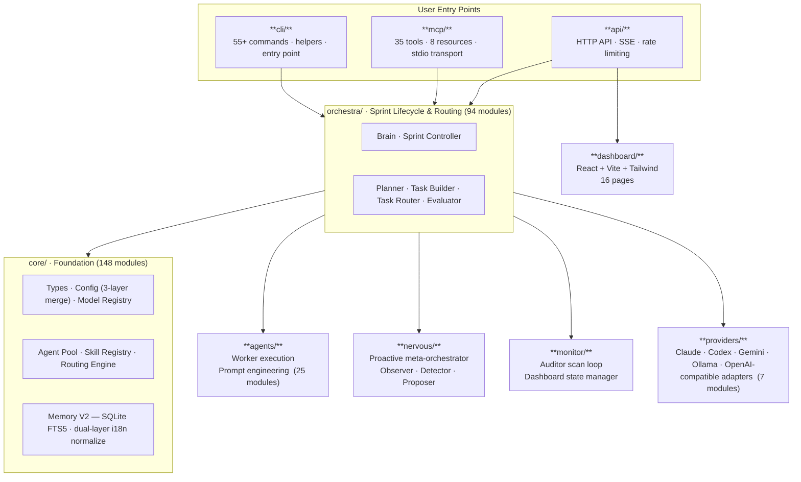

# Deckent Lifecycle & Architecture Diagrams

Visual reference for the sprint lifecycle phases and the module layer map.
Source of truth: `docs/reference/api-surface.md` and `DECKENT.md`.

---

## Sprint Lifecycle

*Nine sequential phases (0–8); WAVE_BUILD (2a) is a conditional sub-step of SPAWN that groups tasks into parallel dependency waves when the pipeline is enabled.*

> **SprintPhase enum note** (`src/core/sprint-types.ts`): The canonical enum values are `DIRECTIVE · PLAN · SPAWN · EXECUTE · EVALUATE · FIX · RETRO · DECAY · TRANSITION · COMPLETE`. `TRANSITION` is the inter-phase state emitted by `emitPhaseChange()` between each arrow above — it does not appear as a sequential node in the diagram. The terminal state after DECAY is `COMPLETE` (not `CLEANUP`; `CLEANUP` is a code-comment label for the operations that run inside the COMPLETE phase).

---

## Architecture Layer Map

*One-way dependency rule (ADR-008): `cli` → `orchestra` → `core`. Only `orchestra` imports from `agents`, `monitor`, `nervous`, and `providers`; `core` never imports from `orchestra`.*
