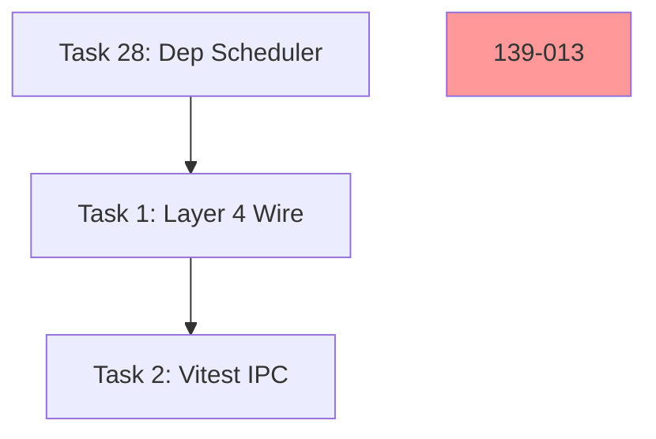

# Sprint 139 — Deckent GOD Sprint Design (Debt Liquidation + Backend Parity + Event Stream Runtime + Output Routing + Notification Dispatcher)

**Date:** 2026-04-14
**Sprint:** sprint-139
**Theme:** Deckent GOD Sprint — Tam Kapsamlı Tech Debt Liquidation + Backend-Agnostic Root Cause Surgery + Vizyon Vitrin
**Previous:** sprint-138 (10/17 Layer 3, readiness 4.03/5, GO_WITH_TECH_DEBT, 6 canlı meta-dogfood kanıt)
**Author:** Claude Opus 4.6 (1M context) — brainstorming session 2026-04-14
**Execution Model:** Deckent Native — Brain-driven wave barrier, no manual barrier (Sprint 138 Task 4 `buildCollisionAwareWaves` canlı kullanım)
**Commit count expectation:** 2 (feat + docs, Sprint 134+ pattern)
**Task count:** 52 (Sprint 138'in 4.7x'i, Sprint 134'ten beri en büyük)
**Hard cap:** 14 saat (50,400,000 ms)

---

## 1. Context & Problem Statement

Sprint 138 tamamlandı **2026-04-14** 53m 46s natural execution. Final label: **GO_WITH_TECH_DEBT** — 10/17 Layer 3 criteria (+1 bounce from Sprint 137), readiness 4.03/5 (+0.03, 4.00 eşik 2-sprint korundu), **6 canlı meta-dogfood kanıt** (Sprint 137'nin 1'den 6'ya 6x jump).

### 1.1 Sprint 138 Başarıları (Devralınan)

Mimari foundation 4 kritik deliverable **kod seviyesinde canlı**:
1. **ADR Governance Integration** — 37 ADR MADR v3 migration + ADR-036 self-referential + `scripts/adr-validator.mjs` (177 LoC) + DECKENT.md mandatory read + `task-builder.ts` loadADRContent() + prompt injection
2. **Auditor Authority 3-Pipeline** — `verifyWorkerResult` + `verifyFunctional` + `validateTechDebt` + `checkADRCompliance` pilot (ADR-006/008/010)
3. **Event Stream Foundation** — `src/orchestra/event-stream.ts` 305 LoC + 15 channel constants (ADR-035 Protocol V1.0) + `src/core/file-lock.ts` 30→267 LoC real implementation + `detectScopeCollisions` + `buildCollisionAwareWaves`
4. **Worker Honest Calibration v2** — `Honest Self-Assessment Required` prompt block + `writeVerifyDeltaBaseline`/`readVerifyDeltaBaseline`/`computeVerifyDelta` + `applyTechDebtDowngrade` çift katman

### 1.2 Sprint 138 Kayıpları (Sprint 139'a Devralınan Kritik Debt)

Sprint 138 mimari foundation yazıldı ama **runtime aktivasyonu büyük ölçüde eksik**:

**Layer 4 Runtime Wire 3-Sprint Fail Streak:**
- `.deckent/sprint-138-gate.json` ❌ (Task 138-006 forensic fix kod seviyesinde, runtime aktif değil)
- `docs/audits/sprint-138/load-test-report.md` ❌
- `.deckent/sprint-138-metrics.jsonl` ❌
- `.deckent/sprint-138-events.jsonl` ❌ (Task 138-004 event stream 305 LoC yazıldı ama 15 kanaldan **sadece 2** runtime'da çağrıldı — `SCOPE_COLLISION_DETECTED` ve `LOCK_STATE_SNAPSHOT`)

**Root cause hipotezi:** Brain runtime Sprint 138 build'den önce spawn edildi, hot-reload yapmadı, yeni kodu kullanmadı. `feedback_mcp_build_reload.md` pattern canlı kanıt 3. sprint.

**Auto-Archive 2-Sprint Partial Regression:**
- `.brain/sprints/sprint-138.md` ✅ ama `.brain/archive/DIRECTIVES-sprint-138.md` + `DIRECTIVES.md` Sprint 139 reset ❌ (manuel archive gerekti, Sprint 137 ile aynı pattern)

**Vitest IPC Channel Error Regression (Sprint 138 kendi bug'ı):**
- `ERR_IPC_CHANNEL_CLOSED` tinypool child_process send error
- Sprint 138 baseline **unmeasurable**
- Task 5 worker 472 LoC test fix yaptı ama final vitest summary alınamadı

**Worker Variance (Sprint 138 canlı kanıt):**
- Task 138-004 (architect/opus/HIGH) **tek başına** `.plan` yazdı + token tracking yazdı
- Task 138-001 + 003 (architect/opus/normal) + Task 138-002 (bug-fixer/sonnet/low) `.plan` yazmadı
- `worker-default.md:8 Write execution plan before coding` kuralı sadece **%25 worker** uyguladı

**stale_heartbeat 69-Sprint Pattern:**
- `.brain/PATTERNS.md`'de tek pattern, **3454 occurrences**, Sprint 69'dan beri unresolved
- Sprint 138 Docker HB shutdown bug 4 worker'da tetiklendi (exitCode 137 SIGKILL → Brain reconcile → HB DONE)
- Helper retrospective relabel 2-sprint streak ama **root cause hâlâ açık**

**Dashboard Parse Error (Sprint 137'den beri):**
- `.dashboard` file format bozuk veya yok
- `deckent_status` çağrısı "Cannot parse dashboard file" döndürür
- `src/mcp/tools/status.ts:211` try/catch generic fallback, gerçek stack trace yutuluyor

**6 Brain MEMORY NO_GO (Geçmişte Çözülmemiş):**
- askBrain() Extraction Finish (Sprint 135 N2)
- Dashboard vs MCP State Divergence Fix (Sprint 135 N8)
- Async I/O İlk Kademe (Sprint 136 T-002)
- T-005 Dep Pipeline Canlı Dogfood Rerun (Sprint 135 N9)
- ErrorRegistry Lint Rule Enforcement (Sprint 136 T-007)
- sprint-controller.ts Full Slim (Sprint 134 T-010 Final)

### 1.3 Alperen'in Sprint 139 Direktifleri (Brainstorming Yansıması)

Sprint 139 brainstorming boyunca Alperen 7 kritik direktif verdi:

1. **"Tüm katmanlar Sprint 139'a dahil"** — stale_heartbeat backend surgery + event stream runtime activation + notification dispatcher birleşik
2. **"Tüm backend'ler — subprocess + tmux + docker kesin çözüm"** — 4 kök sorun × 3 backend = 12 fix vector, backend-agnostic
3. **"Deckent Native çalışacak, task sayısı + süre önemli değil, çalıştırmak önemli"** — Brain kendi orkestrasyonu, koordinatör observer-only (son çare manuel inspection hakkı kalsın)
4. **"Triage: debt → iyileştirme → vizyon"** — FAZ sırası net
5. **"Geçmişte çözülmemiş sprintleri ele alacağız"** — 6 Brain MEMORY NO_GO retrospective
6. **"Milyon kullanıcı × birçok mimari × birçok agent × birçok yük"** — Deckent GOD Sprint canlı sınav
7. **"Deckent Native ama detaylı izleyelim, açıkları zamanında tespit edelim"** — Observability-first execution

Ek 7 direktif (brainstorming sırasında ortaya çıkan):
- **Docker worker düşmeleri** (zaten Task 14, özel vurgu)
- **.prompt hızlı temizleme** (Task 27 canlı gözlem teyit)
- **.plan nadir + ne işe yaradığı kritik** (Task 22 diagnostic-first reframe, hard-NO_GO yok)
- **Zincir bağımlı task planlama/ayırma/takip** (Task 29-33, cascade blocking)
- **Brain-Auditor-Worker tam yetkileri + iletişim standardı** (ADR-037 yeni)
- **Dead code + kullanılmayan özellikler** (Task 38-41, 4-adımlı güvenli süreç)
- **🚨 Output Routing** (Task 46-50, en kapsamlı yeni sistem — "translator rolü kalksın")

### 1.4 Sprint 139 Ana Değer Önerisi

Sprint 139 **tek bir amaç için tasarlandı**: Deckent'ı **Sprint 147 Public Beta GA**'ya hazır hale getirmek. Bunun için:

- **Debt'ler kapanacak** (Sprint 138 carry-over 4 + geçmiş 6 NO_GO + dashboard + stale_heartbeat 69-sprint)
- **Backend'ler 3'ü de çalışacak** (kullanıcıların Docker/tmux/subprocess seçeneği)
- **İletişim standardize** (ADR-035 V1.1 + ADR-037 + event stream 18/18 kanal runtime)
- **Ölü kod temizlenecek** (Deckent'ı bozmadan, 4-adımlı güvenli süreç)
- **Kullanıcı → Deckent arayüzü güçlenecek** (Output Routing + Notification Dispatcher = translator rolü kalkar)

**Sprint 139 "Deckent GOD Sprint" adının hakkını veriyor**: 52 task, 7 wave, 3 faz, 3 yeni ADR, 4 pipeline, ~6-10 saat natural, 14 saat hard cap, multi-backend coverage.

---

## 2. Goals & Success Criteria

### 2.1 Ölçülebilir Hedefler

| Metrik | Sprint 138 | Sprint 139 Hedef | Delta |
|--------|-----------|------------------|-------|
| Layer 3 criteria | 10/17 | **≥11/17** (+1 must) | +1 |
| Readiness | 4.03/5 | **≥4.12/5** (nice-to-have) | +0.09 |
| Coordinator crash | 0 (4-sprint streak) | **0** (5-sprint streak) | unchanged |
| Zero NO_GO streak | 2-sprint | **3-sprint** (hedef) | +1 |
| Vitest fail count | unmeasurable (IPC) | **0 measurable** | regression fix |
| Layer 4 runtime artifacts | 0/4 | **4/4** (must-have break streak) | +4 |
| Auto-archive full | partial | **full** (sprint log + DIRECTIVES archive + reset) | +1 |
| Event stream runtime kanal | 2/15 | **18/18** (V1.1) | +16 |
| Backend parity coverage | 1/3 (Docker only) | **3/3** (Docker+tmux+subprocess) | +2 |
| .plan compliance | 25% (1/4 worker) | **diagnostic + soft warning** (Sprint 140 hard) | diagnostic first |
| Output routing | 0 | **full scope** (Docker+tmux+subprocess × 4 render mode) | new |
| Notification dispatcher events | 0 | **5 event + 2 adapter** | new |
| Meta-dogfood canlı kanıt | 6 (Sprint 138) | **data-first no katı hedef** | retrospective count |
| Carry-over debt | 12 (Sprint 138) | **≤6** (Sprint 140'a) | -6 |

### 2.2 Başarı Kriterleri (Sprint 139 GO için)

**Must-Have (5 madde, Sprint 139 GO için zorunlu):**
1. Layer 3 ≥11/17
2. Zero coordinator crash (4-sprint streak korundu → 5-sprint streak)
3. Zero NO_GO cascade patlaması (risk-taking retry pattern çalıştı)
4. `.deckent/sprint-139-events.jsonl` ≥500 satır (runtime event stream canlı)
5. 1 meta-dogfood canlı kanıt minimum

**Should-Have (5 madde, Sprint 139 başarı için beklenen):**
6. Layer 4 runtime wire 3-sprint fail streak KIRILDI (gate.json + metrics + load-report oluştu)
7. Backend parity 3/3 backend test pass
8. Auto-archive full runtime
9. stale_heartbeat 69-sprint pattern yeni occurrence 0
10. 6+ meta-dogfood canlı kanıt (Sprint 138 parity)

**Nice-to-Have (5 madde, Sprint 139 extraordinary için):**
11. Readiness ≥4.15/5
12. 12+ meta-dogfood canlı kanıt
13. Translator rolü tam kalktı (Alperen sprint boyunca sadece deckent_status çağırdı)
14. Dead code removal 0 regression
15. Resume Capability canlı dogfood (Alperen manuel crash test başarılı)

**Sprint 139 değerlendirme matrisi:**
- Must-Have 5/5 → **GO**
- Must-Have 4/5 + Should-Have 5+/5 → **GO_WITH_TECH_DEBT**
- Must-Have <4 → **NO_GO** (Sprint 140 recovery)

### 2.3 Sprint 139 Sonrası Vizyon Roadmap

- **Sprint 139 (bu sprint):** Deckent GOD Sprint — Full Debt Liquidation + Backend Parity + Event Stream Runtime + Output Routing
- **Sprint 140:** Long-Running Sprint 50-task Live Test + Resume Capability canlı dogfood
- **Sprint 141-142:** Async I/O Tam Migration + Docker HB Shutdown Core Fix (eğer Sprint 139'da bitmezse)
- **Sprint 143-144:** Heartbeat Daemon Dogfood + Human Checkpoints + Agent Evolution + Security Hardening
- **Sprint 145:** 100-Task Long-Running Live Test + npm publish preparation
- **Sprint 146:** Documentation Finalization (388 .md review)
- **Sprint 147:** **Public Beta GA** — Kur-Çalıştır readiness ≥4.5/5

**Sprint 139 → Sprint 147 = 8 sprint chain.** Sprint 139 Deckent GOD Sprint trajectorinin en büyük momentum boost'u olacak.

---

## 3. Scope (52 Task, 3 Faz, 7 Wave)

### 3.1 In Scope

**FAZ 1 — TECH DEBT LIQUIDATION (11 task, Wave 1):**

**A. Sprint 138 Carry-Over Debt (4 P0):**
1. Layer 4 Runtime Wire Deploy
2. Vitest IPC Channel Error Regression Fix
3. Auto-Archive Runtime Regression
4. verifyFunctional Wire Integration

**B. Sprint 135-136 NO_GO Retrospective (5 kayıt):**
5. askBrain() Extraction Finish (Sprint 135 N2)
6. Dashboard vs MCP State Divergence Fix (Sprint 135 N8)
7. Async I/O İlk Kademe (Sprint 136 T-002)
8. T-005 Dep Pipeline Runtime Enforcement (Sprint 135 N9)
9. ErrorRegistry Lint Rule (Sprint 136 T-007)

**C. Dashboard Sorunu:**
10. `.dashboard` Parse Error Root Cause Fix (`status.ts:211` try/catch expose)
11. `.dashboard` File Format Stabilization

**D. Pre-flight Health Check Discipline:**
12. Pre-flight Full Health Check Discipline (`scripts/pre-flight-health-check.mjs`)

**FAZ 2 — İYİLEŞTİRME (29 task, Wave 2-5):**

**E. stale_heartbeat Backend-Agnostic Root Cause Surgery (Wave 2):**
13. Docker HB Shutdown Bug Core Fix (Alperen özel P0 vurgu) — signal handler + fsync loop + result flush sequence
14. Auditor Cache Invalidation + lastHeartbeat Read Path
15. Worker Lifecycle State Machine Refactor — DONE → exit → auditor scan race condition
16. Orphan HB Cleanup Pattern — coordinator restart recovery

**F. Backend Parity Tests (Wave 3):**
17. Docker Backend Parity Test (stale_heartbeat 0 baseline)
18. tmux Backend Parity Test (Sprint 123'ten beri ilk test)
19. subprocess Backend Parity Test (Sprint 120'den beri ilk test)
20. Hybrid Backend ADR-027 Revisit + Karar

**G. Worker Variance Enforcement (Wave 3):**
21. `.plan` Write Diagnostic + Semantic Audit + Soft Warning (diagnostic-first reframe)
22. Worker Token Tracking Mandatory
23. Worker Honest Self-Assessment Runtime Check

**H. Brain Cross-Dependency Discriminator (Wave 3):**
24. Runtime vs Code Issue Discriminator
25. xfix Worker Scope Format Fix

**I. .prompt Persistence + Traceability (Wave 3):**
26. `.prompt-NNN-XXX-<hash>` File Persist + Canlı Kanıt
27. Cleanup Discipline Extension (`.log`, `.timeout`, `.prompt-*`)

**J. Chain Dependency Execution (Wave 1 — early wire):**
28. Zincir Bağımlı Task Execution Scheduler (parser → enforcement wire) — **Wave 1'e taşındı** çünkü Sprint 139'un kalan task'ları bu enforcement'a ihtiyaç duyar
29. Cascade Blocking (task NO_GO → bağlı task'lar auto-blocked)
30. Dependency Graph Persistence + Resume Integration
31. Dependency Chain Observability (`deckent_status` Mermaid graph)
32. Dependency Violation Alert
33. Checkpoint Interval Override Sprint 139 Özel (CHECKPOINT_INTERVAL=3)

**K. Brain-Auditor-Worker Authority Matrix (Wave 4):**
34. ADR-037 Yaz — "Brain-Auditor-Worker Authority Matrix (RBAC Protocol V1.0)"
35. Authority Enforcement Check (Code-Level Runtime)
36. `docs/architecture/authority-matrix.md` Reference Doc

**L. Dead Code + Unused Features Audit (Wave 5, SELF-MODIFYING):**
37. Adım 1 — Runtime Dead Code Audit (`scripts/dead-code-audit.mjs`)
38. Adım 2 — Feature Usage Manifest + Kategorizasyon
39. Adım 3 — Safe Action Decision Matrix (Remove/Revive/Deprecate/Defer)
40. Adım 4 — Safe Execution (sadece kesin Remove, test-first, isolated commits)

**FAZ 3 — VİZYON (11 task, Wave 6-7):**

**M. Event Stream 15-Kanal Runtime Activation (Wave 6):**
41. Worker Event Hook Points (HEARTBEAT, RESULT, QUESTION, CODE_VERIFY_REQUEST)
42. Brain Event Hook Points (TASK_ASSIGN, SPRINT_PHASE_CHANGE, METRIC_EMITTED, FIX_REQUEST, ANSWER, DEPENDENCY_BLOCKED, DEPENDENCY_UNBLOCKED)
43. Auditor Event Hook Points Real Wire (ADR_VIOLATION, GATE_COMPUTED, LOAD_REPORT_WRITTEN, VERIFICATION_RESULT, AUTHORITY_VIOLATION)
44. Event Stream Runtime Canlı Kanıt (`.deckent/sprint-139-events.jsonl` ≥500 satır, 18/18 kanal V1.1)

**N. 🚨 Output Routing Full Scope (Wave 6):**
45. Multi-Backend Output Collector (Docker + tmux + subprocess)
46. Output Formatter + Config-Driven Rendering (explainatory/standart/verbose/json)
47. `deckent_status` MCP + `deckent status` CLI Rich Output Integration
48. Translator Rolü Kaldırma Canlı Kanıt Test
49. Web Dashboard Hook Point (Sprint 140+ hazır)

**O. Notification Dispatcher (Wave 7):**
50. Notification Dispatcher Core + CLI Adapter + MCP Adapter + 5 Event

**P. ADR-038 Self-Modifying Task Detection (Wave 4):**
51. ADR-038 Yaz + `src/orchestra/self-modifying-detector.ts` implementation

**Q. Task 30 Cascade Block Live Test (Wave 4):**
52. Cascade Block Dummy Failure Injection — Task 30 canlı doğrulama için 1 dummy task bilinçli NO_GO (Alperen Q5 direktifi: unit test yetmez)

**Toplam: 52 task, 3 faz, 7 wave**

### 3.2 Out of Scope (Sprint 140+ Chain)

- **Long-running sprint 50-task canlı test** → Sprint 140
- **Live backend switching runtime** (runtime sırasında backend switch) → Sprint 140+
- **Codex + Gemini simultaneous test** → Sprint 140
- **macOS dogfood** → Sprint 140
- **Windows initial spike** → Sprint 140+
- **Async I/O full migration** (Sprint 132 CRITICAL #1) → Sprint 141-142
- **Heartbeat daemon 24h stability** → Sprint 143
- **Human checkpoint canlı sprint** → Sprint 143
- **Agent evolution dogfood** → Sprint 143
- **Security hardening** (MCP auth, plugin sandbox, Docker hardening) → Sprint 144
- **npm publish preparation** → Sprint 145
- **388 .md doc finalization** → Sprint 146
- **Public Beta GA** → Sprint 147

### 3.3 Sprint 139 Yasakları (Prohibited Actions)

1. ❌ **Manuel wave barrier** — Deckent Native, Brain `buildCollisionAwareWaves` canlı
2. ❌ **Worker.ts refactor** — Sprint 139 sonrası değerlendirilecek (Alperen Q2 kararı), worker.ts 6-task collision Brain sequential ile yönetilir
3. ❌ **.plan hard-NO_GO enforcement** — diagnostic-first + soft warning (Task 22 reframe, Alperen Q5)
4. ❌ **Task 41 Dead Code Safe Execution parallel** — self-modifying, sequential zorunlu (ADR-038)
5. ❌ **Koordinatör aktif müdahale** — observer-only, **son çare manuel inspection hakkı** sadece anomali/crash durumunda
6. ❌ **Meta-dogfood katı hedef koyma** — data-first, retrospective count
7. ❌ **git reset --hard / git push --force / --no-verify** — Sprint 132'den beri yasak, Sprint 139'da Task 41 istisna (isolated commits + auto rollback)
8. ❌ **Vitest IPC fix Wave 0 blocking** — Sprint 140 carry-over kabul (Alperen Q3)
9. ❌ **`ts-morph` runtime dependency** — sadece `devDependencies`, ADR-010 compliance (Alperen Q3)
10. ❌ **Eski DIRECTIVES.md'yi ezmek** — Sprint 138 format korundu, Sprint 139 için yeniden yazılır (auto-archive broken için manuel)

---

## 4. 17-Criterion Verification Framework (Sprint 134+ Parity)

Sprint 134'ten beri kullanılan 17-criterion korundu. Sprint 139 özelinde beklentiler:

### Layer 1 — Deckent Self-Evaluation (3 criteria)

1. **≥80% task DONE** — 52 × 0.8 = ≥42 DONE (Sprint 138: 8/10 = 80% parity)
2. **CRITICAL/HIGH effort tasks DONE or TD, not NO_GO** — NO_GO olmamalı (Sprint 138 zero NO_GO streak korumalı)
3. **Brain rubric avg ≥75/100** — Sprint 138 avg 91 (Sprint 139'da da ≥85 beklenti)

### Layer 2 — Technical Verification (3 criteria)

4. **`npx tsc --noEmit` → 0 errors**
5. **`npx vitest run` → 0 fail, ≥12721 pass** — Task 2 IPC fix prereq
6. **Dashboard regression = 0** — Task 10-11 sonrası

### Layer 3 — Manual Verification (3 criteria)

7. **Per-task physical grep proof (52/52)**
8. **Scope compliance — 0 boundary violation**
9. **Auto-archive full** — sprint log + DIRECTIVES archive + reset otomatik

### Layer 4 — Runtime Artifact Generation (3 criteria)

10. **metrics.jsonl ≥50 lines** (3-sprint fail streak break hedef)
11. **`docs/audits/sprint-139/load-test-report.md` full**
12. **`.deckent/sprint-139-gate.json` overallGate === "PASS" or "WARNING"**

### Layer 5 — Product Vision Regression (4 criteria)

13. **ADR-033 + ADR-034 + ADR-037 + ADR-038 immutable** (yeni ADR'ler dahil)
14. **`docs/vision/roadmap.md` immutable**
15. **Forbidden terms audit** (saas/cloud-hosted/paywall/enterprise edition)
16. **Per-task vision lens** (52/52 vision-audited)

### Layer 6 — Kur-Çalıştır Readiness Score (1 criterion)

17. **Readiness ≥4.12/5** (nice-to-have ≥4.15)

---

## 5. Architecture — 7-Wave Hybrid Matrix (Deckent Native)

### 5.1 Wave Structure

```
WAVE 0 — DECKENT SELF-BOOT GATE (Brain otomatik, manuel YOK)
  Self-modifying sprint detect → pre-task'lar otomatik çalıştırılır
  - tsc rebuild (spawnSync, ADR-006 compliance)
  - MCP server restart hook (process.exit → supervisor respawn)
  - deckent doctor --json (health baseline)
  - dashboard health check + repair
  - Event stream initial write
    ⬇ Brain wave barrier
WAVE 1 — FOUNDATION DEBT (Task 1-12 + 28, 13 task)
  Brain `buildCollisionAwareWaves` otomatik gruplandırır
  - Task 1-4: Sprint 138 carry-over debt
  - Task 5-9: NO_GO retrospective (5 task)
  - Task 10-11: Dashboard root cause fix
  - Task 12: Pre-flight health check discipline
  - Task 28: Chain dependency scheduler (Wave 1'e early wire, bootstrap barrier)
    ⬇ Brain wave barrier
WAVE 2 — stale_heartbeat CORE SURGERY (Task 13-16, 4 task)
  - Task 13: Docker HB Shutdown Bug Core Fix (Alperen P0)
  - Task 14: Auditor Cache Invalidation
  - Task 15: Worker Lifecycle State Machine
  - Task 16: Orphan HB Cleanup Pattern
    ⬇ Brain wave barrier (stale_heartbeat çözümü olmadan backend parity yapılamaz)
WAVE 3 — BACKEND PARITY + WORKER DISCIPLINE (Task 17-27, 11 task)
  Lane A (Backend Parity):
    - Task 17-20: Docker/tmux/subprocess parity + hybrid ADR-027
  Lane B (Worker Variance Enforcement):
    - Task 21: .plan diagnostic + semantic audit + soft warning
    - Task 22: Token tracking mandatory
    - Task 23: Honest self-assessment runtime check
  Lane C (Cross-Dep + .prompt):
    - Task 24: Runtime vs code discriminator
    - Task 25: xfix scope format fix
    - Task 26: .prompt persist
    - Task 27: Cleanup extension
    ⬇ Brain wave barrier
WAVE 4 — CHAIN DEPENDENCY + AUTHORITY + ADR-038 (Task 29-36 + 51-52, 10 task)
  Lane A (Chain Dependency Live):
    - Task 29: Cascade Blocking
    - Task 30: Dep Graph Persistence + Resume
    - Task 31: Dep Chain Observability (Mermaid)
    - Task 32: Violation Alert
    - Task 33: Checkpoint Interval=3 override
    - Task 52: Cascade Block Dummy Failure Injection (live test)
  Lane B (Authority Matrix + ADR-038):
    - Task 34: ADR-037 yaz
    - Task 35: Authority Enforcer runtime
    - Task 36: authority-matrix.md reference doc
    - Task 51: ADR-038 Self-Modifying Task Detection
    ⬇ Brain wave barrier + SELF-MODIFYING FLAG TRIGGER
WAVE 5 — DEAD CODE AUDIT (Task 37-40, 4 task, SEQUENTIAL tek lane)
  Self-modifying task'lar güvenlik için sıralı
  - Task 37: Adım 1 Runtime Audit (READ-ONLY, parallel-safe)
  - Task 38: Adım 2 Feature Manifest (READ-ONLY, parallel-safe)
  - Task 39: Adım 3 Decision Matrix (READ-ONLY, new ADR write)
  - Task 40: Adım 4 Safe Execution (SELF-MODIFYING, sequential only)
    ⬇ Brain wave barrier — Task 40 sonrası MCP restart hook tetiklenebilir
WAVE 6 — EVENT STREAM + OUTPUT ROUTING (Task 41-49, 9 task)
  Lane A (Event Stream 15-Kanal → 18-Kanal V1.1):
    - Task 41: Worker hook points
    - Task 42: Brain hook points
    - Task 43: Auditor hook points real wire
    - Task 44: Event stream canlı kanıt (≥500 satır)
  Lane B (Output Routing Full Scope):
    - Task 45: Multi-backend output collector
    - Task 46: Output formatter + rendering
    - Task 47: deckent_status MCP + CLI rich integration
    - Task 48: Translator rolü kaldırma canlı kanıt
    - Task 49: Web dashboard hook point
    ⬇ Brain wave barrier
WAVE 7 — NOTIFICATION DISPATCHER (Task 50, 1 task)
  - Task 50: Dispatcher core + CLI adapter + MCP adapter + 5 event
```

**Toplam tahmin:** 6-10 saat natural execution (Deckent 8x hız pattern), hard cap 14 saat (50,400,000 ms).

### 5.2 Wave Barrier Rationale

**Wave 0 self-boot gate:** Deckent'ın kendi runtime reload mekanizması. Koordinatör manuel `tsc rebuild + MCP restart` çağırmaz. Brain self-modifying sprint detect ederse otomatik çağırır. Kullanıcı projelerinde bu wave hiç çalışmaz.

**Wave 1 early dep scheduler wire (Task 28):** Chicken-egg çözümü — Sprint 139'un Wave 2-6'sı dep enforcement'a ihtiyaç duyar. Task 28 Wave 1'de bootstrap barrier kurar, sonraki wave'ler bunu kullanır.

**Wave 2 intra-sequential barrier:** stale_heartbeat 4 kök sorun birbirine bağlı (Docker HB + auditor cache + worker lifecycle + orphan cleanup). Sequential zorunlu çünkü her biri bir öncekinin fix'ini test eder.

**Wave 3 3-lane paralel:** Backend parity (Lane A) + Worker variance (Lane B) + Cross-dep (Lane C) **bağımsız dosyalar** → paralel çalışabilir. Lane A `providers/*.ts` + `tests/e2e/*-backend.test.ts`, Lane B `worker.ts` + `task-builder.ts` + `result-evaluator.ts`, Lane C `auditor.ts` (cross-dep) + `sprint-spawner.ts` (xfix scope) + `spawn-backend-docker.ts` (.prompt persist). File collision minimum.

**Wave 4 2-lane karışık:** Chain dep (Lane A, 6 task) + Authority matrix + ADR-038 (Lane B, 4 task). Lane A uzun sequential (Task 29→30→31→32→33→52), Lane B kısa sequential (Task 34→35→36→51). Paralel balance.

**Wave 5 sequential tek lane — SELF-MODIFYING CRITICAL:** Dead code removal Task 40 Deckent'ın kendi source'unu siliyor. ADR-038 flag trigger → Brain sequential zorunlu kılar. Paralel olursa regression olur, geri alınamaz. Sprint 139'un en riskli wave'i.

**Wave 6 2-lane paralel:** Event stream (Lane A, 4 task) + Output routing (Lane B, 5 task). Output routing event stream'i consume ediyor ama Wave 6 içinde paralel çalışabilirler çünkü Output collector başlangıçta event stream'siz çalışabilir (file-based fallback). Lane A bittikten sonra Lane B event stream entegrasyonunu ekler.

**Wave 7 tek task:** Notification dispatcher Wave 6 output'larını tüketecek, en sonda. Sprint 139 finalizasyon öncesi son feature.

### 5.3 Coordinator Model

- **Backend:** Docker (Sprint 136-139 devam)
- **Brain planning:** structured (Sprint 136-139 devam)
- **max_workers:** 3 (Sprint 136-139 hard cap)
- **autoApprove:** true
- **force:** true
- **Timeout:** 50,400,000 ms (14 saat hard cap)
- **Checkpoint interval:** 3 (Sprint 139 özel override, Task 33)

### 5.4 Timeout Policy

| Level | Timeout | Aksiyon |
|-------|---------|---------|
| Task heartbeat stale | >2 dk | Auditor alert |
| Task execution hard | 120 dk | Kill worker, Brain NO_GO |
| Wave 0 total | 15 dk | Self-boot gate, hard kill |
| Wave 1 total | 120 dk | Foundation debt, hard kill |
| Wave 2 total | 90 dk | stale_heartbeat core, hard kill |
| Wave 3 total | 150 dk | Backend parity + worker discipline |
| Wave 4 total | 120 dk | Chain dep + authority |
| Wave 5 total | 60 dk | Dead code sequential |
| Wave 6 total | 120 dk | Event stream + output routing |
| Wave 7 total | 30 dk | Notification dispatcher |
| **Sprint total** | **840 dk (14 saat)** | `deckent_start timeout: 50400000` |

### 5.5 Self-Modifying Task Detection (ADR-038)

**Kritik kavramsal ayrım:**

| Boyut | Deckent Dogfood (Sprint 139) | Kullanıcı Projesi |
|-------|------------------------------|-------------------|
| Kim kodu değiştiriyor | Deckent kendi source'unu | Kullanıcı kendi projesini |
| `src/` path | Deckent source | Kullanıcı projesinin src'si |
| MCP restart gerekli mi | Evet | Hayır |
| Self-modifying flag | True | False |

**Runtime detection:**
```typescript
// src/orchestra/self-modifying-detector.ts (Task 51 yeni)
export function isSelfModifying(task: Task, projectRoot: string): boolean {
  const deckentSourcePatterns = [
    'src/core/', 'src/orchestra/', 'src/monitor/',
    'src/agents/', 'src/cli/', 'src/mcp/', 'src/providers/',
    '.deckent/agents/', '.deckent/skills/',
  ];
  return task.scope.filesWrite.some(f =>
    deckentSourcePatterns.some(p => f.startsWith(p))
  );
}

export function isSelfModifyingSprint(tasks: Task[], projectRoot: string): boolean {
  return tasks.some(t => isSelfModifying(t, projectRoot));
}
```

**Policy:**
- Self-modifying task'lar **Wave içinde sequential zorunlu** (parallel false)
- Self-modifying task sonrası **auto-checkpoint + runtime reload hook** (Sprint 138 Task 9 Resume ile uyumlu)
- Kullanıcı projelerinde **hiç çalışmaz**

Spec detayı Section 8.51'de (Task 51 ADR-038 implementation).

---

## 6. Task Specifications (52 Task Detay)

Her task için: agent, model, effort, priority, dependencies, skills, scope (directories + filesWrite), wave position, description, alt-iş, kanıt, test gereksinimi, rollback policy.

### Task 1: Layer 4 Runtime Wire Deploy

- **Agent:** bug-fixer
- **Model:** opus
- **Effort:** normal
- **Priority:** CRITICAL
- **Dependencies:** yok (Wave 1 foundation)
- **Skills:** typescript-expert
- **Scope:** `src/orchestra/`, `src/core/`, `tests/orchestra/`
- **Wave:** 1

**Files:**
- Modify: `src/orchestra/sprint-finalizer.ts` (forensic fix deploy)
- Modify: `src/core/observability.ts` (generateLoadReport real wire)
- Modify: `tests/orchestra/sprint-finalizer.test.ts`

**Description:**

Sprint 136-137-138 3-sprint üst üste Layer 4 runtime wire fail. Sprint 138 Task 6 forensic fix **kod seviyesinde** yazdı ama Brain runtime pre-build cache nedeniyle canlı olmadı. Sprint 139'da deploy pipeline kurulur:

**Alt-iş A — Pre-flight rebuild hook:**
- `src/orchestra/sprint-spawner.ts` veya Wave 0 self-boot: `tsc --noEmit` pre-check + rebuild trigger
- Eğer `dist/` mtime `src/` mtime'dan eski → rebuild + restart signal
- MCP server restart hook eklenir (process.exit(0) → supervisor respawn)

**Alt-iş B — gate.json write path verification:**
- `finalizeSprint()` call chain trace, hangi adımda exit ediyor tespit
- Sprint 138 Task 6 forensic: `runSelfAuditGate` `spawnSync({ shell: true, timeout: 90+300=390s })` → process interrupt. ADR-006 compliance (shell: false), timeout 90→30s tsc + 300→120s vitest
- gate.json write try-catch dışına ayrılır, fail-safe fallback always write
- `initObservability(projectRoot)` finalizeSprint başında çağrılır

**Alt-iş C — load-report write path:**
- `generateLoadReport()` import + call `finalizeSprint()` path
- Event stream hook: `AUDITOR→BRAIN:LOAD_REPORT_WRITTEN`

**Alt-iş D — metrics.jsonl write path:**
- `src/core/observability.ts` metric emit loop
- Event stream hook: `BRAIN→*:METRIC_EMITTED`
- Sprint 139 minimum 50 metric point

**Alt-iş E — Breadcrumb logging permanent:**
- Steps 10, 10b, 10c, 11, 12, 13 breadcrumb log (Sprint 138'den korundu)

**Kanıt:**
- `ls .deckent/sprint-139-gate.json` → exist
- `cat .deckent/sprint-139-gate.json | jq .overallGate` → "PASS" or "WARNING"
- `ls docs/audits/sprint-139/load-test-report.md` → exist
- `wc -l .deckent/sprint-139-metrics.jsonl` → ≥50
- Event stream'de 3+ `GATE_COMPUTED`, `LOAD_REPORT_WRITTEN`, `METRIC_EMITTED` event

**Test:** 5+ regression test:
- gate.json always-write (try/catch dışında)
- gate.json fallback on throw
- load-report write path
- metrics emit integration
- full-failure fail-safe (sprint bozuksa gate.json warning yazılır)

**Rollback policy:** Fallback mevcut (Sprint 138 helper retrospective relabel). Task 1 fail ederse Layer 4 criterion fail devam eder ama sprint bitebilir.

### Task 2: Vitest IPC Channel Error Regression Fix

- **Agent:** bug-fixer
- **Model:** opus
- **Effort:** normal
- **Priority:** CRITICAL
- **Dependencies:** yok
- **Skills:** testing-expert, typescript-expert
- **Scope:** `tests/`, `vitest.config.ts`
- **Wave:** 1

**Description:**

Sprint 138 kendi bug'ı: `ERR_IPC_CHANNEL_CLOSED` tinypool child_process send error. Baseline unmeasurable.

**Alt-iş A — Diagnostic:**
```bash
npx vitest run --pool=threads --poolOptions.threads.maxThreads=1 --reporter=basic 2>&1 | head -200
```
Sequential run ile hangi test dosyasının trigger ettiğini bisect ile bul.

**Alt-iş B — Muhtemel suspects:**
- `tests/e2e/docker-backend.test.ts` (child_process spawn, docker daemon call)
- `tests/providers/*-smoke.test.ts` (claude --version + codex --version + gemini --version smoke)
- `tests/scripts/adr-validator.test.ts` (node script spawn)

**Alt-iş C — Fix pattern:**
- Child process `.on('exit')` handler → cleanup pending IPC
- `send()` öncesi `await ipcReadyPromise`
- Smoke test'ler ayrı vitest config (parallel pool yerine forks)
- Veya: mock child_process in smoke tests

**Alt-iş D — Regression test:**
- `tests/vitest/ipc-channel-stability.test.ts` yeni
- 10+ parallel subprocess spawn senaryosu, IPC stable kalmalı

**Kanıt:**
- `npx vitest run --reporter=basic 2>&1 | tail -5` → `Test Files X passed (513)`, `Tests 0 failed | 12721+ passed`
- IPC error hiç tetiklenmemeli

**Test:** 5+ test (parallel spawn stability + mock cleanup + timeout handling)

**Rollback policy:** Task 2 fail ederse Sprint 140 carry-over (Alperen Q3 kararı). Sprint 139 baseline unmeasurable kalır ama devam.

### Task 3: Auto-Archive Runtime Regression Fix

- **Agent:** refactorer
- **Model:** sonnet
- **Effort:** low
- **Priority:** HIGH
- **Dependencies:** yok (Task 1'den bağımsız)
- **Skills:** typescript-expert
- **Scope:** `src/orchestra/`, `tests/orchestra/`
- **Wave:** 1

**Description:**

Sprint 137-138 2-sprint üst üste auto-archive partial regression:
- `.brain/sprints/sprint-NNN.md` ✅ yazılıyor
- `.brain/archive/DIRECTIVES-sprint-NNN.md` ❌ yazılmıyor
- `DIRECTIVES.md` next sprint reset ❌

Task 138-007 `archiveOrphanTasks()` ekledi ama archiveDirectives + resetDirectives runtime'da hâlâ çalışmıyor.

**Alt-iş A — Forensic trace:**
- `sprint-finalizer.ts` `archiveDirectives()` call site + `resetDirectives()` call site grep
- Runtime breadcrumb log eklemesi (geçici)
- Sprint 139 finalize sırasında hangi adımda exit ediyor gör

**Alt-iş B — Root cause hipotez:**
- Try/catch swallow (silent error)
- Conditional return before hook
- Import chain broken (Sprint 136 Task 8 refactor yan etkisi)

**Alt-iş C — Fix pattern:**
- Error rethrow + fail-safe fallback write
- archiveDirectives + resetDirectives unit test regression

**Alt-iş D — Integration test:**
- Sprint 139 finalize sonrası `.brain/archive/DIRECTIVES-sprint-139.md` otomatik oluşsun
- `DIRECTIVES.md` Sprint 140 template otomatik reset olsun

**Kanıt:**
- Sprint 139 finalize sonrası 3 dosyanın hepsi otomatik:
  - `.brain/sprints/sprint-139.md` ✅
  - `.brain/archive/DIRECTIVES-sprint-139.md` ✅
  - `DIRECTIVES.md` Sprint 140 template ✅

**Test:** 4+ test (sprint log write + DIRECTIVES archive + DIRECTIVES reset + error rethrow)

### Task 4: verifyFunctional Wire Integration

- **Agent:** architect
- **Model:** sonnet
- **Effort:** low
- **Priority:** HIGH
- **Dependencies:** yok
- **Skills:** typescript-expert
- **Scope:** `src/monitor/auditor.ts`, `src/orchestra/result-evaluator.ts`, `tests/`
- **Wave:** 1

**Description:**

Sprint 138 Task 3 worker `verifyFunctional` yazdı (`auditor.ts:1116`) ama `tryCodeVerifiedDone` helper hâlâ file existence ile DONE veriyor. Chain integration eksik:

**Alt-iş A — Chain wire:**
```typescript
// auditor.ts
async function tryCodeVerifiedDone(taskId, projectRoot, options) {
  // Mevcut: file existence check
  const filesVerified = await checkFilesExist(...);
  if (!filesVerified) return { verdict: 'NO_GO' };

  // YENİ: Functional check chain
  const functionalResult = await verifyFunctional(taskId, projectRoot, { filesChanged });
  if (functionalResult.verdict === 'DOWNGRADE') {
    return { verdict: 'TECH_DEBT', reason: functionalResult.reason };
  }
  if (functionalResult.verdict === 'PASS') {
    return { verdict: 'CODE_VERIFIED_DONE' };
  }
  // ...
}
```

**Alt-iş B — Partial fail handling:**
- Eğer affected tests partial fail → TECH_DEBT downgrade (Sprint 138 Task 8 applyTechDebtDowngrade çift katman)
- Eğer affected tests 0 → CODE_VERIFIED_DONE (no tests = no functional check)
- Eğer affected tests total fail → NO_GO

**Kanıt:**
- `grep -n "verifyFunctional" src/monitor/auditor.ts` → tryCodeVerifiedDone içinde çağrı hit
- Sprint 139 execution sırasında ≥1 task functional check chain canlı çalışmalı

**Test:** 4+ test (chain dispatch + partial fail downgrade + no tests case + total fail)

### Task 5: askBrain() Extraction Finish (Sprint 135 N2 Retrospective)

- **Agent:** architect
- **Model:** sonnet
- **Effort:** low
- **Priority:** NORMAL
- **Dependencies:** yok
- **Skills:** typescript-expert
- **Scope:** `src/orchestra/ipc-registry.ts`, `tests/orchestra/`
- **Wave:** 1

**Description:**

Sprint 135 N2 "askBrain() Extraction Finish" NO_GO idi (Docker worker exited without writing result file). Sprint 137 Task 137-002 "wire zaten Sprint 136'dan canlı" buldu. Sprint 139'da **retrospective confirm**:

**Alt-iş A — Current state audit:**
- `src/orchestra/ipc-registry.ts` (270 LoC, Sprint 135 T-004'te yazıldı) oku
- `askBrain()` export var mı, çağrı path çalışıyor mu grep

**Alt-iş B — Integration test:**
- Runtime askBrain call end-to-end test yazımı
- Event stream integration (Sprint 139 Task 42 Brain hook points)

**Alt-iş C — Mark resolved:**
- Brain MEMORY.md'de bu NO_GO kaydı retrospective resolved işaretle
- Sprint 135 N2 debt kapanmış not düş

**Kanıt:**
- `grep -n "export.*askBrain" src/orchestra/ipc-registry.ts` → hit
- Integration test pass
- Brain MEMORY.md update

**Test:** 2+ integration test (askBrain call + response + timeout)

### Task 6: Dashboard vs MCP State Divergence Retest (Sprint 135 N8)

- **Agent:** bug-fixer
- **Model:** sonnet
- **Effort:** low
- **Priority:** HIGH
- **Dependencies:** Task 10 (dashboard parse fix)
- **Skills:** typescript-expert
- **Scope:** `src/monitor/sprint-state.ts`, `src/mcp/tools/status.ts`, `tests/`
- **Wave:** 1

**Description:**

Sprint 135 N8 "Dashboard vs MCP State Divergence Fix" `sprint-state.ts` yazıldı. Ama Sprint 137-138'de `Cannot parse dashboard file` hâlâ patlıyor. Fix canlı değil veya yeni regression var.

**Alt-iş A — Retest current state:**
- `sprint-state.ts` read path audit
- `status.ts:211` try/catch expose (Task 10 ile uyumlu)
- MCP + CLI state convergence integration test

**Alt-iş B — Retrospective fix:**
- Gerçek error stack trace extract (generic fallback yerine)
- Real diagnosis + fix

**Kanıt:**
- Sprint 139 execution sırasında `deckent_status` çağrısı parse error vermemeli
- MCP ve CLI aynı sprint state'ini göstermeli

**Test:** 3+ test (MCP state + CLI state + convergence check)

### Task 7: Async I/O İlk Kademe Retrospective (Sprint 136 T-002)

- **Agent:** refactorer
- **Model:** sonnet
- **Effort:** normal
- **Priority:** NORMAL
- **Dependencies:** yok
- **Skills:** typescript-expert, performance-optimizer
- **Scope:** `src/orchestra/result-collector.ts`, hot path files
- **Wave:** 1

**Description:**

Sprint 136 T-002 "Async I/O İlk Kademe" NO_GO idi (Docker exit). Sprint 137 Task 137-002 "partial sonuç var" buldu. Sprint 139'da **hot path async migration ilerlet**:

**Alt-iş A — Audit:**
- `grep -n "readFileSync\|writeFileSync" src/orchestra/*.ts` → 799 sync I/O call
- Hot path identification (Sprint 132 audit'te 799 count)
- Top 10 çağrılan sync I/O

**Alt-iş B — Migration (partial, top 5):**
- `result-collector.ts` → `fs.promises.readFile` migration (Sprint 136'da başladı)
- `task-builder.ts` → partial async
- `sprint-finalizer.ts` → partial async
- Minimum 5 sync → async migration

**Alt-iş C — Retrospective note:**
- Sprint 132 CRITICAL #1 (799 sync I/O) hâlâ açık, Sprint 141-142'de tam migration
- Sprint 139 ilerlet **~5-10 hot path**

**Kanıt:**
- `git diff --stat src/orchestra/result-collector.ts` → promises import + async migration
- tsc clean

**Test:** Mevcut test suite regression-free

### Task 8: T-005 Dep Pipeline Runtime Enforcement (Sprint 135 N9)

- **Agent:** bug-fixer
- **Model:** sonnet
- **Effort:** low
- **Priority:** NORMAL
- **Dependencies:** Task 28 (Chain Dependency Scheduler Wave 1 early wire)
- **Skills:** typescript-expert
- **Scope:** `src/orchestra/sprint-spawner.ts`, `tests/orchestra/`
- **Wave:** 1

**Description:**

Sprint 135 N9 "T-005 Dep Pipeline Canlı Dogfood" — parser var, execution enforcement yok. Sprint 137-138'de canlı kanıt (paralel spawn devam). Sprint 139'da Task 28 tarafından çözülüyor, bu task sadece **retrospective test**.

**Alt-iş A — Retest:**
- Sprint 139 DIRECTIVES'te dependency line'ları parse edilecek
- Brain spawn loop dep check çalışmalı (Task 28 wire)
- Sprint 139'un kendisi canlı dogfood

**Kanıt:** Task 28 enforcement'ı çalıştığında otomatik pass

**Test:** Task 28 ile birleşik 3+ integration test

### Task 9: ErrorRegistry Lint Rule Retrospective (Sprint 136 T-007)

- **Agent:** bug-fixer
- **Model:** sonnet
- **Effort:** low
- **Priority:** NORMAL
- **Dependencies:** yok
- **Skills:** typescript-expert
- **Scope:** `src/core/errors.ts`, `package.json`, `tests/core/`
- **Wave:** 1

**Description:**

Sprint 136 T-007 "ErrorRegistry Lint Rule Enforcement" NO_GO idi. Sprint 137 Task 137-004 "package.json lint:errors zaten satır 29'da" buldu. Sprint 139'da **retrospective invoke test**:

**Alt-iş A — Invoke test:**
- `npm run lint:errors` çağrısı çalışıyor mu
- `src/core/errors.ts` `ErrorRegistry` export kontrolü
- Lint rule pattern match test

**Kanıt:**
- `npm run lint:errors` exit 0
- Mevcut test suite pass

**Test:** 3+ retrospective test (lint invoke + pattern match + error class detection)

### Task 10: .dashboard Parse Error Root Cause Fix

- **Agent:** bug-fixer
- **Model:** opus
- **Effort:** normal
- **Priority:** CRITICAL
- **Dependencies:** yok
- **Skills:** typescript-expert
- **Scope:** `src/mcp/tools/status.ts`, `src/mcp/resources/dashboard.ts`, `src/monitor/sprint-state.ts`
- **Wave:** 1

**Description:**

Sprint 137'den beri `.dashboard` parse error hayalet pattern. `src/mcp/tools/status.ts:211` try/catch **generic fallback** dönüyor, gerçek stack trace yutuluyor. Sprint 138'de de tekrar etti.

**Alt-iş A — Try/catch expose:**
```typescript
// src/mcp/tools/status.ts:211 mevcut:
} catch {
  const errData = { error: true, active: false, message: 'Cannot parse dashboard file.', job: latestJob };
  // Generic, stack trace yutuluyor
}

// Yeni:
} catch (err) {
  const errData = {
    error: true,
    active: false,
    message: 'Cannot parse dashboard file.',
    actualError: err instanceof Error ? err.message : String(err),
    stack: err instanceof Error ? err.stack : undefined,
    job: latestJob,
  };
  debugLog('status.ts:dashboard-parse-error', JSON.stringify({ err: errData.actualError }));
}
```

**Alt-iş B — ensureDashboard helper:**
- `src/monitor/dashboard-manager.ts` yeni (veya `sprint-spawner.ts`'de inline)
- `ensureDashboard(projectRoot)` — `.dashboard` dosyası yoksa veya bozuksa yeniden yazar
- Sprint spawn sırasında çağrılır

**Alt-iş C — Format validation:**
- `.dashboard` file schema (JSON shape)
- Parse error durumunda schema mismatch detail

**Kanıt:**
- Sprint 139 execution sırasında `deckent_status` parse error vermemeli
- `.dashboard` dosyası her zaman valid JSON

**Test:** 5+ test (parse error expose + ensureDashboard repair + schema validation + sprint spawn integration)

### Task 11: .dashboard File Format Stabilization

- **Agent:** architect
- **Model:** sonnet
- **Effort:** low
- **Priority:** HIGH
- **Dependencies:** Task 10
- **Skills:** typescript-expert
- **Scope:** `src/monitor/`, `.deckent/`, `tests/`
- **Wave:** 1

**Description:**

`.dashboard` single source of truth belirle. Şu an auditor scan cycle'da yazılıyor ama format net değil.

**Alt-iş A — Schema define:**
```typescript
interface DashboardState {
  sprintId: string;
  phase: 'PLAN' | 'SPAWN' | 'EXECUTE' | 'EVALUATE' | 'FIX' | 'RETRO' | 'DECAY' | 'CLEANUP';
  agents: Agent[];
  progress: { done: number; active: number; blocked: number; total: number };
  alerts: Alert[];
  updatedAt: string;
  auditorLastScan: string;
}
```

**Alt-iş B — Writer ownership:**
- Sadece auditor yazar (scan cycle per 30s)
- Worker yazmaz, Brain yazmaz — tek yazıcı auditor

**Alt-iş C — Reader tolerance:**
- Missing file → initial state
- Corrupt file → rewrite + alert

**Kanıt:**
- Schema validation test
- Writer ownership test (authority check)

**Test:** 4+ test (schema + write + read + corrupt recovery)

### Task 12: Pre-flight Full Health Check Discipline

- **Agent:** architect
- **Model:** sonnet
- **Effort:** normal
- **Priority:** HIGH
- **Dependencies:** yok
- **Skills:** typescript-expert, devops-engineer
- **Scope:** `scripts/`, `src/cli/commands/doctor.ts`, `tests/scripts/`
- **Wave:** 1

**Description:**

Sprint 139 büyük risk. Pre-flight health check discipline kurulur:

**Alt-iş A — Script yeni:**
`scripts/pre-flight-health-check.mjs` (~150 LoC):
- `deckent doctor --json` invoke
- `npx tsc --noEmit` exit check
- `npx vitest run --pool=threads --poolOptions.threads.maxThreads=1 --reporter=basic` baseline
- Brain memory budget check (`wc -l .brain/*.md` < 900 budget)
- Lock cleanup (`ls .locks/` stale check + clean)
- Docker daemon health (`docker info` exit)
- MCP server health (eğer running)

**Alt-iş B — CLI integration:**
- `npx deckent doctor --pre-flight` flag yeni
- `scripts/pre-flight-health-check.mjs` çağrılır

**Alt-iş C — Sprint spawn hook:**
- Sprint başlamadan önce pre-flight çalıştırılır
- Herhangi bir component fail → spawn abort + error report

**Kanıt:**
- `ls scripts/pre-flight-health-check.mjs` exist
- `npx deckent doctor --pre-flight` exit 0
- Integration test pass

**Test:** 6+ test (her component için)

### Task 13: Docker HB Shutdown Bug Core Fix 🚨

- **Agent:** architect
- **Model:** opus
- **Effort:** **high**
- **Priority:** CRITICAL
- **Dependencies:** yok (Wave 2 gate)
- **Skills:** typescript-expert, devops-engineer
- **Scope:** `src/providers/spawn-backend-docker.ts`, `src/agents/worker.ts`, `tests/e2e/`
- **Wave:** 2

**Description:**

**Alperen özel P0 vurgu.** 5-sprint süreğen (Sprint 134-138). Worker `status: DONE exitCode: 0` yazıyor ama Docker container `.result` yazmadan exit 137 SIGKILL.

**Root cause analizi (Sprint 138 ERRORS.md canlı kanıt):**
```
10:11:01 docker-backend:exit taskId=138-003 exitCode=137 but .result=DONE → HB DONE
10:11:41 docker-backend:exit taskId=138-001 exitCode=137 but .result=DONE → HB DONE
10:18:05 docker-backend:exit taskId=138-004 exitCode=137
10:23:59 docker-backend:exit taskId=138-006 exitCode=137
```

Pattern: `docker stop --time=10` graceful shutdown ama container exit 137 yüzünden `.result` write atomic değil.

**Alt-iş A — Signal handler + fsync loop:**
```typescript
// src/agents/worker.ts (modify)
process.on('SIGTERM', async () => {
  await flushResultFile(taskId);  // YENİ: explicit fsync
  await writeHeartbeat(taskId, 'DONE', 'graceful');
  exit(0);
});

async function flushResultFile(taskId: string) {
  const fd = openSync(resultPath, 'w');
  writeFileSync(fd, JSON.stringify(result), 'utf-8');
  fsyncSync(fd);  // KRITIK: force disk write
  closeSync(fd);
}
```

**Alt-iş B — Graceful stop sequence (spawn-backend-docker.ts):**
- `docker stop --time=15` (10→15 saniye, SIGTERM grace period)
- Container `.hb` status check → DONE ise kill skip
- Post-stop fsync verification: `.result` dosyası exist + valid JSON mı

**Alt-iş C — Result write atomicity:**
- Temp file pattern: `task-NNN.result.tmp` → rename → `.result`
- `rename()` atomic on POSIX, crash-safe

**Alt-iş D — E2E test:**
- `tests/e2e/docker-hb-shutdown.test.ts` yeni
- SIGTERM → fsync → exit sequence mock test
- Integration test: gerçek Docker container spawn + kill + verify

**Kanıt:**
- Sprint 139 execution sırasında `exitCode=137 but .result=DONE` pattern **0 tetiklenmemeli**
- Event stream'de `WORKER→BRAIN:RESULT` event fsync kanıtı
- stale_heartbeat pattern Sprint 139 sonrası new occurrence 0

**Test:** 7+ test (signal handler + fsync + graceful stop + atomic rename + E2E docker integration + SIGTERM pattern + SIGKILL pattern)

**Rollback policy:** Helper retrospective relabel (Sprint 137-138 pattern) devam eder — fix fail olsa bile fallback recovery var. Sprint 139 hedef: helper tetiklenme sayısı 0.

### Task 14: Auditor Cache Invalidation + lastHeartbeat Read Path

- **Agent:** architect
- **Model:** opus
- **Effort:** normal
- **Priority:** CRITICAL
- **Dependencies:** Task 13
- **Skills:** typescript-expert
- **Scope:** `src/monitor/auditor.ts`, `tests/monitor/`
- **Wave:** 2

**Description:**

Sprint 138 false positive stale alert pattern (Task 7+8 DONE oldu ama auditor "stale" dedi). Auditor cache `lastHeartbeat` field'ını yanlış okuyor.

**Alt-iş A — Cache invalidation:**
```typescript
// auditor.ts scan loop
function readHeartbeat(taskId: string): HBRecord {
  // Mevcut: in-memory cache, invalidation yok
  // YENİ: mtime-based cache invalidation
  const hbPath = `.tasks/${taskId}.hb`;
  const stats = statSync(hbPath);
  const cached = cache.get(taskId);
  if (cached && cached.mtimeMs === stats.mtimeMs) {
    return cached.record;
  }
  const record = JSON.parse(readFileSync(hbPath, 'utf-8'));
  cache.set(taskId, { mtimeMs: stats.mtimeMs, record });
  return record;
}
```

**Alt-iş B — Stale detection algoritma yeniden tasarım:**
```typescript
function isStale(hb: HBRecord, resultExists: boolean, containerRunning: boolean): boolean {
  // Mevcut: if (now - lastHeartbeat > 2min) → stale
  // YENİ: multi-signal heuristic
  const signals = {
    hbSequenceMonotonic: hb.sequence > (previousSeq ?? 0),
    resultExists,
    containerRunning,
  };
  const activeSignals = Object.values(signals).filter(Boolean).length;
  return activeSignals < 2;  // 3 signal'in 2'si aktifse canlı
}
```

**Alt-iş C — Backend-agnostic:**
- Docker: `docker ps --filter "name=deckent-w-NNN"`
- tmux: `tmux has-session -t "w-NNN"`
- subprocess: PID check
- Auditor backend detection + uygun check

**Kanıt:**
- Sprint 139 execution sırasında false positive stale alert 0
- `.deckent/sprint-139-events.jsonl` stale alert count audit edilir

**Test:** 6+ test (cache invalidation + multi-signal + each backend + false positive regression)

### Task 15: Worker Lifecycle State Machine Refactor

- **Agent:** architect
- **Model:** opus
- **Effort:** normal
- **Priority:** CRITICAL
- **Dependencies:** Task 13, 14
- **Skills:** typescript-expert, system-architect
- **Scope:** `src/agents/worker.ts`, `src/orchestra/sprint-spawner.ts`, `tests/agents/`
- **Wave:** 2

**Description:**

Sprint 138 Task 138-007 "No such container: deckent-w-138-007" kanıtı: worker DONE yazdı, container exit, Brain `docker stop` çağırmaya çalıştı, container zaten yok. State machine race condition.

**Alt-iş A — State machine tanımı:**
```typescript
type WorkerLifecycleState =
  | 'SPAWNING'      // Container creating
  | 'STARTING'      // Container running, Claude CLI starting
  | 'EXECUTING'     // Task active
  | 'TESTING'       // Verify loop (tsc + vitest)
  | 'WRITING_RESULT' // Result file write in progress (fsync pending)
  | 'DONE'          // Result written, exit pending
  | 'EXITED'        // Container exited, cleanup
  | 'ORPHAN';       // Coordinator lost track
```

**Alt-iş B — State transitions:**
- `SPAWNING → STARTING` (docker create → start)
- `STARTING → EXECUTING` (Claude CLI ready)
- `EXECUTING → TESTING` (worker verify loop)
- `TESTING → WRITING_RESULT` (result build)
- `WRITING_RESULT → DONE` (fsync complete)
- `DONE → EXITED` (container exit)
- Brain `docker stop` only for `EXECUTING` and `TESTING`, **skip DONE + EXITED**

**Alt-iş C — Event stream integration:**
- Her state transition event stream'e yazılır
- `WORKER→BRAIN:HEARTBEAT` payload'ına state field eklenir

**Kanıt:**
- `src/agents/worker.ts` state machine implementation
- Sprint 139 execution'da "No such container" race condition 0
- Event stream'de state transitions canlı

**Test:** 8+ test (her transition + invalid transition + race condition + Brain stop logic)

### Task 16: Orphan HB Cleanup Pattern

- **Agent:** refactorer
- **Model:** sonnet
- **Effort:** normal
- **Priority:** HIGH
- **Dependencies:** Task 14, 15
- **Skills:** typescript-expert
- **Scope:** `src/monitor/auditor.ts`, `src/core/file-lock.ts`, `tests/monitor/`
- **Wave:** 2

**Description:**

Coordinator restart recovery: Brain crash → yeni Brain → eski worker HB dosyaları orphan. Sprint 134 canlı kanıt.

**Alt-iş A — Orphan detection:**
```typescript
function detectOrphans(projectRoot: string): OrphanHB[] {
  const hbFiles = listHBFiles(projectRoot);
  const activeSprintTasks = readActiveSprintTaskIds(projectRoot);
  return hbFiles.filter(hb => !activeSprintTasks.includes(hb.taskId));
}
```

**Alt-iş B — Cleanup action:**
- Orphan HB → archive to `.brain/archive/sprint-NNN-orphan-hb/`
- Lock file release (Task 16 `clearStaleLocks` extension)
- Event stream log (`AUDITOR→BRAIN:ORPHAN_HB_DETECTED`)

**Alt-iş C — Coordinator restart hook:**
- Brain boot'ta orphan detection + cleanup
- Sprint 138 Task 9 Resume Capability ile uyumlu (checkpoint'ten kalan orphan'lar recovery)

**Kanıt:**
- Sprint 139 execution orphan HB detection canlı
- Coordinator restart recovery smooth

**Test:** 5+ test (orphan detect + cleanup + archive + lock release + Brain boot integration)

### Task 17: Docker Backend Parity Test

- **Agent:** test-writer
- **Model:** sonnet
- **Effort:** normal
- **Priority:** HIGH
- **Dependencies:** Task 13, 14, 15, 16
- **Skills:** testing-expert, docker-expert
- **Scope:** `tests/e2e/docker-backend.test.ts`
- **Wave:** 3

**Description:**

Sprint 139'un kendisi Docker backend'de koşacak (live test). Parity suite:

**Alt-iş A — Suite yazımı:**
- `tests/e2e/docker-backend.test.ts` genişletilir
- 10+ test case: spawn + HB + result + exit + error + orphan + lock + fsync + cache invalidation + state machine

**Alt-iş B — stale_heartbeat regression baseline:**
- Docker backend'de stale_heartbeat new occurrence 0
- `scripts/stale-heartbeat-count.mjs` (veya auditor log parse)

**Kanıt:**
- `npx vitest run tests/e2e/docker-backend.test.ts` 0 fail
- Sprint 139 runtime stale_heartbeat count 0

**Test:** 10+ E2E test

### Task 18: tmux Backend Parity Test 🎯

- **Agent:** test-writer
- **Model:** opus
- **Effort:** normal
- **Priority:** CRITICAL
- **Dependencies:** Task 13, 14, 15, 16
- **Skills:** testing-expert, typescript-expert
- **Scope:** `tests/e2e/tmux-backend.test.ts`, `src/providers/spawn-backend-tmux.ts`
- **Wave:** 3

**Description:**

**Sprint 123'ten beri ilk test.** 16 sprint boşluk var, tmux backend kırık olma ihtimali yüksek.

**Alt-iş A — Baseline audit:**
- `src/providers/spawn-backend-tmux.ts` oku, mevcut kod durumu
- `tmux has-session`, `tmux new-window`, `tmux send-keys`, `tmux capture-pane` komutları
- Sprint 134+ değişikliklerden etkilenmiş mi

**Alt-iş B — Test suite yeni:**
- `tests/e2e/tmux-backend.test.ts` yeni file
- 10+ test: spawn + session creation + send-keys + capture + kill + HB integration
- Skip if tmux binary yok (CI fallback)

**Alt-iş C — Fix broken parts:**
- Eğer tmux backend kırıksa Sprint 139 fix edilir
- Sprint 134+'daki file-lock changes'e adapt

**Kanıt:**
- `npx vitest run tests/e2e/tmux-backend.test.ts` pass
- tmux backend canlı test

**Test:** 10+ E2E test

### Task 19: subprocess Backend Parity Test 🎯

- **Agent:** test-writer
- **Model:** opus
- **Effort:** normal
- **Priority:** CRITICAL
- **Dependencies:** Task 13, 14, 15, 16
- **Skills:** testing-expert, typescript-expert
- **Scope:** `tests/e2e/subprocess-backend.test.ts`, `src/providers/spawn-backend.ts`
- **Wave:** 3

**Description:**

**Sprint 120'den beri ilk test.** 19 sprint boşluk. Kullanıcı projelerinde Docker yoksa fallback.

**Alt-iş A — Baseline audit + fix:**
- `src/providers/spawn-backend.ts` oku
- child_process spawn + stdout/stderr capture
- Sprint 134+ değişikliklerden etkilenmiş mi

**Alt-iş B — Test suite yeni:**
- `tests/e2e/subprocess-backend.test.ts` yeni
- 10+ test

**Kanıt:**
- `npx vitest run tests/e2e/subprocess-backend.test.ts` pass

**Test:** 10+ E2E test

### Task 20: Hybrid Backend ADR-027 Revisit

- **Agent:** architecture-planner
- **Model:** sonnet
- **Effort:** low
- **Priority:** NORMAL
- **Dependencies:** Task 17, 18, 19
- **Skills:** system-architect, documentation-writer
- **Scope:** `.brain/DECISIONS.md`, `docs/vision/`
- **Wave:** 3

**Description:**

ADR-027 "Hybrid Spawn Backend" Sprint 123'te deferred. Sprint 139'da revisit:

**Alt-iş A — Mevcut ADR-027 oku:**
- `.brain/DECISIONS.md` ADR-027 tam incele
- "Hybrid backend deferred" reasoning

**Alt-iş B — 3-backend parity sonuçları değerlendir:**
- Task 17-19 test sonuçlarına göre hybrid mümkün mü
- Performance, reliability, edge cases

**Alt-iş C — Karar:**
- **Option A:** ADR-027 kabul et (hybrid enable) → Sprint 140'ta implement
- **Option B:** ADR-027 reddet (tek backend at a time) → hybrid yok, kullanıcı config seçer
- **Option C:** Defer again → Sprint 145'e kadar ertelenir
- Alperen'e sunulur, karar yazılır

**Kanıt:**
- `.brain/DECISIONS.md` ADR-027 status güncel (deferred → accepted/rejected/deferred-v2)
- Decision rationale dokümante

**Test:** Yok (audit + ADR update)

### Task 21: .plan Write Diagnostic + Semantic Audit + Soft Warning

- **Agent:** architect
- **Model:** opus
- **Effort:** normal
- **Priority:** HIGH
- **Dependencies:** yok
- **Skills:** typescript-expert, documentation-writer
- **Scope:** `src/orchestra/task-builder.ts`, `src/agents/worker.ts`, `docs/worker-guide.md`, `tests/`
- **Wave:** 3

**Description:**

**Diagnostic-first reframe (Alperen Q5 direktifi).** Hard-NO_GO enforcement yok, önce kök neden.

**Alt-iş A — Forensic diagnostic:**
- `src/orchestra/task-builder.ts buildWorkerPrompt()` tam incele
- `.plan` write instruction hangi koşullarda enjekte ediliyor
- Effort flag bağımlı mı (Sprint 138 kanıt: HIGH effort yazıyor, normal effort yazmıyor)?
- Agent type bağımlı mı?
- Skill bağımlı mı?
- Sprint 137-138 result dosyalarını tara, hangi worker'larda `.plan` var
- Output: `docs/audits/sprint-139/plan-file-diagnostic.md`

**Alt-iş B — Root cause fix:**
- Diagnostic sonucuna göre prompt template güncelle
- Effort-conditional ise → tüm effort'lara genişlet
- Agent-specific ise → agent template update
- LLM variance ise → strict MUST level talimat

**Alt-iş C — Soft warning enforcement:**
```typescript
// src/agents/worker.ts execution-time check
async function postTaskWriteValidation(taskId: string): Promise<ValidationResult> {
  const planExists = existsSync(`.tasks/${taskId}.plan`);
  if (!planExists) {
    // SOFT warning, NO_GO değil
    console.warn(`[worker] .plan file missing for ${taskId} — Sprint 139 soft warning`);
    await appendToResult(taskId, { planWarning: 'missing .plan file' });
    // Sprint 140 hard enforcement
  }
  return { valid: true };
}
```

**Alt-iş D — Semantic audit + documentation:**
- `docs/worker-guide.md` yeni section: "`.plan` Dosyası — Nedir, Ne Yapar, Neden Önemli"
- Worker guide kullanıcı-facing doc
- Sprint 147 GA için kritik

**Kanıt:**
- `docs/audits/sprint-139/plan-file-diagnostic.md` exist + root cause tespit
- `docs/worker-guide.md` yeni section
- Sprint 139 execution sırasında `.plan` warning count sayılır
- Sprint 140'a hard enforcement debt

**Test:** 4+ test (diagnostic script + soft warning + docs integration + prompt template change)

### Task 22: Worker Token Tracking Mandatory

- **Agent:** architect
- **Model:** sonnet
- **Effort:** low
- **Priority:** HIGH
- **Dependencies:** yok
- **Skills:** typescript-expert
- **Scope:** `src/orchestra/result-evaluator.ts`, `src/orchestra/task-builder.ts`, `tests/orchestra/`
- **Wave:** 3

**Description:**

Sprint 138 Task 138-002 `tokenUsage: { provider: "claude", model: "sonnet" }` partial — inputTokens/outputTokens undefined. Task 138-001+003 hiç yazmadı. Sadece Task 138-004 (HIGH effort) + Task 138-010 (sonnet) tam yazdı.

**Alt-iş A — Result schema enforcement:**
- `src/orchestra/result-evaluator.ts` validation
- Token usage mandatory field check:
  - `tokenUsage.inputTokens` required
  - `tokenUsage.outputTokens` required
  - `tokenUsage.provider` required
  - `tokenUsage.model` required
- Sprint 139 soft warning (Sprint 140 hard NO_GO)

**Alt-iş B — Worker prompt template:**
- `task-builder.ts buildWorkerPrompt()` token tracking talimatı
- MUST level instruction

**Kanıt:**
- Sprint 139 execution sırasında en az %80 worker full token tracking yazar
- `docs/audits/sprint-139/token-usage-report.md` generate

**Test:** 3+ test (validation + warning + prompt injection)

### Task 23: Worker Honest Self-Assessment Runtime Check

- **Agent:** test-writer
- **Model:** sonnet
- **Effort:** low
- **Priority:** HIGH
- **Dependencies:** Task 4 (verifyFunctional wire)
- **Skills:** testing-expert
- **Scope:** `tests/agents/`, `tests/orchestra/`
- **Wave:** 3

**Description:**

Sprint 138 Task 138-008 `Honest Self-Assessment` + verify-delta kod seviyesinde yazıldı. Sprint 139'da runtime doğrulanır.

**Alt-iş A — Runtime integration test:**
- `.tasks/<taskId>.verify-delta.json` dosyası yazılıyor mu
- `computeVerifyDelta` filesRatio + testRatio doğru hesaplıyor mu
- `applyTechDebtDowngrade` çift katman canlı (DONE+<50%→NO_GO, DONE+50-79%→TD)

**Alt-iş B — Integration test:**
- Mock worker result + partial fail senaryoları
- Downgrade logic end-to-end

**Kanıt:**
- `grep -n "verify-delta" src/agents/worker.ts` → hit
- Runtime verify-delta files Sprint 139'da oluşur

**Test:** 5+ integration test

### Task 24: Runtime vs Code Issue Discriminator

- **Agent:** architect
- **Model:** sonnet
- **Effort:** low
- **Priority:** HIGH
- **Dependencies:** yok
- **Skills:** typescript-expert
- **Scope:** `src/orchestra/result-evaluator.ts`, `src/orchestra/sprint-spawner.ts`, `tests/`
- **Wave:** 3

**Description:**

Sprint 138 Task 1-xfix kanıtı: Brain "Task 5 NO_GO → Task 1 dependency failure" yanlış teşhis, gerçek sebep Docker HB shutdown bug (runtime issue). Discriminator gerek.

**Alt-iş A — Classification logic:**
```typescript
export type FailureClass = 'RUNTIME' | 'CODE' | 'AMBIGUOUS';

export function classifyFailure(
  task: Task,
  result: WorkerResult,
  errors: string[]
): FailureClass {
  // RUNTIME signals:
  // - exitCode 137 (SIGKILL)
  // - "Docker worker exited without writing result file"
  // - container lifecycle errors
  // - network/timeout errors
  if (result.notes?.includes('Docker worker exited')) return 'RUNTIME';
  if (errors.some(e => /SIGKILL|timeout|network/i.test(e))) return 'RUNTIME';

  // CODE signals:
  // - tsc errors
  // - test failures
  // - scope violations
  if (errors.some(e => /tsc|vitest.*fail|scope/i.test(e))) return 'CODE';

  return 'AMBIGUOUS';
}
```

**Alt-iş B — Cross-dep spawn logic:**
```typescript
// sprint-spawner.ts
if (taskFailed) {
  const failureClass = classifyFailure(task, result, errors);

  // Alperen Q1: Risk-taking optimistic
  if (failureClass === 'RUNTIME') {
    // Retry without cascade
    spawnFixWorker(task);
  } else if (failureClass === 'CODE') {
    // Cascade block dependents (Task 30)
    cascadeBlockDependents(task);
    spawnFixWorker(task);
  } else {
    // AMBIGUOUS — risk-taking retry (Alperen Q1 risk-taking)
    spawnFixWorker(task);
    // No cascade, no block
  }
}
```

**Kanıt:**
- Cross-dep discriminator runtime canlı
- Sprint 139'da NO_GO olursa classification event stream'e yazılır

**Test:** 6+ test (RUNTIME + CODE + AMBIGUOUS + cascade logic + retry logic)

### Task 25: xfix Worker Scope Format Fix

- **Agent:** bug-fixer
- **Model:** sonnet
- **Effort:** low
- **Priority:** NORMAL
- **Dependencies:** Task 24
- **Skills:** typescript-expert
- **Scope:** `src/orchestra/sprint-spawner.ts`, `tests/orchestra/`
- **Wave:** 3

**Description:**

Sprint 138 xfix worker scope kanıtı: Brain yanlış scope format (`DECKENT.md/` slash sonu, `.json` invalid, `CLAUDE.md` ADR-013 ihlal riski).

**Alt-iş A — Scope builder fix:**
- Cross-dependency fix worker scope builder path normalization
- Slash sonu kaldır
- Extension-only path reject
- CLAUDE.md/DECKENT.md ADR-013 protected paths

**Kanıt:**
- Unit test scope format validation
- Sprint 139 xfix spawn ederse (eğer tetiklenirse) scope temiz

**Test:** 4+ test (normalization + protected paths + validation + edge cases)

### Task 26: .prompt Persistence + File Tracking

- **Agent:** refactorer
- **Model:** sonnet
- **Effort:** normal
- **Priority:** HIGH
- **Dependencies:** yok
- **Skills:** typescript-expert
- **Scope:** `src/providers/spawn-backend-docker.ts`, `src/orchestra/task-builder.ts`, `src/cli/commands/cleanup.ts`, `tests/`
- **Wave:** 3

**Description:**

Sprint 137 Alperen isteği: `.prompt-*` dosyaları sprint sonuna kadar persist, analiz imkanı. Sprint 138 canlı gözlem: hâlâ hızlı siliniyor.

**Alt-iş A — Hash-based naming:**
- Format: `.prompt-NNN-XXX-<hash>` (initial)
- Format: `.prompt-NNN-XXX-<hash>-fix` (fix worker)
- `randomUUID()` veya `crypto.randomBytes(8).toString('hex')`

**Alt-iş B — Persist logic:**
- Worker spawn sırasında prompt dosyası yazılır
- Spawn sonrası dosya **silinmez**, sprint sonuna kadar durur
- `.tasks/.prompt-*` altında kalır

**Alt-iş C — Archive on finalize:**
- Sprint finalize sırasında `.prompt-*` → `.tasks/archive/sprint-NNN/.prompt-*`
- Cleanup'ta opsiyonel sil (config `prompt_archive_retention: 5` sprint)

**Kanıt:**
- Sprint 139 execution sırasında `ls .tasks/.prompt-139-*` ≥52 dosya (her task için en az 1)
- Sprint finalize sonrası `.tasks/archive/sprint-139/.prompt-*` 52+ dosya

**Test:** 5+ test (spawn persist + hash format + fix suffix + archive + cleanup retention)

### Task 27: Cleanup Discipline Extension

- **Agent:** refactorer
- **Model:** sonnet
- **Effort:** low
- **Priority:** NORMAL
- **Dependencies:** Task 26
- **Skills:** typescript-expert
- **Scope:** `src/cli/commands/cleanup.ts`, `src/orchestra/sprint-finalizer.ts`, `tests/`
- **Wave:** 3

**Description:**

`.tasks/*.log`, `*.timeout`, `.prompt-*` orphan cleanup kuralları genişlet.

**Alt-iş A — Cleanup scope extend:**
- `cleanup()` function patterns:
  - `.tasks/task-*.{hb,result,plan,log,timeout}`
  - `.tasks/.prompt-*`
  - `.tasks/archive/sprint-*/` (retention policy)

**Alt-iş B — Archive strategy:**
- Cleanup önce archive, sonra sil
- `deckent_cleanup --dry-run` ile preview

**Kanıt:**
- Sprint 139 cleanup sonrası `.tasks/` sadece `decisions/` subdir
- Archive `.brain/archive/sprint-139-tasks/` + `.tasks/archive/sprint-139/.prompt-*`

**Test:** 4+ test (pattern match + archive + dry-run + retention)

### Task 28: Chain Dependency Execution Scheduler (Wave 1 Early Wire)

- **Agent:** architect
- **Model:** opus
- **Effort:** normal
- **Priority:** CRITICAL
- **Dependencies:** yok (Wave 1 bootstrap)
- **Skills:** typescript-expert, system-architect
- **Scope:** `src/orchestra/sprint-spawner.ts`, `src/orchestra/dependency-scheduler.ts` (YENİ), `tests/orchestra/`
- **Wave:** 1 (early wire, bootstrap barrier)

**Description:**

**En kritik task — Wave 1'e taşındı chicken-egg çözümü.** T-005 dependency parser Sprint 135'te var, JSON'a yazılıyor, ama Brain `respawnEligibleTasks` dep check yapmıyor. Sprint 137-138'de canlı kanıt (paralel spawn).

**Alt-iş A — dependency-scheduler.ts yeni (~220 LoC):**
```typescript
// src/orchestra/dependency-scheduler.ts
export interface DependencyGraph {
  nodes: Map<string, TaskNode>;
  edges: Edge[];
  waves: Wave[];
  collisions: Collision[];
}

export function buildDependencyGraph(tasks: Task[]): DependencyGraph {
  // Topological sort (Kahn's algorithm)
  // Collision detection (Sprint 138 Task 4 detectScopeCollisions)
  // Wave assignment (Sprint 138 Task 4 buildCollisionAwareWaves)
}

export function enforceWaveDependency(
  graph: DependencyGraph,
  eligibleTaskIds: string[]
): string[] {
  // Filter: task dependencies all DONE?
  // Return: spawn-ready tasks
}

export function cascadeBlockDependents(
  graph: DependencyGraph,
  failedTaskId: string
): string[] {
  // Find all tasks with deps[*] === failedTaskId
  // Mark BLOCKED
  // Return: blocked task IDs
}

export function unblockDependents(
  graph: DependencyGraph,
  resolvedTaskId: string
): string[] {
  // Find all BLOCKED tasks that now have deps resolved
  // Mark PENDING
  // Return: unblocked task IDs
}
```

**Alt-iş B — sprint-spawner.ts integration:**
```typescript
// Mevcut: respawnEligibleTasks dep check yok
// YENİ:
async function respawnEligibleTasks(tasks: Task[], state: SprintState): Promise<void> {
  const graph = buildDependencyGraph(tasks);
  const eligible = enforceWaveDependency(graph, state.eligibleTaskIds);

  // Sadece dep'leri DONE olan task'ları spawn et
  for (const taskId of eligible.slice(0, maxWorkers)) {
    spawn(taskId);
  }
}
```

**Alt-iş C — Event stream integration:**
- Wave spawn'da: `BRAIN→*:SPRINT_PHASE_CHANGE` event
- Dep block'ta: `BRAIN→WORKER:DEPENDENCY_BLOCKED` event
- Dep unblock'ta: `BRAIN→WORKER:DEPENDENCY_UNBLOCKED` event

**Kanıt:**
- Sprint 139 execution sırasında Wave 2 Task 13 Wave 1 Task 1 bitmeden spawn olmamalı
- Event stream'de dep block/unblock event'leri
- `grep -n "enforceWaveDependency" src/orchestra/sprint-spawner.ts` hit

**Test:** 10+ test (topological sort + enforcement + cascade + unblock + edge cases + Kahn's algo + cycle detection)

### Task 29: Cascade Blocking

- **Agent:** architect
- **Model:** sonnet
- **Effort:** low
- **Priority:** HIGH
- **Dependencies:** Task 28, 24
- **Skills:** typescript-expert
- **Scope:** `src/orchestra/dependency-scheduler.ts`, `src/orchestra/sprint-spawner.ts`, `tests/`
- **Wave:** 4

**Description:**

Task 28'in cascade block feature'ı. Task NO_GO → bağlı task'lar auto-blocked. Alperen Q1 risk-taking: AMBIGUOUS case'te cascade yok, retry.

**Alt-iş A — cascadeBlockDependents logic (Task 28'de tanımlı):**
- Task 24 classifyFailure ile koordineli
- CODE failure → cascade block
- RUNTIME failure → retry, no cascade
- AMBIGUOUS → retry, no cascade (risk-taking)

**Alt-iş B — State transition:**
- PENDING → BLOCKED → UNBLOCKED → PENDING
- Event stream log her transition'da

**Kanıt:**
- Task 52 dummy failure injection ile canlı test
- Cascade block event stream'de

**Test:** 6+ test (block + unblock + idempotency + risk-taking retry + event log)

### Task 30: Dependency Graph Persistence + Resume Integration

- **Agent:** architect
- **Model:** sonnet
- **Effort:** normal
- **Priority:** HIGH
- **Dependencies:** Task 28
- **Skills:** typescript-expert
- **Scope:** `src/orchestra/dependency-scheduler.ts`, `src/orchestra/sprint-checkpoint.ts`, `tests/`
- **Wave:** 4

**Description:**

Sprint 138 Task 9 Resume Capability MVP ile uyumlu. Dep graph persist edilir, crash sonrası resume'da restore.

**Alt-iş A — JSON persistence:**
- `.deckent/sprint-139-depgraph.json` yazılır
- SprintCheckpoint schema'ya dahil
- Resume'da readCheckpoint() dep graph yükler

**Alt-iş B — Mermaid persistence:**
- `.deckent/sprint-139-depgraph.mmd` yazılır (human visual)
- Format:


**Alt-iş C — deckent_status embed:**
- Rich output Mermaid dosyasını inline embed eder
- Claude Code chat bar auto-render

**Kanıt:**
- `.deckent/sprint-139-depgraph.json` + `.deckent/sprint-139-depgraph.mmd` exist
- Resume test: crash → resume → graph state restore

**Test:** 5+ test (JSON persist + Mermaid persist + resume restore + state consistency + round-trip)

### Task 31: Dependency Chain Observability (Mermaid Visualization)

- **Agent:** architect
- **Model:** sonnet
- **Effort:** low
- **Priority:** HIGH
- **Dependencies:** Task 30, 47 (deckent_status rich output)
- **Skills:** typescript-expert
- **Scope:** `src/mcp/tools/status.ts`, `src/cli/commands/status.ts`, `tests/`
- **Wave:** 4

**Description:**

`deckent_status` çıktısında dep graph Mermaid rendering. Koordinatör tek komutla dep state görür.

**Alt-iş A — MCP tool extend:**
```typescript
// src/mcp/tools/status.ts
if (verbose) {
  rawData.dependencyGraph = {
    format: 'mermaid',
    content: readFileSync('.deckent/sprint-139-depgraph.mmd', 'utf-8'),
    json: readFileSync('.deckent/sprint-139-depgraph.json', 'utf-8'),
  };
}
```

**Alt-iş B — CLI status extend:**
- `npx deckent status --graph` → Mermaid'i terminal'e yazar
- Markdown viewer'lar (Claude Code, VS Code) otomatik render

**Kanıt:**
- `npx deckent status --graph` → Mermaid diagram
- MCP `deckent_status { verbose: true }` → dependencyGraph field

**Test:** 3+ test

### Task 32: Dependency Violation Alert

- **Agent:** bug-fixer
- **Model:** sonnet
- **Effort:** low
- **Priority:** NORMAL
- **Dependencies:** Task 28
- **Skills:** typescript-expert
- **Scope:** `src/monitor/auditor.ts`, `tests/monitor/`
- **Wave:** 4

**Description:**

Worker scope-out-of-dep yaparsa (dep'i DONE olmayan task'ın scope'una girmeye çalışırsa) auditor alert.

**Alt-iş A — Detection logic:**
- Auditor scan cycle'da her worker'ın write path'lerini kontrol
- Dep'i olmayan scope access → alert

**Alt-iş B — Event stream:**
- `AUDITOR→BRAIN:DEPENDENCY_VIOLATION` event

**Kanıt:**
- Unit test violation detection

**Test:** 3+ test

### Task 33: Checkpoint Interval Override (Sprint 139 Özel)

- **Agent:** refactorer
- **Model:** sonnet
- **Effort:** low
- **Priority:** NORMAL
- **Dependencies:** yok
- **Skills:** typescript-expert
- **Scope:** `src/orchestra/sprint-spawner.ts`, `.deckent/config.json`
- **Wave:** 4

**Description:**

Sprint 138 Task 9 Resume Capability MVP `CHECKPOINT_INTERVAL=5`. Sprint 139 risk yüksek, override `CHECKPOINT_INTERVAL=3`.

**Alt-iş A — Config override:**
- `.deckent/config.json` yeni field: `sprint_checkpoint_interval: 3` (default 5)
- Runtime read override

**Alt-iş B — Sprint 139 geçici:**
- Sprint 139 için 3, Sprint 140+'da 5'e dön (veya Sprint 139 sonuçlarına göre karar)

**Kanıt:**
- Sprint 139 execution sırasında her 3 task'ta checkpoint yazılır
- `ls .deckent/sprint-139-checkpoint-*.json` ≥17 dosya (52/3)

**Test:** 2+ test

### Task 34: ADR-037 — Brain-Auditor-Worker Authority Matrix (RBAC Protocol V1.0)

- **Agent:** architecture-planner
- **Model:** opus
- **Effort:** normal
- **Priority:** CRITICAL
- **Dependencies:** yok
- **Skills:** documentation-writer, system-architect
- **Scope:** `.brain/DECISIONS.md`
- **Wave:** 4

**Description:**

Alperen Q3 direktifi: **Yeni ADR** (ADR-037), enterprise-ready, RBAC pattern, milyon user hedefli.

**ADR-037 yapısı (MADR v3 hibrit):**

```markdown
### ADR-037: Brain-Auditor-Worker Authority Matrix (RBAC Protocol V1.0)

**Status:** accepted
**Date:** 2026-04-14
**Sprint:** sprint-139
**Relates to:** ADR-035 V1.1 (Verification Protocol), ADR-008 (Module Import Rules)

#### Context

Deckent 3 ajan tipi var: Brain (orchestrator), Auditor (observer + verifier), Worker (executor). Her ajanın yetki sınırları Sprint 139'a kadar **belgelenmemişti**. Sprint 138'de Brain cross-dependency reasoning canlı oldu ama authority matrix yoktu. Ajanların hangi dosyalara yazabildiği, hangi event'leri emit edebildiği, hangi komutları çağırabildiği **implicit** idi.

Milyon kullanıcıya gidecek ürün için **explicit RBAC pattern** zorunludur — kullanıcılar Deckent'ın kendi ajanları arasında net yetki sınırları ister, yoksa "Deckent neyi ne zaman yapar" belirsiz kalır.

#### Decision

**Brain Role (Orchestrator):**

CAN:
- `.tasks/*` read + write (task planning, spawn, state management)
- `.deckent/*` read + write (config, state, events, metrics)
- `.brain/MEMORY.md` read + write (learnings)
- `.brain/RETRO.md` write (retrospective)
- `.brain/DEBT.md` write (debt tracking)
- Worker spawn + kill (tmux/docker/subprocess)
- Label decision (DONE / TECH_DEBT / NO_GO)
- Cross-dependency fix worker spawn
- Event stream write (channels: `BRAIN→WORKER:*`, `BRAIN→*:*`)
- `deckent_plan + deckent_start + deckent_cleanup` execution

CANNOT:
- `src/**` write (source code — **istisna: ADR-038 self-modifying sprint**)
- `.brain/DECISIONS.md` write (ADR'ler sadece architecture-planner agent + human review)
- `docs/vision/roadmap.md` write (immutable)
- Docker daemon restart (kullanıcı izni gerekli)

**Auditor Role (Observer + Verifier):**

CAN:
- `.tasks/*.hb` read (heartbeat monitoring)
- `.tasks/*.result` read (verification)
- `.locks/*` read + write (lock management)
- `.dashboard` write (single source of truth)
- `.deckent/sprint-*-gate.json` write (self-audit gate)
- `docs/audits/sprint-*/load-test-report.md` write (load report)
- Verification 3-pipeline (verifyWorkerResult + verifyFunctional + validateTechDebt + checkADRCompliance)
- Event stream write (channels: `AUDITOR→BRAIN:*`)
- Stale detection + alert generation
- Scope violation detection
- ADR compliance check

CANNOT:
- `src/**` write (source code değişikliği Auditor yetkisi değil)
- `.tasks/task-*.json` write (Brain'in yetkisi)
- Task spawn/kill (Brain'in yetkisi)
- Label decision (sadece verification verdict — PASS/DOWNGRADE/FAIL)

**Worker Role (Executor):**

CAN:
- `.tasks/task-<own-id>.hb` write (kendi heartbeat)
- `.tasks/task-<own-id>.result` write (kendi result)
- `.tasks/task-<own-id>.plan` write (kendi plan)
- `.tasks/.prompt-<own-id>-<hash>` write (own prompt persist)
- `.locks/*` read + write (lock acquire for own scope files)
- Scope içi file write (task.scope.filesWrite)
- Event stream write (channels: `WORKER→BRAIN:*`, `WORKER→AUDITOR:*`)
- Tsc + vitest invoke (verify loop)

CANNOT:
- `.tasks/task-<other-id>.*` write (başka worker'ın dosyalarına dokunma)
- `.brain/DECISIONS.md` write (ADR yazma yetkisi yok — istisna: architecture-planner agent ile DIRECTIVES scope)
- `.deckent/config.json` write (config değişikliği Brain yetkisi)
- `sprint-state.json` write (Brain yetkisi)
- `.dashboard` write (Auditor yetkisi)
- Scope dışı file write (ScopeViolationError)
- Other worker kill/signal (Brain yetkisi)

#### Consequence

**Positive:**
- Milyon kullanıcı için explicit RBAC → kullanıcılar Deckent internal boundaries güvende
- Runtime enforcement (Task 35 authority-enforcer.ts) → violation otomatik detect
- Sprint 139'dan itibaren her ajan kendi yetki sınırında kalır
- Enterprise-ready pattern (NIST SP 800-162 RBAC reference)
- Multi-tenancy boundaries ADR-034 ile uyumlu

**Negative:**
- Ek runtime check overhead (her file write öncesi authority check, ~1ms)
- Worker prompt template'e "authority self-check" talimatı eklenir → prompt size artar
- Auditor scan cycle'da violation detection → CPU ~2% artış

#### Alternatives Considered

1. **Implicit trust (mevcut durum Sprint 138'e kadar):** Hızlı ama hatalı — Sprint 134 crash sırasında worker orphan bırakma authority belirsiz
2. **OS-level capability (POSIX capability bits):** Overkill, cross-platform sorunu
3. **Code review time enforcement (CI lint):** Runtime değil, kaçar

#### References

- NIST SP 800-162 RBAC standard
- ADR-035 V1.1 Verification Protocol (iletişim)
- ADR-034 Multi-Project Isolation (kullanıcı izolasyon)
- ADR-008 Module Import Rules (Brain merkezi import)
```

**Kanıt:**
- `.brain/DECISIONS.md` ADR-037 entry ≥150 satır
- `npm run lint:adr` → ADR-037 passes validator
- MADR v3 hibrit format compliance

**Test:** 3+ test (validator parse + field check + authority matrix coverage)

### Task 35: Authority Enforcement Check (Code-Level Runtime)

- **Agent:** architect
- **Model:** opus
- **Effort:** normal
- **Priority:** CRITICAL
- **Dependencies:** Task 34
- **Skills:** typescript-expert
- **Scope:** `src/orchestra/authority-enforcer.ts` (YENİ), `src/monitor/auditor.ts`, `src/agents/worker.ts`, `tests/`
- **Wave:** 4

**Description:**

ADR-037 runtime implementation.

**Alt-iş A — authority-enforcer.ts yeni (~180 LoC):**
```typescript
// src/orchestra/authority-enforcer.ts
export type AgentRole = 'brain' | 'auditor' | 'worker';
export type ActionType = 'read' | 'write' | 'spawn' | 'kill' | 'event';

export interface AuthorityCheck {
  agent: AgentRole;
  action: ActionType;
  target: string;
}

const AUTHORITY_MATRIX: Record<AgentRole, Record<ActionType, string[]>> = {
  brain: {
    write: ['.tasks/*', '.deckent/*', '.brain/MEMORY.md', '.brain/RETRO.md', '.brain/DEBT.md'],
    read: ['*'],
    spawn: ['worker'],
    kill: ['worker'],
    event: ['BRAIN→WORKER:*', 'BRAIN→*:*'],
  },
  auditor: {
    write: ['.dashboard', '.locks/*', '.deckent/sprint-*-gate.json', 'docs/audits/**'],
    read: ['.tasks/*', '.locks/*', '.deckent/*'],
    spawn: [],
    kill: [],
    event: ['AUDITOR→BRAIN:*'],
  },
  worker: {
    write: [], // Dynamic per-task scope
    read: ['.tasks/*', '.deckent/config.json', '.brain/DECISIONS.md'],
    spawn: [],
    kill: [],
    event: ['WORKER→BRAIN:*', 'WORKER→AUDITOR:*'],
  },
};

export function checkAuthority(check: AuthorityCheck, context?: any): AuthorityResult {
  const allowedPatterns = AUTHORITY_MATRIX[check.agent][check.action];
  const matches = allowedPatterns.some(p => matchGlob(p, check.target));

  // Soft mode (Sprint 139): warning, permit
  // Hard mode (Sprint 140+): deny
  return {
    allowed: matches,
    level: matches ? 'ok' : 'violation',
    mode: 'soft', // Sprint 139
  };
}
```

**Alt-iş B — Runtime hook points:**
- `src/monitor/auditor.ts` scan cycle → sprint'te her worker için authority check
- `src/agents/worker.ts` pre-file-write check (opsiyonel Sprint 139, Sprint 140 mandatory)
- Violation → event stream `AUDITOR→BRAIN:AUTHORITY_VIOLATION`

**Alt-iş C — Soft enforcement (Alperen Q4):**
- Sprint 139: warning + permit (NO_GO değil)
- Sprint 140+: hard enforcement

**Alt-iş D — ADR-038 exception:**
- `isSelfModifyingSprint === true` → `src/**` write Worker için permitted

**Kanıt:**
- `grep -n "checkAuthority" src/monitor/auditor.ts src/agents/worker.ts` hit
- Unit test violation detection
- Sprint 139 runtime authority check soft warning event'leri

**Test:** 8+ test (Brain + Auditor + Worker roles × permitted/denied + self-modifying exception)

### Task 36: Authority Matrix Reference Doc

- **Agent:** doc-writer
- **Model:** sonnet
- **Effort:** low
- **Priority:** NORMAL
- **Dependencies:** Task 34
- **Skills:** documentation-writer
- **Scope:** `docs/architecture/authority-matrix.md` (YENİ)
- **Wave:** 4

**Description:**

ADR-037'nin detaylı insan-okunur versiyonu (tablo, senaryo, örnek). Kullanıcı-facing doc.

**İçerik:**
- Full authority matrix table (her role × her action × her target)
- Senaryo örnekleri:
  - "Worker task-139-005 sprint-state.json yazmaya çalışırsa ne olur?"
  - "Auditor src/monitor/auditor.ts düzenlerse ne olur?"
  - "Brain .brain/DECISIONS.md write yapması gerekirse nasıl yapılır?"
- ADR-038 istisna açıklaması
- NIST SP 800-162 RBAC reference

**Kanıt:**
- `ls docs/architecture/authority-matrix.md`
- Markdown valid + table format

**Test:** Yok (doc only)

### Task 37: Dead Code Audit Adım 1 — Runtime Audit

- **Agent:** architect
- **Model:** opus
- **Effort:** normal
- **Priority:** HIGH
- **Dependencies:** yok
- **Skills:** typescript-expert
- **Scope:** `scripts/dead-code-audit.mjs` (YENİ), `tests/scripts/`
- **Wave:** 5 (READ-ONLY)

**Description:**

4-adımlı güvenli dead code audit süreci, Adım 1. READ-ONLY, kod silme yok.

**Alt-iş A — Script yazımı (~200 LoC):**
```javascript
// scripts/dead-code-audit.mjs

import { execSync } from 'node:child_process';
import { readFileSync, writeFileSync } from 'node:fs';

// Strategy: tsc --listFiles + grep cross-reference
// Fallback: ts-morph (devDep) if grep heuristic yetersiz

function findUnusedExports() {
  // 1. Get all exported symbols (grep "export " src/**/*.ts)
  // 2. For each: grep "import.*<symbol>" src/**/*.ts + tests/**/*.ts
  // 3. Count > 0 → used, else unused
}

function auditKnownSuspects() {
  // Sprint 132 audit bulguları:
  // - ParallelPipelineManager topological sort
  // - src/core/decision-orchestrator.ts (ADR-028 V1 deprecated)
  // - Heartbeat daemon (Sprint 134+ dormant)
  // - Human checkpoint (Sprint 134+ dormant)
  // - Agent evolution pipeline (Sprint 134+ dormant)
}

function generateReport() {
  // Output: docs/audits/sprint-139/dead-code-report.md
  // Kategoriler: Dead / Dormant / Lightly-Used / Active
}
```

**Alt-iş B — Known suspects audit:**
- Sprint 132 full 360° audit bulgularını revisit
- Her suspect için runtime call count

**Alt-iş C — Output:**
- `docs/audits/sprint-139/dead-code-report.md`
- 4 kategori: Dead / Dormant / Lightly-Used / Active

**Kanıt:**
- `ls scripts/dead-code-audit.mjs` exist
- `node scripts/dead-code-audit.mjs` exit 0
- `ls docs/audits/sprint-139/dead-code-report.md` exist

**Test:** 4+ test (script run + known suspect detection + category assignment + output format)

### Task 38: Dead Code Audit Adım 2 — Feature Usage Manifest

- **Agent:** architect
- **Model:** sonnet
- **Effort:** low
- **Priority:** HIGH
- **Dependencies:** Task 37
- **Skills:** typescript-expert
- **Scope:** `.deckent/features-manifest.json` (YENİ), `scripts/`, `tests/`
- **Wave:** 5 (READ-ONLY)

**Description:**

Adım 2 — Feature usage manifest kategorizasyonu.

**Alt-iş A — Manifest yapısı:**
```json
{
  "active": [
    "sprint-controller", "task-builder", "result-evaluator",
    "auditor", "tmux backend", "docker backend", "Brain FIX phase",
    "helper retrospective", "dependency scheduler", "event stream"
  ],
  "lightly_used": [
    "deckent_usage", "deckent_archive_debt", "MCP/CLI parity gaps"
  ],
  "dormant": [
    "heartbeat daemon", "human checkpoint CLI", "agent evolution pipeline"
  ],
  "dead": [
    "ParallelPipelineManager (pending Task 37 verification)",
    "decision-orchestrator V1 (pending Task 37 verification)"
  ]
}
```

**Alt-iş B — Usage tracking:**
- Son 10 sprint'te çağrı var mı grep
- Sprint 130+ usage timeline

**Kanıt:**
- `ls .deckent/features-manifest.json` exist
- Schema valid JSON

**Test:** 3+ test (schema + category + tracking)

### Task 39: Dead Code Audit Adım 3 — Safe Action Decision Matrix

- **Agent:** architecture-planner
- **Model:** opus
- **Effort:** normal
- **Priority:** HIGH
- **Dependencies:** Task 37, 38
- **Skills:** documentation-writer, system-architect
- **Scope:** `.brain/DECISIONS.md`, `docs/audits/sprint-139/`, `tests/`
- **Wave:** 5 (READ-ONLY, new ADR write)

**Description:**

Adım 3 — Her feature için 4 karar (Remove / Revive / Deprecate / Defer).

**Alt-iş A — Decision matrix:**
Her feature için (Adım 2 output'undan):
- **Remove:** Tamamen sil (kod + test + doc + manifest). Risk: backward compat.
- **Revive + Test:** Canlılaştır, Sprint 139'un kendi execution'unda dogfood (örn. heartbeat daemon).
- **Deprecate + Warning:** `@deprecated` JSDoc + runtime warning + Sprint 140+ remove timeline.
- **Defer + ADR:** Yeni ADR yaz (örn. "ADR-039: ParallelPipelineManager Future Decision").

**Alt-iş B — Decision rationale:**
- Her karar için neden
- Risk assessment
- Rollback plan

**Alt-iş C — Output:**
- `docs/audits/sprint-139/dead-code-decisions.md`
- İsterse yeni ADR'ler (`.brain/DECISIONS.md` ADR-039+)

**Kanıt:**
- Decision matrix dokümante
- Adım 4 execute edilecek Remove listesi net

**Test:** 3+ test (decision schema + ADR write + rationale completeness)

### Task 40: Dead Code Audit Adım 4 — Safe Execution (SELF-MODIFYING)

- **Agent:** refactorer
- **Model:** opus
- **Effort:** high
- **Priority:** HIGH
- **Dependencies:** Task 39, 51 (ADR-038 Self-Modifying Detection)
- **Skills:** typescript-expert
- **Scope:** `src/**` (yalnızca Adım 3'te **Remove** kararı alınanlar)
- **Wave:** 5 (SELF-MODIFYING, sequential only)

**Description:**

**SELF-MODIFYING TASK — ADR-038 trigger.** Sadece **kesin Remove** olanlar uygulanır. Revive + Deprecate + Defer Sprint 140+'a kalır.

**Alt-iş A — Pre-flight:**
- `git tag sprint-139-wave5-start` (rollback anchor)
- tsc clean + vitest baseline measurable (Task 2 prereq)

**Alt-iş B — Isolated removal:**
- Her feature remove → ayrı commit (isolated rollback unit)
- Her commit sonrası tsc clean + vitest 0 regression
- Regression varsa **otomatik rollback** (Alperen Q2: auto, isolated commits safety net)

**Alt-iş C — Self-modifying flag + MCP restart hook:**
- ADR-038 ile Brain bu task'ı sequential zorunlu koyar
- Task bitince `shouldRestart` flag → Brain supervisor restart çağrısı

**Alt-iş D — Rollback otomasyonu:**
```bash
# Pseudo
for feature in remove_list:
  remove_feature(feature)
  if tsc --noEmit && vitest run:
    git commit -m "chore: remove dead feature $feature"
  else:
    git reset --hard HEAD
    mark feature as NO_GO_REMOVAL
```

**Kanıt:**
- Sprint 139 post-Wave 5: dead feature'lar gitmiş
- 0 regression
- Her remove için ayrı commit (rollback unit)

**Test:** 4+ integration test (remove + regression check + rollback + ADR-038 detection)

**Rollback policy:** AUTO (Alperen Q2 Section 4). Isolated commits + git reset --hard sprint-139-wave5-start fallback.

### Task 41: Worker Event Hook Points

- **Agent:** architect
- **Model:** sonnet
- **Effort:** normal
- **Priority:** HIGH
- **Dependencies:** Task 15 (worker lifecycle state machine)
- **Skills:** typescript-expert
- **Scope:** `src/agents/worker.ts`, `src/orchestra/event-stream.ts`, `tests/`
- **Wave:** 6

**Description:**

Sprint 138 Task 4 event-stream.ts 305 LoC yazıldı ama worker hiç `writeEvent` çağırmıyor. Sprint 139'da hook points eklenir.

**Alt-iş A — HEARTBEAT event:**
- Her `.hb` write'da `writeEvent(WORKER→BRAIN:HEARTBEAT, {workerId, taskId, sequence, phase, state})`

**Alt-iş B — RESULT event:**
- `.result` write sonrası `writeEvent(WORKER→BRAIN:RESULT, {taskId, selfAssessment, filesChanged, rubricScores})`

**Alt-iş C — QUESTION event:**
- Worker Brain'e soru sorarsa `writeEvent(WORKER→BRAIN:QUESTION, {taskId, question, context})`

**Alt-iş D — CODE_VERIFY_REQUEST event:**
- Worker auditor'a verification talebi `writeEvent(WORKER→AUDITOR:CODE_VERIFY_REQUEST, {taskId, filesChanged, evidence})`

**Kanıt:**
- `grep -n "writeEvent.*WORKER→" src/agents/worker.ts` → 4+ hit
- Sprint 139 `.deckent/sprint-139-events.jsonl` worker event'leri

**Test:** 6+ test (her event type + sequence monotonicity + fail-safe)

### Task 42: Brain Event Hook Points

- **Agent:** architect
- **Model:** sonnet
- **Effort:** normal
- **Priority:** HIGH
- **Dependencies:** Task 28 (dep scheduler), Task 11 (dashboard)
- **Skills:** typescript-expert
- **Scope:** `src/orchestra/sprint-spawner.ts`, `src/orchestra/sprint-finalizer.ts`, `src/orchestra/dependency-scheduler.ts`, `tests/`
- **Wave:** 6

**Description:**

Brain event hook points — 7 kanal (TASK_ASSIGN, SPRINT_PHASE_CHANGE, METRIC_EMITTED, FIX_REQUEST, ANSWER, DEPENDENCY_BLOCKED, DEPENDENCY_UNBLOCKED).

**Alt-iş A — Sprint phase transitions:**
- PLAN → SPAWN → EXECUTE → EVALUATE → FIX → RETRO → DECAY → CLEANUP
- Her transition'da `writeEvent(BRAIN→*:SPRINT_PHASE_CHANGE, {sprintId, oldPhase, newPhase, timestamp})`

**Alt-iş B — Task assignment:**
- Her worker spawn'da `writeEvent(BRAIN→WORKER:TASK_ASSIGN, {taskId, workerId, agent, skills, model})`

**Alt-iş C — Metric emit:**
- Her metric calc'da `writeEvent(BRAIN→*:METRIC_EMITTED, {metric, value, sprintId})`
- `.deckent/sprint-139-metrics.jsonl` paralel yazım (backward compat)

**Alt-iş D — Fix request:**
- Brain FIX phase'de `writeEvent(BRAIN→WORKER:FIX_REQUEST, {taskId, originalTaskId, fixReason})`

**Alt-iş E — Dependency events (Task 28 integration):**
- `writeEvent(BRAIN→WORKER:DEPENDENCY_BLOCKED, {taskId, blockedBy, reason})`
- `writeEvent(BRAIN→WORKER:DEPENDENCY_UNBLOCKED, {taskId, resolvedDependency})`

**Kanıt:**
- `grep -rn "writeEvent.*BRAIN→" src/orchestra/` → 7+ hit
- Event stream'de 7 kanal runtime

**Test:** 8+ test

### Task 43: Auditor Event Hook Points Real Wire

- **Agent:** architect
- **Model:** sonnet
- **Effort:** normal
- **Priority:** HIGH
- **Dependencies:** Task 4, 14, 34, 35
- **Skills:** typescript-expert
- **Scope:** `src/monitor/auditor.ts`, `tests/monitor/`
- **Wave:** 6

**Description:**

Sprint 138 `emitVerificationEvent` fallback mode'da. Sprint 139 real wire + 5 kanal canlı.

**Alt-iş A — VERIFICATION_RESULT (real wire):**
- Sprint 138 Task 3 wrote `emitVerificationEvent` ama fallback mode
- Sprint 139 real event stream write

**Alt-iş B — ADR_VIOLATION:**
- `checkADRCompliance` violation'da `writeEvent(AUDITOR→BRAIN:ADR_VIOLATION, {taskId, adrNumber, violationDetails})`

**Alt-iş C — GATE_COMPUTED:**
- `runSelfAuditGate` sonrası `writeEvent(AUDITOR→BRAIN:GATE_COMPUTED, {sprintId, overallGate, scores})`

**Alt-iş D — LOAD_REPORT_WRITTEN:**
- `generateLoadReport` sonrası `writeEvent(AUDITOR→BRAIN:LOAD_REPORT_WRITTEN, {sprintId, reportPath})`

**Alt-iş E — AUTHORITY_VIOLATION (yeni):**
- Task 35 authority-enforcer violation'da `writeEvent(AUDITOR→BRAIN:AUTHORITY_VIOLATION, {agent, action, target, level})`

**Kanıt:**
- `grep -n "writeEvent.*AUDITOR→" src/monitor/auditor.ts` → 5+ hit
- Sprint 139 auditor event'leri

**Test:** 6+ test

### Task 44: Event Stream Runtime Canlı Kanıt

- **Agent:** test-writer
- **Model:** sonnet
- **Effort:** low
- **Priority:** HIGH
- **Dependencies:** Task 41, 42, 43
- **Skills:** testing-expert
- **Scope:** `tests/orchestra/`, `tests/e2e/`
- **Wave:** 6

**Description:**

Sprint 139 execution sonrası event stream tam kanıt:

**Alt-iş A — Integration test:**
- Sprint 139 finalize sonrası `.deckent/sprint-139-events.jsonl` ≥500 satır olmalı
- 18 kanaldan 13+ canlı (Sprint 139'da FIX phase ve ANSWER tetiklenmezse fallback)

**Alt-iş B — Test suite:**
- `tests/e2e/event-stream-runtime.test.ts` yeni
- Full pipeline test: writeEvent → read → reconstruct

**Kanıt:**
- Sprint 139 sonrası `wc -l .deckent/sprint-139-events.jsonl` ≥500
- `cat .deckent/sprint-139-events.jsonl | jq '.channel' | sort -u | wc -l` ≥13

**Test:** 5+ integration test

### Task 45: Multi-Backend Output Collector

- **Agent:** architect
- **Model:** opus
- **Effort:** high
- **Priority:** CRITICAL
- **Dependencies:** Task 13 (docker core fix), Task 18, 19 (backend parity)
- **Skills:** typescript-expert, devops-engineer
- **Scope:** `src/core/output-collector.ts` (YENİ), `src/providers/`, `tests/core/`
- **Wave:** 6

**Description:**

**Alperen Q1 FULL SCOPE direktifi.** Docker + tmux + subprocess output capture, multi-backend abstraction.

**Alt-iş A — output-collector.ts yeni (~280 LoC):**
```typescript
// src/core/output-collector.ts

export interface OutputEntry {
  timestamp: string;
  workerId: string;
  backend: 'docker' | 'tmux' | 'subprocess';
  level: 'stdout' | 'stderr';
  line: string;
  taskId: string;
}

export class OutputCollector {
  private buffers: Map<string, CircularBuffer<OutputEntry>> = new Map();
  private polling: Map<string, NodeJS.Timeout> = new Map();

  async collect(workerId: string, backend: BackendType, taskId: string): Promise<void> {
    // Adaptive polling (Alperen Q2b)
    const interval = this.isActive(workerId) ? 1000 : 5000;

    this.polling.set(workerId, setInterval(async () => {
      const lines = await this.pollBackend(backend, workerId);
      this.appendLines(workerId, lines, taskId);
    }, interval));
  }

  private async pollBackend(backend: BackendType, workerId: string): Promise<string[]> {
    switch (backend) {
      case 'docker':
        return execSync(`docker logs --tail 50 --timestamps deckent-${workerId} 2>&1`)
          .toString()
          .split('\n');
      case 'tmux':
        return execSync(`tmux capture-pane -t ${workerId} -p -S -100`)
          .toString()
          .split('\n');
      case 'subprocess':
        // Direct stdout/stderr pipe (already captured)
        return this.subprocessBuffer.get(workerId) || [];
    }
  }

  private appendLines(workerId: string, lines: string[], taskId: string): void {
    const buffer = this.buffers.get(workerId) || new CircularBuffer(10000);
    for (const line of lines) {
      buffer.push({ timestamp: now(), workerId, backend, level: 'stdout', line, taskId });
    }
    this.buffers.set(workerId, buffer);

    // Also append to .deckent/sprint-139-outputs/task-139-NNN.out
    this.writeToFile(taskId, lines);
  }

  private writeToFile(taskId: string, lines: string[]): void {
    const outPath = `.deckent/sprint-${sprintId}-outputs/task-${taskId}.out`;
    ensureDirSync(dirname(outPath));
    appendFileSync(outPath, lines.map(l => JSON.stringify({ ts: now(), line: l })).join('\n') + '\n');
  }
}
```

**Alt-iş B — Backend abstraction:**
- Docker: `docker logs --tail N --timestamps --follow`
- tmux: `tmux capture-pane -t <name> -p -S -1000`
- subprocess: direct child_process.stdout/stderr pipe

**Alt-iş C — Circular buffer:**
- Max 10k lines per worker (memory protection)
- Rotation: overflow → oldest dropped

**Alt-iş D — Fail-safe:**
- Backend API fail → console.warn + continue
- Polling error → retry with backoff

**Kanıt:**
- `ls src/core/output-collector.ts` exist
- Sprint 139 execution sırasında `.deckent/sprint-139-outputs/task-139-*.out` 52 dosya
- Circular buffer rotation test

**Test:** 10+ test (3 backend × mock polling + circular buffer + file write + fail-safe + adaptive interval)

### Task 46: Output Formatter + Config-Driven Rendering

- **Agent:** architect
- **Model:** sonnet
- **Effort:** normal
- **Priority:** HIGH
- **Dependencies:** Task 45
- **Skills:** typescript-expert
- **Scope:** `src/core/output-formatter.ts` (YENİ), `src/core/config.ts`, `tests/`
- **Wave:** 6

**Description:**

4 render mode: explainatory / standart / verbose / json. Config-driven.

**Alt-iş A — output-formatter.ts yeni (~240 LoC):**
```typescript
// src/core/output-formatter.ts

export type OutputMode = 'explainatory' | 'standart' | 'verbose' | 'json';

export function formatStatus(
  data: StatusData,
  mode: OutputMode = 'explainatory'
): string {
  switch (mode) {
    case 'explainatory':
      return renderExplainatory(data);
    case 'standart':
      return renderStandart(data);
    case 'verbose':
      return renderVerbose(data);
    case 'json':
      return JSON.stringify(data, null, 2);
  }
}

function renderExplainatory(data: StatusData): string {
  // Emoji prefix + multi-line + Türkçe + ★ Insight blocks
  return `
🚀 Sprint ${data.sprintId} — Wave ${data.wave}

${data.agents.map(a => `
┌─ Worker ${a.id} (${a.backend}, ${a.model}, ${a.taskId}) ─┐
│ HB: ${a.lastHeartbeat} (seq ${a.sequence}, ${a.status})
│ Phase: ${a.state}
│ Files: ${a.filesChanged} modified, ~${a.loc} LoC
│ Output (son 3 satır):
${a.lastOutput.slice(-3).map(l => `│   ↳ ${l}`).join('\n')}
└${'─'.repeat(50)}┘`).join('\n')}

★ Insight ─────────────────────────────────────
${data.insights.join('\n')}
─────────────────────────────────────────────────

${data.dependencyGraph ? `\nDep Graph:\n${data.dependencyGraph}` : ''}
`;
}

function renderStandart(data: StatusData): string {
  // Minimal: tek satır summary, markdown table
  return `Sprint ${data.sprintId} | Wave ${data.wave} | ${data.agents.length} active | ${data.alerts.length} alerts
${data.agents.map(a => `${a.id} ${a.backend} ${a.model} ${a.state} seq${a.sequence}`).join('\n')}`;
}

function renderVerbose(data: StatusData): string {
  // Full worker output stream + timestamps + metric snapshot
}
```

**Alt-iş B — Config integration:**
- `.deckent/config.json` yeni field: `output_mode: "explainatory"` (default)
- Runtime read

**Alt-iş C — Template:**
- Literal string templates (zero-dep)
- Emoji mapping (🚀 🎯 ⚠ ❌ ✅ ⭐)

**Kanıt:**
- `ls src/core/output-formatter.ts` exist
- 4 mode rendering test
- Config override test

**Test:** 8+ test (4 mode + config override + template injection + emoji mapping + Türkçe)

### Task 47: deckent_status MCP + CLI Rich Output Integration

- **Agent:** architect
- **Model:** sonnet
- **Effort:** normal
- **Priority:** HIGH
- **Dependencies:** Task 45, 46
- **Skills:** typescript-expert
- **Scope:** `src/mcp/tools/status.ts`, `src/cli/commands/status.ts`, `src/cli/commands/output.ts` (YENİ), `tests/`
- **Wave:** 6

**Description:**

`deckent_status` + `npx deckent status` rich output consumer. Output collector + formatter entegre.

**Alt-iş A — MCP tool extend:**
```typescript
// src/mcp/tools/status.ts
const rawData = {
  sprint, agents, progress, alerts,
  // YENİ Sprint 139:
  lastOutputs: outputCollector.getLastLines(workerIds, 10),
  dependencyGraph: { mermaid: mmdContent, json: jsonContent },
  eventStreamTail: events.slice(-20),
  metricSnapshot: { coverage, rubricAvg, tokenUsage },
  phaseCountdown: estimatePhaseETA(),
  backendBreakdown: { docker: N, tmux: M, subprocess: K },
};

const formatted = formatStatus(rawData, config.output_mode);
return { content: [{ type: 'text', text: formatted }] };
```

**Alt-iş B — CLI status extend:**
- `npx deckent status` default explainatory
- `--mode <mode>` flag override
- `--watch` canlı streaming (2s interval)
- `--graph` Mermaid dep graph dahil

**Alt-iş C — deckent output CLI yeni:**
- `npx deckent output <taskId> --tail 50 --follow`
- Per-worker output streaming

**Kanıt:**
- `npx deckent status --mode explainatory` zengin çıktı
- `deckent_status { verbose: true, outputMode: "explainatory" }` MCP çağrısı
- Sprint 139 execution sırasında Alperen tek komut yeterli

**Test:** 8+ test (MCP rich + CLI watch + explainatory mode + deckent output command + Mermaid embed)

### Task 48: Translator Rolü Kaldırma Canlı Kanıt Test

- **Agent:** test-writer
- **Model:** sonnet
- **Effort:** low
- **Priority:** NORMAL
- **Dependencies:** Task 47
- **Skills:** testing-expert
- **Scope:** `tests/integration/`, `docs/audits/sprint-139/`
- **Wave:** 6

**Description:**

Alperen direktifi: "translator rolü kalksın, Deckent kendi konuşsun". Sprint 139 canlı kanıt testi.

**Alt-iş A — Baseline ölçüm:**
- Sprint 138'de koordinatör manuel inspection count (shell watchdog log + conversation history)
- Komutlar: `ls .tasks/`, `cat *.result`, `git diff`, `docker ps`

**Alt-iş B — Sprint 139 target:**
- Alperen tek komut `deckent_status` yeterli olmalı
- Claude Code 0 defa manuel inspection

**Alt-iş C — Canlı kanıt rapor:**
- `docs/audits/sprint-139/translator-role-elimination.md`
- Sprint 138 baseline vs Sprint 139 target karşılaştırma

**Kanıt:**
- Sprint 139 retro'da koordinatör manuel inspection count sayılır
- Sprint 138'e göre ≥80% azalma hedef

**Test:** Yok (canlı gözlem testi)

### Task 49: Web Dashboard Hook Point (Sprint 140+ hazır)

- **Agent:** architect
- **Model:** sonnet
- **Effort:** low
- **Priority:** NORMAL
- **Dependencies:** Task 45
- **Skills:** typescript-expert
- **Scope:** `src/dashboard/api/output-stream.ts` (YENİ), `tests/`
- **Wave:** 6

**Description:**

Sprint 140+ web dashboard için hook point hazır bırak.

**Alt-iş A — SSE endpoint:**
- `src/dashboard/api/output-stream.ts` yeni
- Server-Sent Events endpoint
- Output collector → SSE stream

**Alt-iş B — Interface only:**
- UI yok, sadece API surface
- Sprint 140 React dashboard bu endpoint'e bağlanır

**Kanıt:**
- Endpoint exist, basic test pass

**Test:** 2+ test

### Task 50: Notification Dispatcher Core + 2 Adapter + 5 Event

- **Agent:** architect
- **Model:** opus
- **Effort:** high
- **Priority:** HIGH
- **Dependencies:** Task 41, 42, 43 (event stream hooks)
- **Skills:** typescript-expert, anthropic-sdk
- **Scope:** `src/core/notification-dispatcher.ts` (YENİ), `src/core/notify-adapters/` (YENİ), `src/mcp/server.ts`, `tests/`
- **Wave:** 7

**Description:**

Sprint 138 seed: ADR-035 `DECKENT→USER:NOTIFY` kanal protokolü tanımlandı. Sprint 139'da dispatcher + 2 adapter implement.

**Alt-iş A — Dispatcher core (~160 LoC):**
```typescript
// src/core/notification-dispatcher.ts

export interface Notification {
  priority: 'info' | 'warning' | 'critical';
  title: string;
  summary: string;
  details?: Record<string, unknown>;
  sprintId: string;
  timestamp: string;
}

export interface NotificationAdapter {
  name: string;
  isAvailable(): boolean;
  send(notification: Notification): Promise<void>;
}

export class NotificationDispatcher {
  private adapters: NotificationAdapter[] = [];
  private queue: Notification[] = [];
  private throttle = { lastSent: 0, minInterval: 1000 }; // Max 1/sec (Alperen Q5)

  register(adapter: NotificationAdapter): void {
    this.adapters.push(adapter);
  }

  async dispatch(notification: Notification): Promise<void> {
    // Critical immediate, info throttled (Alperen Q5)
    if (notification.priority === 'critical') {
      return this.sendNow(notification);
    }

    const now = Date.now();
    if (now - this.throttle.lastSent < this.throttle.minInterval) {
      this.queue.push(notification);
      return;
    }
    return this.sendNow(notification);
  }

  private async sendNow(notification: Notification): Promise<void> {
    for (const adapter of this.adapters) {
      if (adapter.isAvailable()) {
        try {
          await adapter.send(notification);
        } catch (e) {
          console.warn(`[dispatcher] ${adapter.name} send failed:`, e);
        }
      }
    }
    this.throttle.lastSent = Date.now();
  }
}
```

**Alt-iş B — CLI parent-tty adapter (~90 LoC):**
```typescript
// src/core/notify-adapters/cli-adapter.ts
export class CLIAdapter implements NotificationAdapter {
  name = 'cli';

  isAvailable(): boolean {
    if (!process.env.DECKENT_PARENT_PID) return false;
    try {
      accessSync(`/proc/${process.env.DECKENT_PARENT_PID}/fd/1`, constants.W_OK);
      return true;
    } catch { return false; }
  }

  async send(n: Notification): Promise<void> {
    const prefix = n.priority === 'critical' ? '🚨' : n.priority === 'warning' ? '⚠️' : 'ℹ️';
    const line = `${prefix} [Deckent] ${n.title}\n   ${n.summary}\n`;
    appendFileSync(`/proc/${process.env.DECKENT_PARENT_PID}/fd/1`, line);
  }
}
```

**Alt-iş C — MCP notifications/message adapter (~110 LoC):**
```typescript
// src/core/notify-adapters/mcp-adapter.ts
export class MCPAdapter implements NotificationAdapter {
  name = 'mcp';

  constructor(private mcpServer: MCPServer) {}

  isAvailable(): boolean {
    return this.mcpServer?.isConnected() ?? false;
  }

  async send(n: Notification): Promise<void> {
    await this.mcpServer.sendNotification({
      method: 'notifications/message',
      params: {
        level: n.priority === 'critical' ? 'error' : n.priority === 'warning' ? 'warning' : 'info',
        logger: 'deckent',
        data: { title: n.title, summary: n.summary, sprintId: n.sprintId, ...n.details },
      },
    });
  }
}
```

**Alt-iş D — 5 minimal event:**
1. `sprint-started` (info): "Sprint 139 started, 52 tasks, wave 1 EXECUTE"
2. `task-done` (info): "Task 139-014 DONE (Docker HB core fix) in 12m"
3. `task-no-go` (warning): "Task 139-005 NO_GO → spawning fix worker"
4. `sprint-finalized` (info): "Sprint 139 FINALIZED — 48 DONE + 4 TD + 0 NO_GO"
5. `human-checkpoint-required` (critical): "Sprint 139 Wave 5 — manual approval required"

**Alt-iş E — Event stream hook:**
- `DECKENT→USER:NOTIFY` kanalında yazılanlar dispatcher'a forward
- `src/orchestra/event-stream.ts` writeEvent hook extend

**Kanıt:**
- `ls src/core/notification-dispatcher.ts src/core/notify-adapters/cli-adapter.ts src/core/notify-adapters/mcp-adapter.ts` 3 dosya
- Sprint 139 execution sırasında Claude Code chat bar'da **canlı notification** (meta-dogfood)

**Test:** 10+ test (dispatcher throttle + critical immediate + CLI adapter Linux + MCP adapter protocol + 5 event types + fail-safe fallback)

### Task 51: ADR-038 Self-Modifying Task Detection

- **Agent:** architecture-planner
- **Model:** opus
- **Effort:** normal
- **Priority:** CRITICAL
- **Dependencies:** yok
- **Skills:** documentation-writer, typescript-expert, system-architect
- **Scope:** `.brain/DECISIONS.md`, `src/orchestra/self-modifying-detector.ts` (YENİ), `tests/`
- **Wave:** 4

**Description:**

Alperen Q2 direktifi: Deckent-dogfood vs kullanıcı-projesi ayrımı. Yeni ADR-038 + runtime implementation.

**Alt-iş A — ADR-038 yazımı:**

```markdown
**ADR-038 yapısı (MADR v3 hibrit):**

```markdown
### ADR-038: Self-Modifying Task Detection (Deckent-as-User-vs-Deckent-Dogfood)

**Status:** accepted
**Date:** 2026-04-14
**Sprint:** sprint-139
**Relates to:** ADR-033 Product Vision, ADR-010 Minimal Dependencies

#### Context

Deckent iki moddan birinde çalışır:
1. **Deckent-Dogfood:** Deckent'ın kendi source code'unu geliştiriyor (Sprint 139 Wave 5 Dead Code Removal örnek)
2. **Kullanıcı-Projesi:** Kullanıcının projesini geliştiriyor (Sprint 147 GA sonrası milyon kullanıcı)

Bu iki modun runtime davranışı **farklı olmalı**:
- Deckent-Dogfood: Source değişikliği → Brain runtime cache invalidation → MCP restart
- Kullanıcı-Projesi: Source değişikliği kullanıcının code'u → Deckent cache'i etkilemez → MCP restart gereksiz

Sprint 134-138 boyunca bu ayrım yoktu. Sprint 138'de Layer 4 runtime wire 3-sprint fail streak'in kök sebebi bu: Brain runtime pre-build cache'de, Deckent-dogfood mode tanınmadığı için restart hook hiç tetiklenmedi.

#### Decision

**Self-Modifying Task Detection:**

```typescript
// src/orchestra/self-modifying-detector.ts
export function isSelfModifying(task: Task, projectRoot: string): boolean {
  const deckentSourcePatterns = [
    'src/core/', 'src/orchestra/', 'src/monitor/',
    'src/agents/', 'src/cli/', 'src/mcp/', 'src/providers/',
    '.deckent/agents/', '.deckent/skills/',
  ];

  // Only trigger if projectRoot === __deckent_source_root__
  const isDeckentRepo = detectDeckentRepo(projectRoot);
  if (!isDeckentRepo) return false;

  return task.scope.filesWrite.some(f =>
    deckentSourcePatterns.some(p => f.startsWith(p))
  );
}

export function isSelfModifyingSprint(tasks: Task[], projectRoot: string): boolean {
  return tasks.some(t => isSelfModifying(t, projectRoot));
}
```

**Policy:**
- Self-modifying task'lar **wave içinde sequential zorunlu** (parallel false)
- Self-modifying sprint → Wave 0 self-boot gate otomatik prepend (tsc rebuild + MCP restart hook)
- Self-modifying task sonrası auto-checkpoint + runtime reload option
- **Kullanıcı projelerinde hiç çalışmaz** — scope check false döner

#### Consequence

**Positive:**
- Deckent-dogfood sprint'lerde Layer 4 runtime wire deploy sorunu çözülür (Sprint 136-138 3-sprint fail streak kapanır)
- Kullanıcı projelerinde gereksiz MCP restart overhead YOK
- Explicit kavramsal ayrım → ürün kimliği netleşir
- Sprint 139 Wave 5 Dead Code Removal güvenle çalışır

**Negative:**
- Runtime detection overhead (her task başında scope check, <1ms)
- Kullanıcı custom worker'ları Deckent source'una yazmaya çalışırsa authority violation (ADR-037 ile uyumlu)

#### Alternatives Considered

1. **Manuel coordinator koordinasyon (mevcut Sprint 138):** Her sprint'te koordinatör manuel tsc rebuild + MCP restart çağırır. Reddedildi — Deckent Native yaklaşımına aykırı.
2. **Always restart (aggressive):** Her task sonrası MCP restart. Reddedildi — kullanıcı projelerinde gereksiz overhead.
3. **Never restart (passive):** Deckent-dogfood sprint'lerde Layer 4 fail devam. Reddedildi — Sprint 139'da kesin çözüm hedefi.

#### References

- ADR-033 Product Vision — Deckent product olarak kimlik
- ADR-010 Minimal Dependencies — runtime overhead minimum
- Sprint 138 Layer 4 Runtime Wire 3-Sprint Fail Streak (root cause: Brain runtime cache)
- `feedback_mcp_build_reload.md` memory — MCP restart pattern
```

**Alt-iş B — self-modifying-detector.ts implementation (~120 LoC):**
- `isSelfModifying(task, projectRoot)` pure function
- `isSelfModifyingSprint(tasks, projectRoot)` batch check
- `detectDeckentRepo(projectRoot)` — `.deckent/` exists + `package.json` name === 'deckent'

**Alt-iş C — Integration:**
- Brain `sprint-spawner.ts` `isSelfModifyingSprint` çağrısı → Wave 0 prepend
- Brain `sprint-finalizer.ts` self-modifying task sonrası MCP restart hook

**Kanıt:**
- `.brain/DECISIONS.md` ADR-038 entry ≥150 satır
- `npm run lint:adr` ADR-038 passes
- `ls src/orchestra/self-modifying-detector.ts` exist
- Sprint 139 Wave 5 için `isSelfModifyingSprint === true` runtime canlı

**Test:** 6+ test (detection positive + negative + Deckent repo check + kullanıcı project false + Wave 0 trigger + MCP restart hook)

### Task 52: Cascade Block Dummy Failure Injection (Live Test)

- **Agent:** test-writer
- **Model:** sonnet
- **Effort:** low
- **Priority:** HIGH
- **Dependencies:** Task 28, 29 (cascade block)
- **Skills:** testing-expert
- **Scope:** `tests/integration/`, `.tasks/task-139-dummy-inject.json`
- **Wave:** 4

**Description:**

Alperen Q5 direktifi: "unit test yetmez, doğrulama kritik". Sprint 139'da **1 task bilinçli NO_GO** yapılır — cascade block canlı test.

**Alt-iş A — Dummy task spawn:**
- Sprint 139 içinde bir **dummy task** planla (örn. `task-139-dummy-inject.json`)
- Bu task'ın bir bağımlısı olsun (örn. `task-139-dummy-dependent`)
- Dummy task intentionally NO_GO return

**Alt-iş B — Cascade validation:**
- Dummy task NO_GO → dummy-dependent **BLOCKED** olmalı
- Event stream'de `BRAIN→WORKER:DEPENDENCY_BLOCKED` event canlı
- Rich status output'ta BLOCKED state görünür

**Alt-iş C — Dummy fix:**
- Sprint 139 FIX phase'de dummy task fix worker spawn
- Dummy fix DONE → dummy-dependent UNBLOCKED
- Event stream `BRAIN→WORKER:DEPENDENCY_UNBLOCKED`

**Alt-iş D — Canlı kanıt:**
- `docs/audits/sprint-139/cascade-block-live-evidence.md`
- Timeline: spawn → NO_GO → cascade → fix → unblock
- Event stream tail with related events

**Kanıt:**
- Sprint 139 execution sırasında cascade block pipeline **canlı tetiklenmeli**
- Event stream'de 2+ DEPENDENCY_BLOCKED + 2+ DEPENDENCY_UNBLOCKED event
- Rich status output BLOCKED state gösterdi

**Test:** 4+ integration test (dummy NO_GO + cascade → block + fix → unblock + event emission)

---

## 7. Error Handling & Fallback Strategy

### 7.1 4-Katmanlı Error Boundary

Section 4'te detaylı (spec'e yazım için referans):

```
Katman 1: Task-Level Recovery (Worker verify loop + honest self-assessment)
  ↓
Katman 2: Brain-Level Recovery (FIX phase + helper relabel + cross-dep discriminator + cascade block)
  ↓
Katman 3: Sprint-Level Recovery (Checkpoint interval=3 + Resume Capability)
  ↓
Katman 4: Koordinatör-Level Fallback (Claude Code last resort, Alperen Q4 hakkı)
```

### 7.2 Wave Barrier Failure Scenarios

- **Wave 0 fail:** Self-boot gate bozuksa manuel koordinatör müdahale (Alperen Q4)
- **Wave 1 Task 28 fail:** Chain dep enforcement yok → paralel spawn patlama riski → manuel barrier fallback
- **Wave 2 Task 13 fail:** Docker HB core fix fail → helper retrospective relabel devam
- **Wave 5 Task 40 fail:** Dead code removal regression → auto rollback (isolated commits + git reset --hard sprint-139-wave5-start)

### 7.3 Rollback Policy

- **Task 40 Safe Execution:** AUTO rollback (Alperen Q2 karar)
- **Task 13 Docker HB Core Fix:** Fallback mevcut (helper retrospective relabel)
- **Task 2 Vitest IPC Fix:** Sprint 140 carry-over (Alperen Q3)

### 7.4 Docker HB Shutdown Bug Mitigation

- Sprint 134-138: 5-sprint süreğen
- Sprint 139 Task 13: Core fix (signal handler + fsync loop + atomic rename)
- Fallback: Sprint 137-138 helper retrospective relabel pattern devam
- Sprint 139 hedef: helper tetiklenme sayısı 0

---

## 8. Testing & Verification Strategy

Section 5'te detaylı. Önemli noktalar:

- **17-Criterion Layer 3 Scoring** değişmez (Sprint 134+ parity)
- **Layer 4 runtime wire 3-sprint fail streak** Sprint 139'da kırılmalı (Should-Have)
- **Backend parity 3/3** (Should-Have)
- **Meta-dogfood data-first** (hedef koymaz, retrospective count)
- **Test budget ~150+ yeni test** (nitelik > sayı, Alperen Q4)
- **Pre-flight verification 9-check** (Task 12)
- **Post-sprint scoring 7-step workflow**
- **Must-Have 5 kriter** (Layer 3 ≥11/17, zero crash, zero cascade, events ≥500, 1+ meta-dogfood)
- **Should-Have 5 kriter** (Layer 4 streak break, backend parity, auto-archive full, stale_heartbeat 0, 6+ meta-dogfood)
- **Nice-to-Have 5 kriter** (readiness ≥4.15, 12+ meta-dogfood, translator rolü kalktı, dead code 0 regression, resume canlı)

---

## 9. Appendix A — References

- `.brain/archive/DIRECTIVES-sprint-138.md` (Sprint 138 archive)
- `.deckent/sprint-138-layer3-scorecard.md` (10/17 Sprint 138 baseline)
- `docs/audits/sprint-132/FINAL-EXECUTIVE-REPORT.md` Section 20+21 (Sprint 138 status + retro)
- `docs/superpowers/specs/2026-04-14-sprint-138-architectural-pivot-design.md` (1290 satır, Sprint 138 spec)
- `docs/superpowers/plans/2026-04-14-sprint-138-architectural-pivot-plan.md` (1150 satır, Sprint 138 plan)
- Memory: `project_sprint138_completed.md` (Sprint 138 kapanış snapshot)
- Memory: `project_sprint139_preflight.md` (Sprint 139 preflight hipotez)
- Memory: `project_sprint139_notification_dispatcher.md` (Sprint 139 notification seed)
- Memory: `feedback_worker_inconsistency_sprint138.md` (Sprint 138 worker variance kanıtı)
- Memory: `feedback_deckent_native_execution_rule.md` (Deckent Native kural)
- Memory: `feedback_mcp_build_reload.md` (MCP restart pattern)
- Memory: `feedback_preflight_source_inspection.md` (pre-flight discipline)
- ADR-008: Module Import Rules
- ADR-010: Minimal Dependencies
- ADR-022: CLI/MCP Feature Parity
- ADR-033: Product Vision — Product Not Service
- ADR-034: Multi-Project Isolation
- ADR-035: Verification Protocol Standard V1.0 (Sprint 138) → V1.1 (Sprint 139)
- ADR-036: ADR Governance Integration (Sprint 138 self-referential)
- ADR-037 (Sprint 139 yeni): Brain-Auditor-Worker Authority Matrix (RBAC Protocol V1.0)
- ADR-038 (Sprint 139 yeni): Self-Modifying Task Detection

---

## 10. Sprint 140+ Handoff Preview

**Sprint 140 tentative theme:** "Long-Running Sprint 50-task Live Test + AI-to-Human Notify Extension"

**Tentative tasks:**
- 50-task sprint canlı test (Task 9 Resume Capability dogfood + Checkpoint interval=5)
- AI-to-human notify extended (Sprint 139 Task 50 dispatcher + yeni event types)
- macOS dogfood spike
- Codex + Gemini simultaneous test
- Sprint 139 carry-over debt (varsa)

**Sprint 139 → 147 Chain:**
- Sprint 140: Long-Running 50-task + AI-to-human
- Sprint 141-142: Async I/O Tam Migration + Docker HB Core Fix polish
- Sprint 143-144: Heartbeat Daemon + Human Checkpoints + Security Hardening
- Sprint 145: 100-Task Live Test + npm publish prep
- Sprint 146: Documentation Finalization (388 .md)
- Sprint 147: **Public Beta GA**

---

*Spec yazıldı 2026-04-14 by Claude Opus 4.6 (1M context), brainstorming session 978a810d-b1e6-4093-ab1c-d93636442fe6. Alperen yanıtları Section-by-section onaylandı (Section 1-5, Section 6 skip). Sprint 139 execution hazır, writing-plans skill invoke sıradaki adım.*
