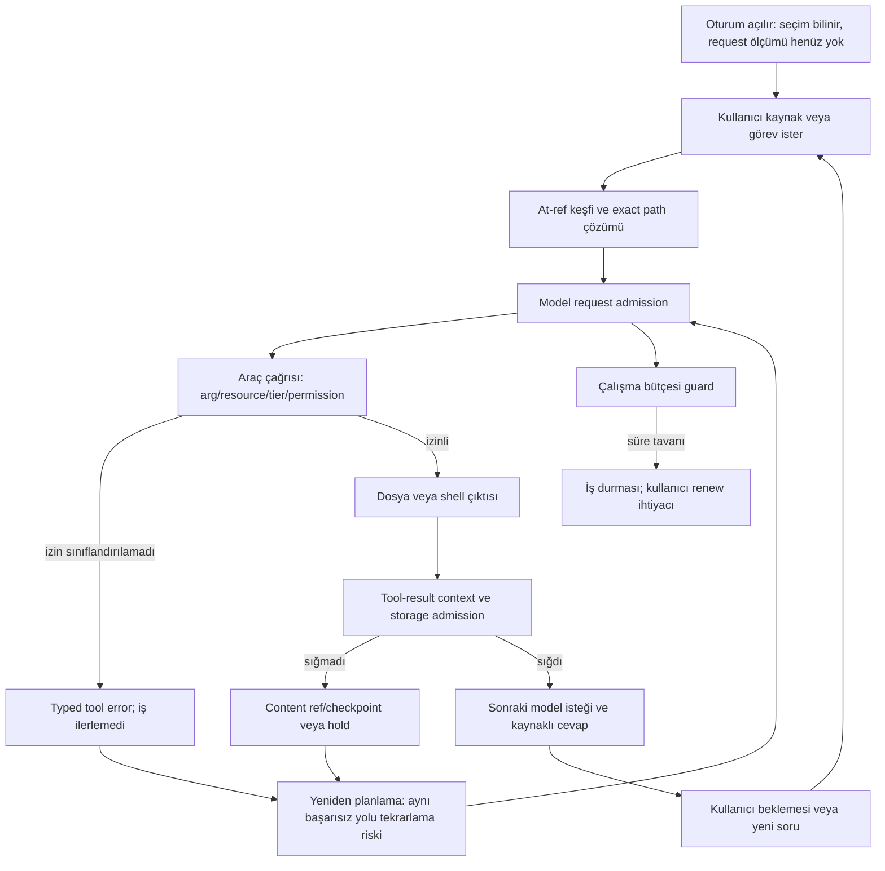

# Terminal operator akışı — Astra analizi ve devam kontratı

Tarih: 2026-09-11 yerel. Kapsam: ENTRY166 A–I, mevcut P1/P2 ve P1–P5 planı. Salt-okunur kod incelemesi; ürün değişikliği/build/provider koşusu yok. Cursor owner kontrolünde devam eder; Astra %5 sınırı Cursor'u durdurmaz. İletim alınması yeni bot/auth/mode yetkisi değildir.

## Sonuç

Sorun tek bir modelin araç seçme kalitesi değil. Dosya keşfi, permission admission, tool-result saklama, çalışma bütçesi ve kullanıcıya gösterilen durum farklı kaynaklardan geliyor; bunlardan biri başarısız olduğunda kullanıcı işi kalıcı olarak ilerletmek yerine tekrar okuma/yenileme döngüsüne giriyor. Mevcut P1 dar ölçüm etiketi iyileşmesi korunuyor. P2 read-model eklenmiş fakat idle muhasebesi iddiası mevcut kodla çelişiyor. Tam P1/P2 veya Terminal DONE denemez.

Önceki kısa TRIAGE+STOP istenen analiz/planı karşılamadı. Bu belge onun yerini alır; owner'ın Cursor devam kararı geçerlidir. Kapasite/model seçimi agent görüşlerinin ortalamasıyla yapılmaz: config/capability/custody ve kanıt önceliği esas alınır.

## Kanıtın sınırı

`owner-pty-p1-p2-session-20260911.md` owner oturumunun Composer tarafından yazılmış anlatımıdır. Yararlı gözlem, ancak ham PTY kaydı veya byte-exact binary/config/source manifest değildir. ENTRY163/166 bunu taşıyor; kanal bildirimi tek başına owner'ın bütün iddiaları bağımsız doğruladığı anlamına gelmez. Header, ekran, model girdisi ve provider cevabı ayrı consumer'lardır. Session `chat-2026-09-10T21-09-07-050Z-ipknjv` mevcut kayıtlarına başvurulmalı; yeni pahalı koşu ilk adım değildir.

P1 `1dfc9441e` için önceki41test/i18n bağımsız PASS ve scoped code acceptance geçerlidir. P2 `28005cc01` için bu tur read-model, session integration ve budget guard source review yapıldı; **tam commit review/test/binary verification yapılmadı**. Aşağıdaki karşı bulgu production kodundan doğrulanmıştır.

## Akış ve nedensellik

Bu diyagram mantıksal akıştır; loglar olmadan olayların tam kronolojik sırası iddia edilmez. Owner anlatısındaki hold → tekrar tool batch → checkpoint → yeniden @ref → permission sorunları bu döngünün farklı girişleridir. Yanlış kaynak keşfi daha geniş grep/bash çıktısını teşvik edebilir; büyük sonuç admission'ı zorlar; sonuç kullanılamazsa model aynı kaynağı tekrar okuyabilir. Bu nedensellik makul hipotezdir, her kenar actual tool/request id'leriyle doğrulanmalıdır. Checkpoint'in görünmesi işin ilerlediğini veya bütçe muhasebesinin doğru olduğunu kanıtlamaz.

## A–I bulgu matrisi

| Başlık | Kabiliyet / sınıf | Kaynak, kök neden ve kesinlik | Gerekli kanıt / dependency |
|---|---|---|---|
| A — tur öncesi seçim/pending | Kısmen çalışıyor; RELATED_BUT_NONBLOCKING | P1 measurement yokken pending doğru. P2 lastUserActivity yalnız send/compact ile tutuluyor; untracked input ölçülmedi demektir, bütün kullanıcı etkinliği ölçümü değildir. | Mevcut başlangıç PTY + build/config digest. P1 identity consumer parity. |
| B — çok tur ve work/idle | Kısmen çalışıyor; BLOCKS_CURRENT_DONE | `work-budget-snapshot.ts:26` elapsedWorkMs=now-startedAtMs. `guards/recursion.ts:79` aynı farkla terminate ediyor. `cli-terminal-slash.ts:186` idle wall tüketmez; :210 active work time diyor. Session entegrasyonunda idle süresini startedAtMs'den çıkaran muhasebe yok. **Çelişki doğrulandı.** | Sentetik saatle aynı state'in idle sırasında artışı; gerçek send→settle→idle→send izi. P2 muhasebe/continuation. |
| C — tool-result hold | Kısmen çalışıyor; BLOCKS_CURRENT_DONE | `loop.ts` tool-result broker admission; storage kapasitesi, tek sonuç/turn payı, request context aynı limit değil. Büyük çıktı ve retained body tekrarı hipotezi. Model workflow'a tek başına kusur atfedilemez. | Tool ID, raw/retained bytes, token ölçüm yöntemi, cap, receipt/spill sonucu, checkpoint sonrası freed tokens. P3/P4/P5. |
| D — classifier unavailable | Çalışmıyor (bildirilen read çağrıları); BLOCKS_CURRENT_DONE | `loop.ts:1000` resource üretimi; classifyNativeToolApproval throw dönüşümü; :1058 ask yolunda reasonCode/invalid/resource mismatch aynı koda gider. Safe-read bash silent tier olabilir, dolayısıyla aynı kontrol dalına girmez; **bash geçti ⇒ diğer araçlara izin ver** çıkarımı yanlış. | Exact tool def.approval, sanitized args/resource, seçilen tier/decision, gerçek başarısızlık nedeni. Deterministik fixture; P4 öncelikli. |
| E — usage ve request ölçümü | Kısmen çalışıyor; RELATED_BUT_NONBLOCKING | Bir request 17–22k ile38 raporun kümülatif input'u karşılaştırılamaz. Büyük fark tek başına sayaç hatası değildir. | Request/attempt ID ledger, actual vs reservation vs unknown, cumulative/last-request/time scope. P1 usage ve P3 maliyet muhasebesi. |
| F — @ref keşfi | Çalışmıyor (hedef dosya bulunamıyor); BLOCKS_CURRENT_DONE | `at-ref.ts:256` cap40k, :264 walk tüm cap dolana kadar; sonra dosya+dizin listesi tekrar sort/slice. Sıralama ve ikinci cap kayıp üretebilir. Runtime klasörlerinin exact bu kaybı yarattığı henüz hipotez. Literal @master-plan.md ile docs/MASTER-PLAN.md aynı path değil. | Gerçek liste sayımı ve target membership, erken dolum prefix dağılımı; synthetic runtime-heavy fixture; duplicate basename/case/OS. P4/P5. |
| G — MCP attach | Kanıtlanamadı; RELATED_BUT_NONBLOCKING | Initialize başarı bildirimi server erişimi; mevcut host tools listesine attachment kanıtı değil. mcp0 tek başına hata değil. Config değişimi mevcut process'i güncellemeyebilir. | Secret içermeyen effective config kaynağı, loader lifecycle, tools/list ve exact session attachment. Restart gereği koddan doğrulansın; otomatik restart/login yok. |
| H — auth/status | Kanıtlanamadı; RELATED_BUT_NONBLOCKING | Model seçimi ve request ölçüm kimliği auth entitlement değildir. Local backend auth gerektirmiyorsa not-required/unknown ayrımı capability'den çözülür. | Header auth producer→status row; local/API/subscription capability. P1; raw credential okunmaz. |
| I — transcript görsel ayrımı | Kanıtlanamadı; RELATED_BUT_NONBLOCKING | Kanal dışında değişiklik bildirildi; bu tur exact diff ve görsel kanıt verilmedi. Okunabilirlik önemli, fakat permission/continuation kapanışını yerinden etmez. | Exact dosya/commit + EN/TR ANSI tiers, TTY/pipe, keyboard/screen-reader, dar/geniş ekran kanıtı. Ayrı P4 UX scope, paralel shared-file writer yok. |

### P2 özel karar: REVISE

`elapsedWorkMs` gerçekte epoch başlangıcından geçen duvar zamanı. `userIdleMs` de son kullanıcı etkinliği işaretinden geçen süre; uzun model çalışmasını dışlamıyor. Bu iki sayı bağımsız kategorilere ayrılmış iş/idle muhasebesi değildir. İlk send öncesi22s görülmesiyle de tutarlıdır. Idle değişkenini eklemek guard'ı değiştirmiyor. Bu nedenle owner raporundaki “326s wall tüketmez” gözlemi doğrulanmış davranış sayılmamalı.

Operation seçimi de inflight turn'ü permission-wait'ten önce kontrol ediyor (`session-lifecycle-snapshot.ts:64` civarı). Permission açıkken operation turn görünebilir; ayrı permissionPending bayrağı olsa da render hangi bilgiyi önceliyor incelenmeli. Reference turn akışı ve eşzamanlı operation tracker finally davranışı tüm ingress için kontrol edilmeden lifecycle tamlık iddiası yapılmaz.

Düzeltme iki şeyi ayırmalı: bugünkü sayaçlara doğru etiket vermek ve gerçek aktif çalışma süresi/otomatik devam mekanizmasını uygulamak. Yalnız metni düzeltmek bütün P2 hedefini tamamlamaz. Idle, permission wait, background work, compact, provider wait ve cancellation için sayılacak/sayılmayacak süreler açık kontratla tanımlanmalı; aynı clock/accounting producer hem guard hem snapshot tüketicisine bağlanmalı. Finansal ve usage counters renewal ile sıfırlanmamalı.

## Öncelik DAG ve tek aktif Cursor dilimi

1. **Aktif öneri: D classifier RCA ve deterministik reproduction, salt-okunur evidence dilimi.** Kullanıcının temel dosya okumasını engelliyor ve mevcut failure kodu üç ayrı nedeni birleştiriyor. Önce exact failure dalını bul; policy gevşetme çözümü kabul edilmez.
2. **P2 truth/accounting REVISE** sıradaki kod dilimi. Bu tur yeni kaynak bulgusu geldi; eski PTY yorumuna dayanarak kabul verme. Ortak guard/snapshot muhasebe tasarımı ve fake-clock kontratı mevcut P2 kapsamına bağımlı.
3. **F @ref discovery** deterministik reproduction sonrası sınırlı implementation. Query-aware ve kaynak öncelikli keşif; bütün .deckent'i gizleme veya cap'i büyütme tek başına çözüm değil. Exact path korunur; fuzzy fallback belirsizse seçim gerekir. Case-sensitive/insensitive FS, symlink boundary ve tenant scope tasarlanır.
4. **C context/storage recovery** P2 muhasebe ve P4 araç kontratlarıyla birleşir: output shape/range/pagination, persistent reference, measured compaction gain, thrash detection. Kullanıcı /renew yapmadan görev devamı P2/P3 kapanışına bağlı.
5. **E/H/G/I** yukarıdakilerle kesişen gerekli producer düzeltmeleri dışında ayrı sonraki dilimler. MCP web search değildir; unrelated yeni connector veya görsel redesign otomatik açılmaz.

Her sırada bir ACTIVE implementation; artifact inceleme görevi execution state yaratmaz. Owner mevcut Cursor scope'unu genişletebilir; bu rapor diğer yetkileri devralmaz. P1–P5 bütün outcome DAG'ı durum-raporu.md'deki P0–P8 planına bağlıdır.

## ASSIGN — P4 permission RCA evidence

Recipient cursor-composer. Amaç: read_file/list_dir için classification-unavailable nedenini branch seviyesinde kanıtla; bash'in neden aynı koşula girmediğini karşılaştır.

Write scope yalnız `docs/execution/evidence/terminal-winddown-20260910/p4-permission-rca/`. Teslim: `ANALYSIS.md`, `receipt.json`, gerekirse deterministik fixture/probe ve redacted çıktı. Product source/test, policy/config, auth/runtime/memory, bot/build/restart/commit/push değişmez. Mevcut oturum kayıtları kullanılabilir; raw secret/transcript toplu kopyalanmaz. Yeni provider çağrısı yok. Fixture/probe kendi geçici dizinine yazabilir; ürün runtime state yaratmaz.

Read scope: `src/agent/loop.ts`, native approval classifier/types, native registry approval metadata, primaryResource ve tier/decision producer'ları; bunların ilgili testleri. Exact file+line+digest, tool name, sanitized args, resource derivation, approval result ve current policy branch raporlanır. Repo dışı private auth kaynağı okunmaz.

Başarı: en az bir exact unavailable nedeni deterministik reproduction ile doğrulanır veya mevcut kanıt eksikliği typed HOLD ile ayrılır; karşılaştırmalı güvenli read/bash yolu ve deny/ask davranışı korunur; tek önerilen kod değişikliği scope'u hazırlanır. Üç farklı nedeni aynı hata mesajından tahmin etme. Tek READY_FOR_REVIEW; yeni P4 implementation otomatik başlamaz. Bu bounded analizden sonra mevcut owner talimatı ve review sonucuyla implementation scope verilir. İzin hatasını gidermek için silent allow, bash fallback veya kullanıcıya blanket approval önerilmez.

## P1/P2 kabul özeti

- P1 measurement label dar code acceptance korunur; owner narrative görünür iyileşmeyi destekler. Host/provider/header/account parity ve tam product closure açık.
- P2 UI lifecycle alanları görünmüş olabilir; **aktif iş/idle semantiği REVISE**, full runtime acceptance HOLD. Tam source/operation matrix review ve gerçek binary proof açık.
- Yeni test/tsc/lint/build bu salt-okuma analizinde koşulmadı. Önceki41test ve i18n sonucunu bu yeni P2 karşı bulgusunu kapatmak için kullanma.
- Mevcut ham kanıt varsa korunur; eksik build provenance sıfırdan pahalı provider run başlatma gerekçesi değil. Owner senaryosu tamamlanmadan MASTER DONE/settlement üretilmez.
