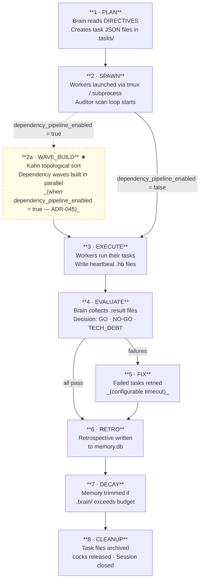
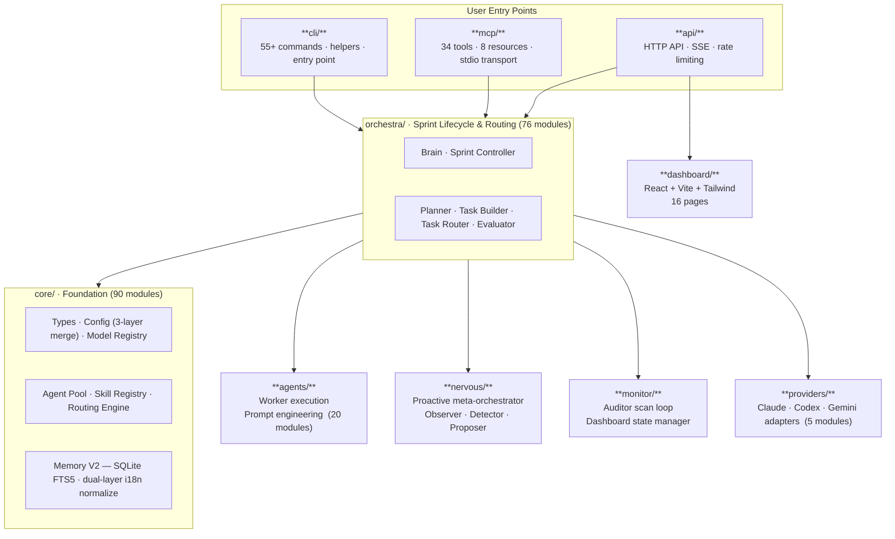

# Deckent Lifecycle & Architecture Diagrams

Visual reference for the sprint lifecycle phases and the module layer map.
Source of truth: `docs/reference/api-surface.md` and `DECKENT.md`.

---

## Sprint Lifecycle

*Eight sequential phases; WAVE_BUILD (2a) is a conditional sub-step of SPAWN that groups tasks into parallel dependency waves when the pipeline is enabled.*

---

## Architecture Layer Map

*One-way dependency rule (ADR-008): `cli` → `orchestra` → `core`. Only `orchestra` imports from `agents`, `monitor`, `nervous`, and `providers`; `core` never imports from `orchestra`.*
